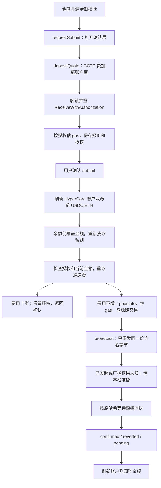

# perps-funding 页面行为与证据

整理日期：2026-09-23。代码基线：`205e192f` 及整理时的工作区内容。本文描述当前实现；领域术语见 [CONTEXT.md][context]，其中尚未落地的追踪概念另在第 7.4 节说明。

本页处理同一钱包地址的 USDC 入金和提现。入金由用户在 Arbitrum 上发起 CCTP 交易，提现由 Hyperliquid 接受签名操作后继续跨链。两条路径都包含确认面板，但签名、费用、等待结果和刷新方式不同；“已发起”“源链确认”和“最终到账”不能互相替代。

| 要理解的问题 | 需要拿到的证据 | 本文对应内容 |
| --- | --- | --- |
| 用户做了什么，预期结果是什么？ | 入口页面、操作步骤、验收条件 | 第 1 节：入口、入金与提现行为 |
| 数据如何流动？ | 从输入到请求，再到页面更新的调用链 | 第 2 节：读取、授权、广播、提现请求 |
| 核心规则是什么？ | 数量、价格、杠杆、保证金、手续费的计算及单位 | 第 3 节：余额、精度、下限、费用和到账估算 |
| 状态如何变化？ | 等待签名、已提交、成功、失败、取消等状态 | 第 4 节：准备、确认、发送、结果未知 |
| 异常怎么处理？ | 拒签、超时、断网、余额不足、重复点击 | 第 5 节：异常分类及处理边界 |
| UI 与真实结果如何保持一致？ | 请求响应、订阅、轮询、刷新和重连逻辑 | 第 6 节：账户订阅、源链轮询、报价复核及回收 |
| 正确性怎么证明？ | 协议文档、测试、可复现操作，而非仅靠代码解释 | 第 7 节：协议依据、测试结果、验收及缺口 |

## 1. 用户做了什么，预期结果是什么？

从永续首页进入 `/popup/perps/funding?tab=deposit` 或 `?tab=withdraw`；没有参数或参数不是 withdraw 时默认为入金。只读取路由初始参数。Perps 父路由检查钱包和 NeoX 链类型，funding 子路由再次运行 `PerpsFundingGuard`，避免区段内部切页绕过链类型检查。

| 操作 | 当前行为及验收条件 |
| --- | --- |
| 打开入金 | 显示所配置 Arbitrum 网络的原生 USDC 余额、25%/50%/MAX，以及需要该链 ETH 支付 gas 的说明 |
| 打开提现 | 显示按账户模式计算的可提 USDC、当前跨链费及预计收到；stale 时显示非实时提示 |
| 输入金额 | 十进制文本，最多 6 位小数；超出部分当场截断并回填。这里的金额是转移 USDC 总额，不是交易名义价值或保证金 |
| 使用百分比/MAX | 基于当前方向的可用源余额，向下取到 6 位小数；未知余额时不能使用。预设不是随每次余额更新自动跟随的订阅 |
| 点击入金 | 打开确认层并开始准备：读取报价、解锁并签 USDC 授权、估 gas；此时尚未广播源链交易，但已经生成授权签名 |
| 入金准备完成 | 确认层显示金额、网络、CctpExtension 合约地址、交易费及说明、ETH 网络费估算、预计收到；准备未完成或校验失败不能确认 |
| 点击提现 | 重新取报价，保存本次确认报价；确认层显示本人目的地址、网络、金额、跨链费与预计收到，不需要用户填写其他收款地址 |
| 确认提交 | 先刷新账户，入金另刷新源链余额；重新解锁取私钥，再读取本次通道报价。费用上涨返回确认层；未变或下降继续 |
| 入金广播成功 | 提示已发起、清金额及预设、丢弃本地授权，页面留在原处；后台 Promise 继续等待该源链哈希的回执 |
| 源链回执成功 | 刷新账户及源链余额，不显示“HyperCore 已到账”；失败回执提示已回滚，等待无定论提示仍在处理中 |
| 提现接口接受 | 提示已提交、清金额及预设、刷新账户，仍留在本页；没有目的链到账回执追踪 |
| 取消确认/切页签 | 清确认状态和本地入金准备；切页签还清金额及预设。submitting 时禁止切页签和改预设；返回按钮仍可离开 |
| 重试 | 余额未知或提现报价未知时显示重试，重取账户、源链余额及当前提现报价 |

本页没有地址编辑、资产/网络选择、杠杆或保证金设置，也没有交易进度列表、哈希链接、手动查询到账或撤销已广播交易入口。

证据：[组件][component]、[模板][html]、[首页导航][tab]、[Perps 路由][route]、[父路由][popup-route]、[守卫][guard]、[组件测试][component-test]。

### 1.1 网络与资产身份

| 配置 | 主网 | 测试网 |
| --- | --- | --- |
| 源/目的 EVM 网络 | Arbitrum，chainId=42161 | Arbitrum Sepolia，chainId=421614 |
| 转移币种 / gas 币种 | 原生 Circle USDC / ETH | Circle 测试 USDC / ETH |
| USDC 小数位 | 6 | 6 |
| Arbitrum CCTP domain | 3 | 3 |
| HyperEVM chainId / CCTP domain | 999 / 19 | 998 / 19 |
| 入金 HyperCore destinationDex | 0，标准永续余额入口 | 0，标准永续余额入口 |

`resolvePerpsTestnet()` 仅在非 production 且 perpsNetwork=testnet 时使用测试网；生产构建固定走主网。整理时本地 `environment.ts` 的工作区配置为 mainnet。选择 NeoX 测试网络本身不会改变这里的 Hyperliquid/CCTP 网络。

具体 USDC、CctpExtension、CctpForwarder、CoreDepositWallet 和 RPC 地址以 [配置常量][model] 为准。当前走用户自行广播的 CctpExtension，不是另一个需要 relayer 的 CctpExtensionV2；部署角色及地址可与 [Circle 地址表][p-addresses] 核对。

## 2. 数据如何流动？

### 2.1 页面事实来源

| 事实 | 调用链 | 更新方式 |
| --- | --- | --- |
| 钱包/地址 | `Store.select('account')` → 首个账户地址 | 地址或资金配置变化时重订账户并重启余额轮询 |
| HyperCore 账户 | `watchAccount(address)`，默认 dex='' → `getAccount()` | 首次 REST，后续 clearinghouseState 与 spotState；不读取首页的跨 DEX 聚合账户 |
| 账户模式 | `/info userAbstraction` | 读取服务缓存 30 分钟；force 刷新余额不等于必定重取账户模式 |
| 源链 USDC | `tokenBalanceExact(config,address)` → USDC.balanceOf | 进入页面立即读取，此后每 15 秒；提交前、手动重试及入金回执后另读 |
| 源链 ETH | `nativeBalanceExact(config,address)` → getBalance | 同一次余额流程在 USDC 请求结束后读取；两种余额失败分别记 null |
| 入金通道费 | `depositQuote(amount,address)` | 确认准备时读取，发送前再次读取；不在输入每个字符时询价 |
| 入金网络费 | `authorizeDeposit()` → `depositFeeExact()` | 准备好有效 USDC 授权后估算真实合约调用；发送时服务会再估 gas |
| 提现通道费 | `withdrawQuote()` → HyperEVM 合约只读调用 | 进入提现、重试、打开确认层、最终发送前分别读取 |
| 连接状态 | `channel.watchConnectionState()` | 只有提现页显示 stale 提示；连接正常不等于余额或报价一定最新 |

HyperCore 标准账户快照包含 clearinghouseState、spotClearinghouseState 与账户模式；统一/组合保证金账户依赖现货 USDC。读取失败与正常空账户分开处理。

证据：[组件][component]、[账户服务][account-service]、[账户解析][account-model]、[读取服务][hyperliquid]、[链服务][deposit-chain]、[报价服务][fee-service]。

### 2.2 入金：准备 → 复核 → 广播 → 查源链回执



准备阶段以 `depositPreparationSeq`、配置引用、地址和 confirming 判断是否已过期，避免取消后旧结果恢复授权。页面只跨确认层保存授权数据和报价，不保存私钥字段。最终 `sendDeposit()` 在重取报价前后检查当前方向、配置、地址、授权引用及授权金额与当前金额相等。

源链服务先生成并签好完整交易，再交给 `rpc.broadcast()`。重试/轮换 RPC 时提交的是同一份原始字节，哈希由本地 keccak256 算出。即使广播答复丢失，仍可按原哈希查询，不创建另一笔入金。

确认层显示的入金“收款方”是 Arbitrum CctpExtension。跨链参数中的 mintRecipient 和 destinationCaller 都是配对网络的 HyperEVM CctpForwarder；最终 HyperCore 用户地址来自授权签名者，通过 hookData 携带。三种地址承担不同角色。

证据：[组件 `prepareDeposit/submit/sendDeposit/trackDeposit`][component]、[链服务][deposit-chain]、[RPC 广播][rpc]；协议路径见 [Circle 入金指南][p-deposit]。

### 2.3 提现：预览 → 复核 → 签名的交易所操作

`requestSubmit()` → `prepareWithdraw()` 取得本次确认报价 → 用户确认 → `refreshBeforeSubmit()` → 检查余额 → `getPassword/getPrivateKey` → 重取 withdrawQuote → 对比已展示费用 → `writes.withdraw(privateKey,address,amount,{fromSpot})` → 签 `sendToEvmWithData` → POST `/exchange`。

关键 payload 为 `token=USDC`、规范化金额文本、`sourceDex=''` 或 spot、`destinationRecipient=本人地址的小写形式`、`addressEncoding=hex`、`destinationChainId=3`、`gasLimit=200000`、`data=0x`、nonce，以及 Mainnet/Testnet 标识。这里 destinationChainId 是 CCTP domain，不是 42161/421614。data 为空启用默认转发路径。

这不是源链 EVM 转账，用户不在本页另签 HyperEVM 或目的链交易，也不先发 ERC-20 approve。提现没有携带已确认报价作为不可变的费用上限字段，页面采用发送前复核报价的方式；不能保证签名后费用一定不变。

收到可接受答复仅提示已提交并刷新 HyperCore 账户。当前没有把提现 nonce 与账本/目的链交易关联，也没有自动等待到账；另见 [历史页文档][history-doc] 的账本和 CCTP 证据边界。

证据：[组件 `prepareWithdraw/submit`][component]、[写服务 `withdraw`][exchange]、[签名 payload][signing]；协议路径见 [Circle 提现指南][p-withdraw]。

## 3. 核心规则是什么？

### 3.1 金额、精度、可提余额及下限

约定 A 为输入 USDC，总费用报价为 F。数量均为转移币数，不使用市价、杠杆或订单保证金公式。

| 规则 | 当前计算及单位 |
| --- | --- |
| 输入/签名金额 | 保持十进制文本，BigNumber 规范化；UI 两个方向均最多 6 位小数；源链 parseUnits(A,6) 转整数，不经过 Number |
| 入金上限 | 当前配置源链的 USDC balanceOf，未知为 null；不读取 NeoX 当前网络的 USDC 余额 |
| 标准及非 unified 模式提现 | 标准 DEX 的 withdrawableExact；不加上其他 HIP-3 DEX 可提额，也不加独立现货余额 |
| unifiedAccount / portfolioMargin 提现 | `max(spotUsdcExact - spotUsdcHoldExact, 0)`，从 spot 扣款；本页只处理 USDC，不折算 HYPE 等其他抵押品 |
| dexAbstraction | 当前解析为非 unified，沿用标准 DEX withdrawable/sourceDex='' 路径；不在本页切换账户模式 |
| unknown 模式 | 可提余额为 null，阻止提现；入金使用独立源链余额，不单因模式 unknown 被禁用，但仍要求账户数据存在 |
| 百分比 | `floor_6(当前上限×25%或50%)`；MAX=`floor_6(当前上限)`，不预扣通道费，费用从输入总额中扣 |
| 入金下限 | A≥5 USDC，明确是产品下限，不是当前 CCTP 的固定协议门槛 |
| 提现下限 | A≥2F，且 A>0；这是本地产品缓冲，不是协议规定的固定最低提现额；未取到报价时不能判断下限，也不能提交 |
| 预计收到 | `max(A-F,0)`；确认层采用对应的已确认报价。未知费用不编成零；ETH 网络费不从 USDC 预计收到中扣 |
| 显示精度 | 输入最多 6 位；金额摘要通常显示 2 位，余额向下显示 2 位，确认层 ETH 网络费向下显示 6 位；签名仍用精确原值 |

例如 unified 账户 spot total=12.3456789、hold=2，则可提值为 10.3456789，MAX 为 10.345678；若 F=0.2，预计收到 10.145678 USDC。费用翻倍下限为 0.4，不意味着所有网络始终收 0.2。

提交前余额低于输入时，手动金额保持原值并停止；若先前选的是 MAX，更新为新的向下量化余额后停止，等待再次操作。余额上涨不自动增加已经确认的金额，25%/50% 也不在此重新计算。

证据：[组件余额、预设和校验][component]、[格式化工具][util]、[账户模式解析][account-model]、[常量][model]；模式区别见 [Account abstraction modes][p-modes]。

### 3.2 入金费用

报价读取当前网络 Circle `/v2/burn/USDC/fees/3/19?forward=true&hyperCoreDeposit=true`，只接受 finalityThreshold=1000 的 Fast 档。

| 组成 | 当前计算 |
| --- | --- |
| CCTP 协议费 | `ceil_6(A × minimumFee / 10000)`；minimumFee 单位为 bp |
| CCTP 转发费 | `forwardFee.high / 10^6` USDC；字段缺失/不可读就拒绝报价，不用历史常量兜底 |
| CCTP maxFeeExact | 协议费 + 转发费；仅这一部分传给销毁调用的 maxFee |
| 新账户费 | 在 HyperEVM 调用用户存在性预编译；已存在为 0，否则读 CoreDepositWallet.newCoreAccountFee()，本地适配按 8 位小数解码 |
| 总交易费 feeExact | maxFeeExact + 新账户费；确认层显示这个总额并用 tooltip 解释构成，不逐项列出金额 |
| 网络费 networkFeeExact | `floor(estimateGas × 12/10) × (maxFeePerGas ?? gasPrice) / 10^18` ETH |

例：A=10、minimumFee=1.4 bp、forwardFee.high=200000、新账户费=1，则 CCTP maxFee=0.2014、总交易费=1.2014、预计收到=8.7986 USDC；网络 gas 另由 ETH 支付。新账户费不能被重复放进 CCTP maxFee。

网络费依据真实 batchDepositForBurnWithAuth 调用估算并加 20% gas 余量。广播前重新估 gas、获取 nonce 和交易费率，**确认层网络费不是最终花费或固定上限**；当前不因这项 ETH 估算上涨重新打开确认层。

`gasShortfall` 仅在 ETH 余额和网络费均已知且余额小于费用时为 true。ETH 余额未知不被当成零，也没有单独阻止确认的条件。入金费用大于金额时，预计收到会降为零，但当前本地闸门没有额外的 `A>feeExact` 校验，应作为验收边界。

证据：[报价服务][fee-service]、[授权及 gas 估算][deposit-chain]、[组件][component]、[报价测试][fee-test]。Circle 指南支持询价参数与转发路径；`newCoreAccountFee` 的具体 ABI/单位在本次查看的说明页中未列出，本处依据本地实现及测试，尚需部署合约读取证据。

### 3.3 提现报价与报价变化

提现调用 HyperEVM CoreDepositWallet 的 `calculateCrossChainWithdrawalFee(true, 3)`，按 6 位小数解码 USDC；不直接读可能未覆写的 cctpForwardFees 映射。这里 feeExact 与 maxFeeExact 相同，页面下限为 2×feeExact。

表单使用 withdrawQuote，确认层使用 withdrawConfirmedQuote。发送前两侧都只比较总 feeExact：费用上涨，更新报价并回确认；不变或下降继续。没有报价 TTL 或按报价年龄强制失效；读取失败不能沿用旧数发送。

入金遇到费用上涨保留原 USDC 授权，等待用户确认新报价，因为尚未广播；取消或其他失败则丢弃。提现确认准备与表单报价是不同异步方法，其时序保护范围见第 7.4 节。

界面预览只减本服务读到的通道费，未从交易所历史账本读取这笔未来提现的实际附加费用。最终净到账应由账本和目的链回执确认。不能依据当前示例值，把费用写死或宣称报价覆盖未来所有实际扣费。[Circle 提现费用说明][p-withdraw]

证据：[报价服务][fee-service]、[组件费用比较][component]、[仓库历史费用研究][fee-research]。

### 3.4 授权、目标与重试中的不变量

| 项目 | 当前规则 |
| --- | --- |
| USDC 授权域 | 从源 USDC 合约读取 name/version，配源链 chainId 和该 USDC verifyingContract |
| 授权内容 | ReceiveWithAuthorization：from=私钥地址、to=CctpExtension、value=A 的最小单位；validAfter=0、validBefore=当前秒+1800，随机 32 字节 nonce |
| 授权生命周期 | 仅内存；取消、切页签、销毁或一次发送尝试结束后丢弃。删除本地对象不等于链上撤销授权，已签许可在协议有效期内仍有意义 |
| 入金目标 | domain=19，mintRecipient/destinationCaller 均为配对 HyperEVM forwarder 的 bytes32；配置没有配对则拒绝，不能猜主网/测试网 |
| hookData | 24 字节标记、4 字节版本 0、4 字节内容长度 24、20 字节授权 from、4 字节 destinationDex=0 |
| 提现签名 | 用户签名 EIP-712 HyperliquidSignTransaction；本地 signatureChainId=421614，另以 hyperliquidChain 区分端点网络，不能用该签名域数字判断钱到哪条链 |
| 提现 nonce | 当前服务实例按签名者分配 `max(Date.now(),last+1)`；确定的 nonce 业务拒绝最多重新签名一次，传输失败不自动重签 |
| 入金广播重试 | 对固定 signedTransaction 重发，始终相同哈希；already known 等视为已知同一交易。曾经出现不确定尝试后，后续 nonce 拒绝不能覆盖原未知状态 |

入金授权不包含 CCTP maxFee，也不包含最终 EVM gas 费用；提现签名不包含页面的 feeExact。用户审核报价与协议真正锁定字段应分开核对。

证据：[链服务与 hook 编码][deposit-chain]、[签名模块][signing]、[写服务][exchange]、[nonce][nonce]、[RPC][rpc]、[Circle 入金指南][p-deposit]。

## 4. 状态如何变化？

页面由 accountLoading/accountLoadError、confirming、preparingDeposit/preparingWithdraw、submitting 及报价/授权字段组合驱动；没有统一持久化的资金状态机。

| 状态/事件 | 转移及可观察结果 |
| --- | --- |
| 初始化读取 | loading 时不可提交；未知余额显示 `--`，未知费用/预计收到显示 N/A；尚无独立加载完成倒计时 |
| 编辑草案 | 校验通过可打开确认层；手动改金额清预设和刷新警告 |
| 入金准备中 | confirming=true、preparingDeposit=true；请求报价、私钥、授权和 gas，确认按钮禁用 |
| 提现准备中 | confirming=true、preparingWithdraw=true、清旧确认报价；成功取得报价后才可确认 |
| 入金 gas 不足 | 准备结束关闭确认层，清授权/通道报价，但保留网络费显示不足原因；不是已广播失败 |
| 取消确认 | confirming=false，清入金准备和提现确认报价；未广播，也未发送撤销授权交易 |
| 确认后提交中 | confirming=false、submitting=true；刷新、解锁、复核和发送共用这个标记，金额输入禁用 |
| 刷新失败 | submitting=false，清入金准备，refreshFailed=true；不继续发送 |
| 余额降到输入以下 | submitting=false，balanceMovedUnderInput=true；手动金额不缩减，MAX 可下调后等待再次操作 |
| 总通道费上涨 | submitting=false，confirming=true，展示新报价并提示重新确认；入金授权保留 |
| 入金已广播 | 清授权、金额和预设，submitting=false；提示已发起，然后按哈希等回执。等待期间可以发起另一笔新的意图 |
| 入金广播答复不确定 | 提示状态未知，清表单及授权，仍按原哈希等回执；组件不会自动重新准备或发送 |
| 源链 confirmed | 回执 status=1，刷新余额；没有把它直接标成 HyperCore 入账 |
| 源链 reverted | 回执非成功，提示已回滚并刷新；本地不继续等待这次入金的 HyperCore 到账 |
| 源链 pending | 没回执或链读取无定论，提示仍在处理中并刷新；页面没有后续持久追踪记录 |
| 提现已提交 | next 回调清金额/预设、解除 submitting，提示已提交并刷新账户；不是目的链已到账 |
| 提现结果未知 | 提示 perpsWithdrawStatusUnknown、解除 submitting、保留金额并刷新账户；没有持续关闭提交闸门或自动查询 nonce |
| 确定失败 | 提示 txFailed 或 verifyFailed，解除 submitting；具体取决于失败发生在准备、发送或外层异步路径 |

`disabledReason` 按签名方式、账户错误、余额/报价未知、刷新警告、金额/精度/余额/下限、gas 不足的顺序显示一个原因。refreshFailed 和 balanceMovedUnderInput 是提示标记，不直接纳入 canSubmit；条件恢复后用户仍可再次发起检查。

证据：[组件状态与 canSubmit/canConfirm][component]、[源链结果][deposit-chain]、[模板][html]、[组件测试][component-test]。

## 5. 异常怎么处理？

| 异常 | 当前处理 | 边界/需要保留的证据 |
| --- | --- | --- |
| Neo2/Neo3 或链类型读失败 | 守卫回钱包首页 | 不把非 EVM 地址用于资金操作 |
| Ledger/二维码钱包 | signingUnavailable 在打开准备前阻止，并显示原因 | 两条路径都需要可导出的私钥，当前未支持这些签名方式 |
| 余额未知 | 对应值为 null；无法设置该方向预设或提交，可重试 | ETH 未知与 USDC 未知的闸门不同：ETH 未知不等于 gasShortfall |
| 用户取消解锁/私钥读取失败 | 准备阶段可能显示 txFailed；submit 外层显示 verifyFailed，清入金准备 | 没有独立用户拒签枚举；verifyFailed 也可能包含后续报价失败等非密码问题 |
| 可用 USDC 降低 | 刷新后停止，标余额变化，必要时下调 MAX | 不在每个后续 await 后重做完整余额/账户身份检查 |
| ETH 不足 | 准备时已知不足则关闭确认，显示所配置链的 ETH 不足 | 发送前虽刷新 ETH，但现有 submit 在刷新后主要复核 exceedsBalance，未再次执行完整 gas 闸门；链估算/广播还可能拒绝 |
| 报价缺 Fast 档/非法字段 | 报价服务抛错，不假设为免费 | 入金报价验证有限值，未完整校验负费率等所有异常数值；需用异常响应验收 |
| 提现报价读取失败 | 表单报价置 null，不能提交，显示重试；确认准备失败关闭层 | 当前发送前读报价失败走外层 verifyFailed，不等同于密码错误 |
| RPC/报价 HTTP 超时、0、502/503/504 | 10 秒单请求超时；最多重试 4 次，250/500/1000/2000ms 退避；RPC 再轮换端点 | 每端点最多 5 次尝试；不是整个页面操作最多 10 秒 |
| 明确 4xx、带答复的 500、业务 revert、浏览器离线 | 不按临时传输错误重试，分类为 rejected | 当前重试分类是客户端策略；不能推出链上资金一定如何回补 |
| 入金广播丢回复 | 固定原交易重发；无可判定结果抛带原 hash 的未知异常，组件只查原哈希 | 不新签第二次入金；INSUFFICIENT_FUNDS/REPLACEMENT_UNDERPRICED 且无先前不确定尝试时保留确定拒绝 |
| 源链回执久未确认 | waitForTransaction(hash,1,90000)，无回执/PerpsChainError 记 pending | 外层仍有 RPC 重试/端点轮换，90 秒不构成整段追踪的严格总时限 |
| 提现 nonce 明确被拒 | 至多分配新 nonce 重签一次 | 只针对明确业务拒绝，不对丢回复、0/5xx 自动重发 |
| 提现响应丢失/不可解码 | unknown 提示并刷新；4xx/明确拒绝提示失败 | 没有提现结果恢复状态机；未知后表单仍可再次操作，不能宣称已实现跨窗口或未知期间防重 |
| 重复点击 | submitting 同步阻止再次提交；发送中输入、预设和页签受限 | 入金准备阶段尚未 submitting；重复 prepare 主要靠序号丢弃旧结果，仍可能多次询价/解锁 |
| 授权超期 | 合约估算/执行可能拒绝 | 本页没有 30 分钟到期倒计时或自动重新准备；丢弃授权不等于链上已消耗 |
| 离开/切地址 | 读取有部分地址检查，入金准备有序号防过期 | 提现准备/提交和已交给链服务的调用不具备完整取消能力，见第 7.4 节 |

POST `/exchange` 没有显式 timeout。通用响应解析拒绝顶层 err 和逐项 error，但没有专门证明目的链结果；顶层 ok 的结构校验也不等于最终提现成功。

证据：[组件][component]、[守卫][guard]、[RPC 策略][rpc]、[报价服务][fee-service]、[写服务][exchange]、[失败分类][failure]。

## 6. UI 与真实结果如何保持一致？

| 机制 | 当前实现及边界 |
| --- | --- |
| 账户快照与 WS | 标准 DEX 账户使用共享数据集，在 REST 在途时缓冲 clearinghouse/spot 帧，再回放到快照；相同地址的并发刷新共用在途请求 |
| 账户失败重试 | 有观察者时按指数退避重读；普通失败从 1 秒、429 从 10 秒起，上限 60 秒；不是组件自行轮询 HyperCore 余额 |
| WS 重连 | 通道恢复订阅，账户数据集补快照；30 秒 ping/10 秒 pong 超时，重连延迟 1、2、4…秒，上限 30 秒 |
| 源链轮询 | 两个页签都维持每 15 秒 USDC/ETH 读取，submitting 时跳过新一轮；已在途轮询不取消，同地址并发返回没有请求代次排序 |
| 提交前刷新 | 调 refreshAccount，入金再读源余额；必须至少拿到账户对象和可用源余额。stale 失败保留旧 account 时，本组件未另检查 availability，不能笼统宣称每次提交都取得新快照 |
| 模式缓存 | refreshAccount(force=true) 刷清算所/现货，但 userAbstraction 仍可能命中 30 分钟缓存；发送 sourceDex 是否跟上外部模式切换需联调 |
| 报价一致性 | 提现确认费与表单当前费分开；入金确认费和授权配对，发送前检查总费是否上涨；UI 不把报价当实际回执 |
| 写后刷新 | 提现接受/未知时刷新账户；入金回执结算后刷新账户及源余额；WS 和 15 秒轮询可继续反映后续变化 |
| 成功判定 | 当前本页只确认源链交易结果或交易所接受，不按余额差额匹配某笔跨链款项，也不追踪 attestation、forwarder 或目的链 mint |
| 销毁 | 退订钱包、连接和账户数据流，清余额定时器及入金准备；未取消已经在途的 Promise、提现写订阅或源链回执等待 |

入金 trackDeposit 完成后只检查配置和地址是否仍匹配，没有额外 destroyed 标记；离开但地址未变时仍可能继续提示和刷新。销毁后已在途余额/提现报价读取也不全由生命周期守卫拦截。页面离开不等于撤回已广播资金移动。

证据：[组件][component]、[账户状态服务][account-service]、[共享数据集][dataset]、[读取服务][hyperliquid]、[数据通道][channel]、[写操作架构约定][adr-write]。

## 7. 正确性怎么证明？

### 7.1 协议及外部证据

以下官方资料于 2026-09-23 在线核对；未发起真实交易，也未读取任何私钥。

| 资料 | 能证明的范围 |
| --- | --- |
| [Circle Arbitrum → HyperCore][p-deposit] | CctpExtension、ReceiveWithAuthorization、询价路由、forwarder 与 hook 参数、源链 gas 估算流程 |
| [Circle HyperCore → EVM][p-withdraw] | sendToEvmWithData、sourceDex、CCTP domain、空 data 的自动转发及扣款到铸币的多个阶段 |
| [Circle 合约地址][p-addresses] | 主网/测试网 CctpExtension、CctpForwarder、CoreDepositWallet 身份；与 V2 sponsored 路径区分 |
| [CoreDepositWallet 接口][p-core-wallet] | HyperCore 入账入口和 destinationDex 语义；当前该说明页未完整列出本地所读费用 getter，不能据此宣称已核验其实时值 |
| [Hyperliquid 账户模式][p-modes] | 标准账户与统一/组合保证金账户的余额来源差别；不把单 DEX 余额当聚合可提值 |
| [仓库费用研究][fee-research] | 2026-09-07 的历史回执核对记录；仅是既有证据，不是本次实时费率或提现到账保证 |

最小证明链：入金需授权域/金额、源链签名交易与成功回执、目标 mint/转发事件、HyperCore 对应账本；提现需签名 action、交易所答复、源账户扣款账本、目的链 mint 和接收余额。单元测试通过、源链成功或余额增长中的任意一个都不能单独证明整条跨链路径正确。

### 7.2 已有测试与本次结果

| 测试 | 主要覆盖 |
| --- | --- |
| [资金组件测试][component-test] | 标准/统一/组合保证金余额、6 位输入及精确 MAX、提交刷新、费用涨跌再确认、gas 不足、授权生命周期、未知广播原哈希追踪、源链三类结果及确认层渲染 |
| [守卫测试][guard-test] | NeoX 放行、其他链及读取失败重定向 |
| [源链服务测试][deposit-test] | EIP-3009 域与金额、hook 布局、配对 forwarder、maxFee、20% gas、固定交易字节广播及源链结果 |
| [报价测试][fee-test] | Fast 档、不同网络 API、bp 向上舍入、新账户费与 maxFee 分离、提现合约报价及两倍下限 |
| [RPC 测试][rpc-test] | 传输/拒绝/离线分类、同字节广播、already known、哈希保留及先未知后拒绝 |
| [写服务测试][exchange-test]、[签名测试][signing-test]、[nonce 测试][nonce-test] | 提现扣款来源、payload/签名恢复、明确拒绝与未知响应、实例内 nonce 分配 |
| [账户服务测试][account-service-test]、[账户解析测试][account-model-test]、[数据集测试][dataset-test]、[读取服务测试][hyperliquid-test] | 账户模式、精确余额、快照/WS 仲裁、重连及失败保留规则 |
| [格式化测试][util-test] | 金额/余额展示与协议精度边界 |

在仓库根目录执行：

```bash
nvm use
npm run lint
npm run test:ci -- \
  --include='src/app/popup/perps/perps-funding/*.spec.ts' \
  --include='src/app/core/services/perps/perps-deposit-chain.spec.ts' \
  --include='src/app/core/services/perps/perps-fee-quote.spec.ts' \
  --include='src/app/core/services/perps/perps-rpc.spec.ts' \
  --include='src/app/core/services/perps/perps-exchange-write.service.spec.ts' \
  --include='src/app/core/services/perps/hyperliquid-signing.spec.ts' \
  --include='src/app/core/services/perps/hyperliquid.service.spec.ts' \
  --include='src/app/core/services/perps/perps-account-state*.spec.ts' \
  --include='src/app/core/services/perps/perps-dataset.spec.ts' \
  --include='src/app/core/services/perps/perps-nonce.spec.ts' \
  --include='src/app/popup/perps/perps.util.spec.ts' \
  --reporters=dots
```

本次环境：Node `16.20.1`、npm `8.19.4`、ChromeHeadless `154`。定向测试 **284 项通过**，包含共享服务的其他业务用例。`npm run lint` **未通过**：现有 [模板][html] 第 49 行 `withdrawableExact != null` 触发 `@angular-eslint/template/eqeqeq`，要求 `!==`；本次文档任务未修改该模板。未执行全量测试、生产构建或真实跨链交易。

### 7.3 可复现验收方案（本次未执行）

准备：使用测试网软件钱包及源链原生 USDC/ETH，记录代码版本、构建端点、账户模式、地址、合约配置和报价。用可控替身覆盖延迟/失败/费用变动；真实流程保留公开交易哈希、nonce、请求答复、账本和截图，不记录密码、私钥或可用授权签名。

| 编号 | 操作步骤 | 验收条件/需核对结果 |
| --- | --- | --- |
| F1 网络与入口 | 分别从首页进入存入/提现，用 Neo2/Neo3 访问；核对构建主网/测试网 | 页签正确，链守卫生效；源链、USDC、forwarder 和 Hyperliquid 网络配对，不受 NeoX 网络选择误导 |
| F2 账户模式 | 标准/统一/portfolioMargin/unknown 设置不同 perps、spot total、hold 和 HIP-3 余额 | 标准只读标准 DEX withdrawable；统一/PM 为 max(total-hold,0)；不合并其他币或池；unknown 不提现 |
| F3 精确金额 | 输入 7 位小数、设置小数尾数 MAX、25%/50%，并检查签名参数 | 输入截到 6 位；MAX/比例向下取，不经 Number 丢最小单位；摘要显示精度不改变提交值 |
| F4 入金报价 | 模拟 bp=1.4、转发费最小单位 200000、新账户费 1；再缺 Fast 档或给非法费 | 总费、CCTP maxFee、新账户费分离正确；失败不回退免费；费用高于金额时记录当前闸门缺口 |
| F5 入金授权和目标 | 准备确认，解码授权与合约 calldata，估 gas；取消再打开 | 授权金额/域/to/有效期正确；mintRecipient 与 caller 为配对 forwarder；hook 为本人和 dex=0；无独立 approve/提前广播 |
| F6 gas | 用精确相等、少一个最小单位及未知 ETH 余额；发送前再提高 gas | 已知不足阻止；未知不被报零；对比确认层估算与真实交易费，记录未重新确认 ETH 费用的边界 |
| F7 刷新与 MAX | 确认期间减少余额，分别用手填和 MAX；使刷新失败或返回 stale 旧账户 | 手填不改、MAX 下调后停止；失败不继续；stale 保留旧账户的场景需单独核对，不能仅以对象存在证明刷新成功 |
| F8 报价变动 | 确认后使总费上涨、下降、不变；在等待中取消/更换准备 | 上涨重新确认；不增继续；取消的旧入金准备不能恢复；发送使用新 maxFee，不重复授权给开户费 |
| F9 入金广播 | 模拟接受后丢响应、端点轮换、already known、后续 nonce 拒绝 | 各次广播字节/哈希相同；未知后查询原哈希，无第二笔入金；真实源链以 receipt.status 判成功 |
| F10 入金后续 | 给 confirmed、reverted、无回执；关闭再打开 | 提示区分正确；源链成功不宣称最终到账；记录页面关闭后没有持久恢复，另核对目标 mint/HyperCore 账本 |
| F11 提现 payload | 标准/统一账户分别确认提现，检查 action 与签名域 | sourceDex 为 ''/spot，目标本人、domain=3、data=0x；不是目的 EVM chainId；没有另签目的链交易 |
| F12 提现异常 | 明确 nonce 拒绝、余额拒绝、0/5xx、畸形响应及长时间无答复 | nonce 业务拒绝最多一次重签；其他确定拒绝与未知区分；未知不自动重发，但记录当前允许人工再次提交的范围 |
| F13 生命周期与串号 | 源余额/报价/解锁延迟时切钱包、切页签、取消、销毁；使旧提现确认请求后返回 | 验收目标为旧地址/旧确认不影响新操作；当前提现异步隔离和准备完成后的钱包绑定未完整实现，须记录实际签名者/收款方，不能算已通过 |
| F14 最终到账 | 测试网完整执行两方向，关联源链/交易所账本和目的链回执 | 按同一笔交易证据核对实际扣款、全部费用、接收地址与到账金额；余额变化本身不足以证明归因 |

### 7.4 实现边界与待补证据

1. **CONTEXT 中的概念不全是当前功能。** 本页未持久化公开追踪记录，未实现 Tracking Not Saved、Credit Unattributed 或跨重启 Pending Deposit 列表。当前只有内存授权和一次源链回执等待；不能写成完整资金追踪系统。
2. **入金准备会先签授权。** 最终确认前不广播，不等于不签任何东西。现有“提交前刷新失败不签名”测试主要证明该次 submit 不再调用私钥/写服务，不能否认先前 prepareDeposit 已生成授权。
3. **钱包与生命周期隔离不完整。** 读取有地址/配置检查，入金准备有序号，但地址变化未统一清空已完成的确认与授权；最终提交没有贯穿所有 await 的钱包基线。提现路径尤缺少销毁/地址复核，入金 stillPrepared 也未显式比较 authorization.from 与当前钱包，需专门联调。
4. **提现确认没有入金准备同等的代次保护。** 表单 loadWithdrawQuote 有 seq，prepareWithdraw 只检查 confirming/isWithdraw；取消后重开时旧成功/失败仍可能影响新确认。两种报价方法的保护不能混为一谈。
5. **提交前刷新不一定代表取得新事实。** 数据集可能合并已有在途请求，断线读取失败可保留旧 account，账户模式还有独立缓存；组件未逐项验证这些新鲜度条件。
6. **估算与最低额仍需边界验收。** ETH 估算发送时重取但不比较展示值；ETH 未知、入金报价吞掉金额、长时间确认导致授权过期，以及报价异常值没有完整 UI 阻断。两倍提现下限只能作为产品缓冲，不能证明未来扣费上限或回滚退款。
7. **未知结果处理没有全局防重保证。** 提现 unknown 后解除 submitting 且保留金额，入金广播后也解除 submitting；当前只避免同一次发送自动生成另一笔意图，不跨窗口协调，不持久化，也不自动判断最终到账。
8. **本地测试不替代部署证据。** 本次未验证费用 getter 的实时值/所有异常数值、真实签名被服务端接受、目标链异常后资金回补、完整跨链到账或所有账户模式的真实可提限制。F1–F14 均为待执行方案。

[context]: ./CONTEXT.md
[component]: ./perps-funding.component.ts
[html]: ./perps-funding.component.html
[component-test]: ./perps-funding.component.spec.ts
[guard]: ./perps-funding.guard.ts
[guard-test]: ./perps-funding.guard.spec.ts
[tab]: ../perps-tab/perps-tab.component.ts
[route]: ../perps.route.ts
[popup-route]: ../../popup.route.ts
[history-doc]: ../perps-history/README.md
[model]: ../../_lib/perps.ts
[util]: ../perps.util.ts
[util-test]: ../perps.util.spec.ts
[deposit-chain]: ../../../core/services/perps/perps-deposit-chain.service.ts
[deposit-test]: ../../../core/services/perps/perps-deposit-chain.spec.ts
[fee-service]: ../../../core/services/perps/perps-fee-quote.service.ts
[fee-test]: ../../../core/services/perps/perps-fee-quote.spec.ts
[rpc]: ../../../core/services/perps/perps-rpc.ts
[rpc-test]: ../../../core/services/perps/perps-rpc.spec.ts
[exchange]: ../../../core/services/perps/perps-exchange-write.service.ts
[exchange-test]: ../../../core/services/perps/perps-exchange-write.service.spec.ts
[signing]: ../../../core/services/perps/hyperliquid-signing.ts
[signing-test]: ../../../core/services/perps/hyperliquid-signing.spec.ts
[nonce]: ../../../core/services/perps/perps-nonce.ts
[nonce-test]: ../../../core/services/perps/perps-nonce.spec.ts
[failure]: ../../../core/services/perps/perps-fetch-failure.ts
[hyperliquid]: ../../../core/services/perps/hyperliquid.service.ts
[hyperliquid-test]: ../../../core/services/perps/hyperliquid.service.spec.ts
[account-service]: ../../../core/services/perps/perps-account-state.service.ts
[account-service-test]: ../../../core/services/perps/perps-account-state.service.spec.ts
[account-model]: ../../../core/services/perps/perps-account-state.ts
[account-model-test]: ../../../core/services/perps/perps-account-state.spec.ts
[dataset]: ../../../core/services/perps/perps-dataset.ts
[dataset-test]: ../../../core/services/perps/perps-dataset.spec.ts
[channel]: ../../../core/services/perps/perps-data-channel.service.ts
[adr-write]: ../../../../../docs/adr/0003-no-background-trade-executor.md
[fee-research]: ../../../../../docs/research/hyperliquid-cctp-withdrawal-fee-2026-09-07.md
[p-deposit]: https://developers.circle.com/cctp/howtos/transfer-usdc-from-arbitrum-to-hypercore
[p-withdraw]: https://developers.circle.com/cctp/howtos/withdraw-usdc-from-hypercore-to-evm
[p-addresses]: https://developers.circle.com/cctp/references/hypercore-contract-addresses
[p-core-wallet]: https://developers.circle.com/cctp/references/coredepositwallet-contract-interface
[p-modes]: https://hyperliquid.gitbook.io/hyperliquid-docs/trading/account-abstraction-modes
