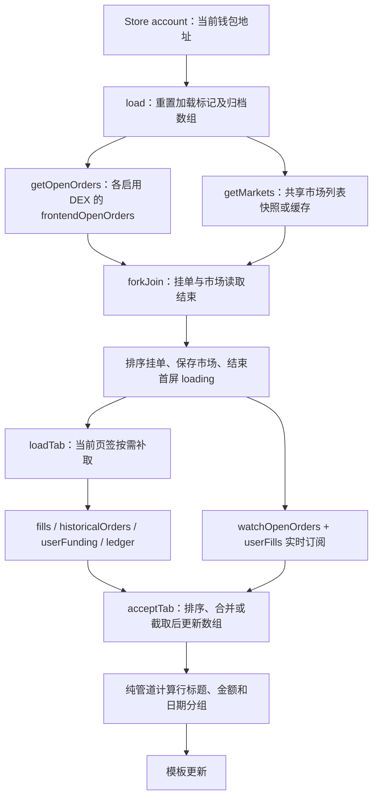

# perps-history 页面行为与证据

整理日期：2026-09-23。代码基线：`261d928d` 及整理时的工作区内容，包含尚未提交的改动。本文描述当前实现，不等同于已发布版本。

本页展示当前委托、历史成交、历史委托、资金费、存款和提款五类活动，并提供单笔撤单。查看记录不签名；撤单需要解锁并签署 Hyperliquid 操作。页面不负责开仓、调杠杆或执行出入金。

| 要理解的问题 | 需要拿到的证据 | 本文对应内容 |
| --- | --- | --- |
| 用户做了什么，预期结果是什么？ | 入口页面、操作步骤、验收条件 | 第 1 节：入口及行为表 |
| 数据如何流动？ | 从输入到请求，再到页面更新的调用链 | 第 2 节：首屏、按需读取、实时订阅及撤单 |
| 核心规则是什么？ | 数量、价格、杠杆、保证金、手续费的计算及单位 | 第 3 节：显示口径、金额计算、排序与范围 |
| 状态如何变化？ | 等待签名、已提交、成功、失败、取消等状态 | 第 4 节：加载状态、撤单状态及协议状态 |
| 异常怎么处理？ | 拒签、超时、断网、余额不足、重复点击 | 第 5 节：异常处理及限制 |
| UI 与真实结果如何保持一致？ | 请求响应、订阅、轮询、刷新和重连逻辑 | 第 6 节：数据合并、刷新与生命周期 |
| 正确性怎么证明？ | 协议文档、测试、可复现操作，而非仅靠代码解释 | 第 7 节：协议依据、测试结果、验收方案及缺口 |

## 1. 用户做了什么，预期结果是什么？

路由为 `/popup/perps/history`，入口包括永续首页的历史按钮，以及下单页结果未知时的历史入口。Perps 父路由用钱包守卫和 `PerpsFundingGuard` 检查钱包及 NeoX 链类型；history 子路由没有额外守卫。网络由构建配置 `environment.perpsNetwork` 决定。

| 操作/入口 | 当前行为及验收条件 |
| --- | --- |
| 进入历史页 | 默认选中“当前委托”；读取当前钱包首个账户地址，加载挂单和市场元数据，随后建立实时订阅 |
| 查看当前委托 | 显示币种图标、订单类型加方向、原始委托数量及撤单按钮；页签显示非零挂单数量；不展示剩余数量、订单价格或逐笔时间 |
| 切到历史成交 | 展示协议 `dir` 原文、本次成交数量及右侧净金额；若尚未收到成交 WS 快照，发一次 REST 兜底请求 |
| 切到历史委托 | 首次按需读取，显示类型、方向、原始数量和订单状态；保留接口中的 `open` 记录，不只保留终态 |
| 切到资金费 | 首次按需读取；显示收取/支付资金费、币种及带符号的协议金额 |
| 切到存款和提款 | 首次按需读取非资金费账本；内容也包含账户划转、现货转账等，标题不代表只过滤 deposit/withdraw |
| 第一次点击撤单 | 当前行按钮变为“确认撤单”，尚未解锁或发送请求；点击其他行会更换待确认订单 |
| 再次点击同一行 | 检查签名方式和市场资产 ID，进入解锁、签名、发送；相同订单按钮禁用，组件阻止另一笔撤单同时开始 |
| 撤单返回成功 | 本地移除对应 oid、清空撤单标记、提示已取消，使历史委托的已加载标记失效；下次选择历史委托时重新读取 |
| 切换页签 | 清除待确认撤单标记；不取消已经开始的撤单；成功读取过的归档页签通常直接复用内存数据 |
| 切换钱包地址 | 保留当前页签并调用 `load()` 重新读取；当前实现对旧地址请求和解锁中的撤单隔离不完整，见第 7.4 节 |
| 离开页面 | 退订账户监听、读取请求和实时订阅；已开始的异步撤单不受这组退订管理 |

所有列表按本地日历日分组。页面没有币种/日期筛选、分页、导出、记录详情或区块浏览器链接，也没有一键撤销全部订单。当前模板不提供手动刷新按钮。

证据：[组件][component]、[模板][html]、[首页入口][tab]、[下单页入口][order]、[Perps 路由][route]、[父路由][popup-route]、[链类型守卫][guard]、[渲染测试][render-test]。

## 2. 数据如何流动？

### 2.1 首屏与按需读取



| 数据 | 具体调用/请求 | 范围及页面消费方式 |
| --- | --- | --- |
| 当前钱包 | `Store.select('account')` → `currentWallet.accounts[0].address` | 原地址保存在组件中；服务查询时转小写；同地址更新钱包对象不会重新加载 |
| 当前委托 REST | `getOpenOrders()` → 每个启用 DEX 的 `/info {type: frontendOpenOrders, user, dex}` | 当前主网/测试网均为标准永续 `''` 和 `xyz`；`forkJoin` 后拼接，任一 DEX 失败会使这次挂单读取失败 |
| 市场元数据 | `PerpsMarketDatasetService.getMarkets()` | 获取 `coin → assetId/szDecimals`。共享列表有 120 秒快照新鲜度；本页只取一次，不订阅持续行情；读取抛错时组件回退 `[]` |
| 当前委托 WS | `watchOpenOrders()` → 各 DEX 的 `openOrders` | `combineLatest` 等每个 DEX 至少一帧后合并；每帧替换该 DEX 的挂单集合，页面再整体排序 |
| 成交 WS | `channel.subscribe({type: userFills, user, aggregateByTime: true})` | 首屏成功后即订阅，即使还没打开成交页签；快照替换成交数组，增量去重合并 |
| 成交 REST | `getUserFills()` → `/info {type: userFills, user, aggregateByTime: true}` | 打开页签且尚未 loaded/pending 时执行；结果与当前成交列表合并 |
| 历史委托 | `getHistoricalOrders()` → `/info {type: historicalOrders, user}` | 没有 dex 参数；按 `statusTimestamp` 排序后取前 200 行 |
| 资金费 | `getUserFunding()` → `/info {type: userFunding, user, startTime: 0}` | 按 `delta.coin` 过滤现货，按 `time` 排序后取前 200 行 |
| 存款和提款 | `getLedgerUpdates()` → `/info {type: userNonFundingLedgerUpdates, user, startTime: 0}` | 不过滤现货/划转类型；可附加 CCTP 费用证据，按 `time` 排序后取前 200 行 |

`loadedTabs` 防止已经成功的页签重复读取，`pendingTabs` 防止在途重复请求，`failedTabs` 按页签保存错误。归档数据存于本组件，不持久化。市场列表自己的缓存不能被理解为历史记录也有相同 TTL。

证据：[组件 `load/loadTab/requestFor/acceptTab/watchLiveActivity`][component]、[读取服务][hyperliquid]、[市场数据集][markets]、[DEX 配置与模型][model]。

### 2.2 撤单链路

`requestCancel(order)` 两次确认 → `cancel(order)` → 检查 Ledger/二维码钱包 → 按完整 `order.coin` 查市场 → 设置 `cancelingOrderId` → `ChromeService.getPassword()` → `EvmWalletService.getPrivateKey()` → `PerpsExchangeWriteService.cancelOrder(privateKey, assetId, oid)`。

写服务将 oid 解析为 uint64，构造 `{type: 'cancel', cancels: [{a: assetId, o: oid}]}`，分配签名者 nonce，调用 `signHyperliquidL1Action()`，再 POST `/exchange`。它取消的是整张指定挂单的未成交部分，不是按当前显示数量发送减仓，也不会撤回已成交部分。

`postExchange()` 解码响应，拒绝顶层 `status: err` 及 `statuses` 内的 `error`。响应通过后，写服务发布 `wrote()`，组件移除本地订单、使历史委托缓存失效并提示成功。**当前没有进一步要求 `response.type === 'cancel'` 且对应逐项结果明确为 `success`**，因此不能把本地行消失作为独立的撤单证明。

该路径没有自动重签重试、撤单结果轮询或持久化恢复。`withNonceRetry()` 存在于写服务，但当前撤单未调用它；下单页的 cloid 未知结果恢复也没有复用到本页。

证据：[组件 `requestCancel/cancel`][component]、[写服务 `cancelOrder/signedL1Action/postExchange`][exchange]、[签名实现][signing]、[nonce 分配][nonce]、[撤单服务测试][exchange-test]；外部格式见 [Exchange endpoint][p-exchange]。

### 2.3 转账记录中的 CCTP 补充读取

仅当账本行满足 `type=send`、发送人是当前地址、目的地为 USDC 系统地址、`destinationDex=spot`、`token=USDC` 且有 nonce，服务才查询当前网络的 Across 历史索引：`GET hyperliquid-transfers?direction=out&user=...`。

按 nonce 找到记录后，要求目的链等于当前出入金配置、`fillTxnRef` 为合法交易哈希，再向配置 RPC 请求 `eth_getTransactionReceipt`。索引及每次回执读取各有 5 秒 timeout，回执最多 4 路并发；并非整个账本加载统一在 5 秒内完成。

费用只取唯一匹配的成功 `MintAndWithdraw` 事件：交易哈希、TokenMessenger、接收人、USDC 合约均须匹配，且 `mint amount + feeCollected = delta.amount`。链上整数按 6 位小数转为 USDC，附加到 `cctpFeeExact`，不覆盖原始 `delta.fee/amount`。缺失、歧义、超时或失败时保留原账本。

**当前模板没有显示 `cctpFeeExact`、目的链、桥接进度或到账状态**，右侧仍按第 3.3 节展示账本金额。存在 `send` 行不等于已完成目的链到账。Circle 官方流程区分 HyperCore 扣款、HyperEVM 销毁及目的链铸币阶段。[Circle 提现流程][p-circle]

证据：[读取服务 `getLedgerUpdates/readCctpHistoryFee`][hyperliquid]、[CCTP 事件核对][cctp]、[CCTP 测试][cctp-test]、[模板][html]。

## 3. 核心规则是什么？

### 3.1 委托与成交的数量、方向、价格

| 字段/规则 | 当前口径 |
| --- | --- |
| 市场身份 | 用完整协议 coin 查市场，例如 `ETH` 与 `xyz:ETH` 分开；图标可使用去前缀符号，撤单资产 ID 和精度不能据此去前缀 |
| 当前/历史委托数量 | 展示 `origSz`，单位为标的数量；不是 `sz` 剩余量，也不是美元名义价值。即使部分成交或 `isPositionTpsl=true`，仍使用这个字段 |
| 成交数量 | 展示 `fill.sz`；客户端不按价格重新计算数量，也不自行计算加权成交价 |
| 数量格式 | 有市场时按其 `szDecimals` 四舍五入并去尾零；无市场时按绝对数量 `<0.01` 用 6 位、`<1` 用 4 位、其余 2 位；缺失/非法数量当前显示 `0` |
| 普通委托方向 | 非 reduce-only：`side=B` 显示 long，其他按 short；这是买卖方向标签，不证明账户实际净仓一定为该方向 |
| 减仓委托方向 | reduce-only：买单显示 close short，卖单显示 close long |
| 委托标题 | `orderType` 去首尾空格，转为句首大写后拼方向；缺类型只保留方向，未做类型翻译 |
| 成交方向 | 直接显示 `fill.dir`，包括 Open Long、Close Long、Long > Short 等协议原文 |
| 价格 | 模型保留 `limitPx/triggerPx/px`，当前模板均不显示。`orderPriceExact()` 及相关管道仍有测试，但不接入当前行模板；不能写成“页面已展示触发价” |
| 杠杆/保证金 | 本页不计算杠杆、可用保证金、强平价或预计释放保证金，也不从历史成交净金额反推账户余额 |

金额计算使用 BigNumber 和协议十进制字符串。oid/tid 经无损 JSON 解析及规范化后保留字符串；撤单 oid 转 BigInt 校验 uint64 范围并无损编码，不先转 JavaScript Number。日期毫秒时间戳仍使用 number。

证据：[模板][html]、[展示规则][pipes]、[数量格式和市场查找][util]、[格式管道][format-pipes]、[协议 JSON][json]、[写服务][exchange]。

### 3.2 成交净金额与资金费

| 记录 | 计算及展示 |
| --- | --- |
| USDC 手续费成交 | `净金额 = closedPnl - fee`；缺 `closedPnl` 按 0，缺 `fee` 或结果非法则不显示右侧金额；缺 feeToken 默认 USDC |
| builder 费用 | `fee` 已包含 `builderFee`，不重复扣除；负 fee 是返佣，减去负数会增加净金额 |
| 非 USDC 手续费 | 只显示 `-fee` 及原代币，不将它与美元 closedPnl 相减；此时右侧不能解释为完整交易净盈亏 |
| 普通 USDC 金额 | 非零带正负号、两位小数和千分位；绝对值小于 0.01 显示 `+$<0.01` 或 `-$<0.01`；精确为零显示中性的 `$0` |
| 资金费金额 | 直接使用 `delta.usdc`，不重算 `szi×fundingRate`；按数值的小数位数保留有效协议精度，小额不折叠为 `<0.01` |
| 资金费方向 | usdc>0：`Received funding fee`；usdc≤0：`Paid funding fee`；当前是英文原文，零金额不着正负颜色 |
| 颜色 | 正负由未格式化数值决定，仅用于右侧金额；订单方向和订单状态使用正文颜色 |

例如开仓 `closedPnl=0, fee=0.449968` 显示 `-$0.45`；平仓 `closedPnl=0.353, fee=0.008487` 得到 `0.344513`，显示 `+$0.34`；资金费 `-0.005589` 显示 `-$0.005589`。

成交行只显示一个结果金额，不分别列出 PnL、手续费或 builder 费，也不包含另一个页签的资金费。它不是平仓后释放的保证金总额。`fee` 包含 builderFee 及负值返佣的契约见 [Info endpoint][p-info]、[WS 字段][p-ws]。

证据：[展示规则 `fillResult/fundingResult/activityResult`][pipes]、[格式化工具][util]、[金额规则测试][pipe-test]、[渲染测试][render-test]。

### 3.3 存款、提款及划转金额

1. 金额优先取 `delta.usdc`，否则取 `delta.amount`；存在 usdc 字段时币种为 USDC，否则用 `delta.token`。没有金额或结果非有限值时不显示右侧金额，不编造零。
2. 流向依次判断：withdraw 为流出；accountClassTransfer 仅 `toPerp=false` 为流出；有 destination 时，目的地址与本地址不同为流出；其他默认流入。地址比较忽略大小写。
3. internalTransfer 收款方显示 `金额-fee`，缺 fee 按 0；付款方显示原金额的负数，不再次扣 fee。其他类型不额外加减 delta.fee、nativeTokenFee 或 CCTP 费用。
4. USDC 使用带符号美元格式；其他代币保留原币种与数值，不折算美元。标题为 `delta.type + token`，保留协议类型原文。

例如内部转账 `usdc=1000, fee=1`，收款方显示 `+$999.00`，付款方显示 `-$1,000.00`。`spotTransfer amount=2.5 token=HYPE` 的发送方显示 `-2.5 HYPE`。

这些规则依赖协议提供的类型、金额与目的地址，未为每一种未来新增账本类型建立专门语义。不能仅凭标题或箭头断言跨链完成、到账净额或最终余额。

证据：[展示规则 `ledgerValue/ledgerIsOut/ledgerResult`][pipes]、[账本模型][model]、[金额测试][pipe-test]。

### 3.4 排序、合并、日期与历史范围

| 规则 | 实际行为 |
| --- | --- |
| 排序字段 | 当前委托用 timestamp；历史委托用 statusTimestamp；成交/资金费/账本用 time。均降序，时间相同时保留输入顺序 |
| 服务端成交聚合 | REST 和 WS 都传 `aggregateByTime=true`；按交易场所规则聚合，不保证一张订单一生只占一行。官方区分主动吃单撮合和同块被动成交的聚合条件 |
| 客户端成交去重 | 键为 `tid:oid:time:px:sz`，缺 tid/oid 用空串；先接收 incoming，再接旧数组，保留第一个相同键；不是仅按 oid 合并 |
| WS 成交快照 | `isSnapshot=true` 时以 incoming 替换现有成交，再去重排序；它不与旧数组永久求并集 |
| WS 增量/REST 成交 | 与当前数组并集合并；相同键优先采用新传入行。WS 快照迟到仍会替换此前 REST 数据，不能宣称任意到达顺序下保留的历史范围完全相同 |
| 本地 200 行上限 | 仅历史委托、资金费和转账在排序后 `slice(0,200)`；当前委托和成交没有这个本地上限，成交增量可继续累积 |
| 协议读取范围 | `userFills` 和 `historicalOrders` 官方各至多返回最近 2000 条；时间范围端点存在分页限制。本实现只请求一次，不沿 startTime 翻页，因此 `startTime:0` 不证明取到了全部历史 |
| 日期分组 | 用浏览器本地日历日判断“今天/昨天”，相邻同日只显示一次标题；其他日期用 en-US 月日，跨年加年份；不是按最近 24/48 小时分桶 |
| 日期锚点 | 初始值为 Date.now()，切页签或接收数据时刷新；没有午夜/每分钟定时更新，静止页面跨午夜可能保留旧相对标题 |

页面未显示“已截断”的提示，也没有跳往更早历史的按钮。前三类归档保留的是**本次接口返回集合**中的最新 200 条，不能据此保证覆盖全账户最新 200 条资金费或转账。

证据：[组件 `mergeFills/newestFirst/acceptTab`][component]、[日期管道][pipes]、[读取服务][hyperliquid]；协议范围及聚合契约见 [Info endpoint][p-info]。

## 4. 状态如何变化？

### 4.1 页面和页签加载

| 状态/事件 | 转移及 UI |
| --- | --- |
| 无有效地址 | ngOnInit 不调用 load；初始 loading 保持 true，没有独立“无地址”错误页；通常由入口守卫避免 |
| `load()` 开始 | loading=true，清初始/页签错误和 loaded/pending 标记，清历史委托、资金费及转账；当前委托和成交没有立即清空 |
| 首屏成功 | 保存挂单及市场，清成交，标记 orders loaded，loading=false，启动实时订阅，再加载当前页签 |
| 首屏失败 | loading=false，initialLoadError=true；本次不建立实时订阅。没有首屏重试按钮，重新进入会再次加载 |
| 页签首次请求 | pendingTabs 加入该 tab；仅当前页签尚未 loaded 时 tabLoading=true，显示加载动画 |
| 页签成功 | acceptTab 更新数组，删除 pending/failed，加入 loaded；空数组也视为成功 |
| 页签失败 | 删除 pending；若还未 loaded，加入 failed。再次选择该页签可重新请求，无自动重试 |
| 成交快照到达 | 标记 fills loaded 并清其错误；即使 REST 仍在途，也可结束成交页签加载；随后 REST 报错不覆盖这次快照成功 |
| 后台页签失败 | 错误按页签隔离，不让当前其他页签停止 loading 或显示无关失败 |

`loadError = initialLoadError || failedTabs.has(tab)`。模板将错误提示和列表/空态分别渲染，因此失败时可能同时出现“暂无记录”和“加载失败”；空态不能单独证明账户没有记录。首屏错误还会跨页签保留，其他页签成功不会自动清它。

### 4.2 撤单状态

本页用 `pendingCancelOrderId` 和 `cancelingOrderId` 表达状态，没有与下单页共用的 submitting/unknown 状态机。

| 状态/事件 | 转移及 UI |
| --- | --- |
| 未确认 | pending 为空，显示撤单 |
| 待确认 | pending=oid，显示确认撤单；切页签会清除 |
| 解锁/签名/发送中 | canceling=oid；同一行按钮禁用；cancel() 对任何非空 canceling 直接返回，避免其他行并发发送 |
| 已发送、回复未到 | 仍是 canceling；没有独立已提交标记、倒计时或结果查询入口 |
| 写服务 next | 清 pending/canceling，移除对应 oid，历史委托 loaded 失效，提示已取消 |
| 写服务 error | 清 canceling、显示 txFailed，保留 pending；同一行仍显示确认撤单，可再次操作 |
| 密码/私钥读取失败 | 清 canceling、显示 verifyFailed；没有单独“用户拒签”枚举 |
| 签名方式不支持/缺市场 | 在设置 canceling 前返回并提示错误；pending 保留 |

### 4.3 历史委托状态

| 协议状态 | 显示映射 |
| --- | --- |
| filled / open | 已成交 / 未成交 |
| canceled / scheduledCancel / 任意以 Canceled 结尾的状态 | 已取消 |
| rejected / 任意以 Rejected 结尾的状态 | 已拒绝 |
| triggered / queued | 已触发 / 队列中 |
| 未识别状态 | 原文显示，不静默当成成功 |

历史状态来自接口；本地撤单成功不会直接插入一条 canceled 历史记录。多个取消/拒绝原因被映射为统一文案，页面不展示完整原因。`triggered` 表示触发，不等于已经成交。

证据：[组件][component]、[模板][html]、[状态映射][pipes]、[协议状态列表][p-info]。

## 5. 异常怎么处理？

| 异常 | 当前处理 | 限制/需要保留的证据 |
| --- | --- | --- |
| 某 DEX 当前委托读取失败 | 整次首屏挂单读取失败 | 未像市场列表那样保留其他 DEX 的部分成功结果；记录 dex、请求错误与返回集合 |
| 市场读取失败/缺失 | 不隐藏已读取挂单；无市场行按数量级格式化 | 撤单会报 Unknown perpetual market；本页不自动补读对应 coin 元数据 |
| 归档请求断网或 4xx/5xx | 对当前页签报加载失败，可再次选择重试 | 不做自动重试/退避；标准 /info 请求没有页面级显式 timeout |
| WS 断网或半开 | 通道重连，页面保留已有数组 | 本页不订阅连接状态、不显示 stale 横幅；不能将保留内容解释为实时已核对 |
| 成交快照没到 | 用户打开 fills 时立即发 REST 兜底 | 没有独立等待快照的超时；若 REST 也长时间不返回，可一直 loading |
| CCTP 索引/RPC 失败 | 超时或 catch 后保留原始账本 | 不把补充费用读取失败当成历史不存在；当前也没有费用证据缺失提示 |
| 解锁取消/私钥失败 | verifyFailed，解除本次 canceling | 真实密码弹窗取消路径仍需联调；未区分拒签和其他验证错误 |
| Ledger/二维码钱包 | 检查 ledgerSLIP44/qrBasedXFP，提示 perpsSigningUnavailable | 不能据此宣称支持硬件钱包撤单 |
| 重复点击或同时撤不同订单 | 本页用 cancelingOrderId 阻止并发；仅正在撤的行按钮禁用 | 其他行仍能切换待确认标记；无跨窗口协调或持久化防重 |
| 订单已成交/已取消/不存在 | 交易场所逐项 error 经写服务抛出，页面提示 txFailed | 本页不会因错误主动补查挂单，等待 WS 或重新进入核对 |
| 撤单响应丢失/5xx/无法解码 | 统一走 error 提示并重新开放操作 | 没有 unknown 状态或自动 oid 查询；错误不证明撤单未生效 |
| 响应顶层 ok，但逐项结果缺失 | 当前只检查是否有逐项 error，没有完整成功结构校验 | 可能仍进入成功回调；应保留原始响应，不能只凭 toast 验收 |
| 撤单请求长时间不返回 | canceling 一直保留，阻止其他撤单 | 没有显式 HTTP timeout，也没有取消在途请求按钮 |
| 余额不足/保证金不足 | 查看历史不依赖余额；撤单没有本地余额或保证金计算 | 历史中的 marginCanceled/perpMarginRejected 等仅映射状态；页面不补算失败时余额 |
| 切钱包/离开时有异步操作 | 销毁可退订读取，但切地址不主动取消旧读取；撤单 Promise/订阅也不受销毁管理 | 地址隔离和撤单签名者一致性必须单独验收，见第 7.4 节 |

输入形状校验也有边界：服务将部分非数组结果回退 `[]`；`isPerpsActivity()` 仅排除已知现货 coin 格式，非字符串 coin 仍放行。模板会调用 `coin.split()`，因此不能从过滤器容错测试推导出“所有畸形响应都能安全渲染”。

证据：[组件][component]、[读取服务][hyperliquid]、[写服务][exchange]、[数据通道][channel]、[活动类型过滤][activity]。

## 6. UI 与真实结果如何保持一致？

| 机制 | 当前实现及边界 |
| --- | --- |
| REST 与 WS 的职责 | 首屏 REST 提供当前挂单基线，成功后才建立订阅；本页不使用账户页的共享快照/帧仲裁机制，也没有初始读取期间的挂单帧缓冲 |
| 挂单替换 | 各 DEX 的完整快照合并后整体替换页面数组；不是追加单条 orderUpdates。各 DEX 独立到达，不保证来自同一时刻 |
| 成交合并 | REST 与 WS 使用相同服务端聚合参数；增量去重，快照替换；只收到增量不会将 fills 标记 loaded，仍可能触发 REST 兜底 |
| 过滤范围 | 委托、成交、资金费排除 PURR/USDC 和匹配 `@数字` 的现货 coin，保留 HIP-3 前缀；成交/历史/资金费没有另按 enabledDexes 白名单过滤 |
| 归档更新 | 历史委托、资金费、转账没有 WS 或定时轮询；成功加载后切换回来通常不刷新，即使别处发生新成交、资金费或转账 |
| 撤单后更新 | 立即按 oid 移除本地挂单，删除 orderHistory 的 loaded 标记；不立即发起历史请求，不刷新持仓余额。后续挂单 WS 仍会覆盖本地列表 |
| 写后通知 | wrote() 清除读取服务账户/现货缓存；它不自动清本页的历史数组或替本页重新请求历史 |
| 重连 | 数据通道每 30 秒 ping、10 秒无 pong 关闭，按 1、2、4…秒退避重连，上限 30 秒并重发订阅；本页不在重连时另发 REST，依赖新挂单/成交快照 |
| 频道共享 | 通道按用户/DEX 等身份共用订阅，不重放旧帧；最后一个观察者离开后保留 500ms 再拆频道。快速重进时不能假设一定重新收到订阅首帧，成交仍靠按需 REST 兜底 |
| 回收 | ngOnDestroy 退订 accountSub/liveSubs/requestSubs；测试覆盖“销毁后迟到的首屏响应不再建立订阅”。撤单不在这些订阅集合中 |

纯管道按输入缓存展示结果，组件更新数组触发渲染。它优化了重复计算，但不提供额外的数据新鲜度保证。归档记录的时间、客户端收到帧的时间和真实交易完成时间也不能混用。

证据：[组件][component]、[读取服务][hyperliquid]、[频道身份][channel-identity]、[数据通道][channel]、[纯管道][pipes]、[通道测试][channel-test]。

## 7. 正确性怎么证明？

### 7.1 协议证据

以下官方资料于 2026-09-23 在线核对。

| 资料 | 本页核对内容 |
| --- | --- |
| [Info endpoint][p-info] | frontendOpenOrders、userFills、historicalOrders、订单状态、成交聚合与分页范围 |
| [Perpetuals info][p-perps] | userFunding 与 userNonFundingLedgerUpdates 的区别、时间范围及字段 |
| [Exchange endpoint][p-exchange] | cancel 的资产/订单 ID、签名请求、逐项成功与逐项错误 |
| [WebSocket subscriptions][p-ws] | openOrders/userFills、isSnapshot、aggregateByTime、成交费用字段 |
| [Timeouts and heartbeats][p-heartbeat] | ping/pong 与服务端连接保活约定；30/10 秒是本地实现参数 |
| [Circle HyperCore 提现流程][p-circle] | 跨链的扣款、销毁、目的链铸币阶段及费用来源；不把账本发送记录等同于到账 |

协议文档证明外部约定，单元测试证明本地给定输入的行为。真实撤单需同时保留 `/exchange` 逐项响应、后续挂单快照及历史状态；CCTP 到账另需目的链回执。文档中的流程图或本地成功提示不能替代这些证据。

### 7.2 已有测试与本次执行结果

| 测试 | 主要覆盖 |
| --- | --- |
| [组件逻辑测试][component-test] | 市场失败仍显示挂单、现货过滤、快照/增量去重及排序、成交 REST 兜底、按页签错误隔离、销毁后迟到响应 |
| [组件渲染测试][render-test] | 五类列表、日期分组、原始数量、状态映射、净金额/资金费、两次确认撤单及按钮禁用 |
| [纯管道测试][pipe-test] | 净金额不重复扣 builder fee、返佣、非 USDC、内部转账净入账、小额资金费、跨日/跨年分组、未知状态 |
| [读取服务测试][hyperliquid-test] | 启用 DEX 挂单、聚合参数、现货过滤、无损 ID、资金费请求及 CCTP 关联/失败回退 |
| [写服务测试][exchange-test] | cancel payload、uint64 最大值无损发送、越界拒绝及通用写入通知 |
| [通道测试][channel-test] | 用户/DEX 寻址、订阅共享与回收、重连、心跳、协议 ID 精度 |
| [市场数据集测试][markets-test]、[格式化测试][util-test] | 市场元数据/缓存边界，数量与金额格式及完整 coin 查找 |
| [CCTP 事件测试][cctp-test] | 成功回执、合约/代币/接收人/金额匹配、失败或多个匹配事件不编造费用 |

在仓库根目录执行：

```bash
nvm use
npm run lint
npm run test:ci -- \
  --include='src/app/popup/perps/perps-history/*.spec.ts' \
  --include='src/app/core/services/perps/hyperliquid.service.spec.ts' \
  --include='src/app/core/services/perps/perps-exchange-write.service.spec.ts' \
  --include='src/app/core/services/perps/perps-cctp-history.spec.ts' \
  --include='src/app/core/services/perps/perps-data-channel.service.spec.ts' \
  --include='src/app/core/services/perps/perps-market-dataset.service.spec.ts' \
  --include='src/app/popup/perps/perps.util.spec.ts' \
  --reporters=dots
```

本次结果：Node `16.20.1`、npm `8.19.4`、ChromeHeadless `154`；lint 通过，定向测试 **232 项通过**。总数包含共享服务中的其他业务用例。未执行全量测试、生产构建、真实撤单或跨链联调；测试名称中的“测试网三笔成交”是静态夹具，不能当成本次测试网操作记录。

### 7.3 可复现验收方案（本次未执行）

准备：记录版本、网络、钱包地址、完整 coin/DEX/assetId、oid/tid、时间戳及原始响应。用测试网账户做真实撤单；延迟、响应丢失、异常结构和跨钱包时序使用可控测试替身。每次同时保存请求、页面截图及权威状态，避免只看 toast。

| 编号 | 操作步骤 | 验收条件/需要核对的结果 |
| --- | --- | --- |
| H1 入口与按需加载 | 进入页面，依次切五个页签，再切回 | 首屏读挂单与市场；三类归档首次各一次、成功后不重复；成交已有 WS 快照时不发 REST；检查没有不存在的筛选/详情入口 |
| H2 多 DEX 与现货 | 混入 ETH、xyz:ETH、其他 HIP-3、@107、PURR/USDC；让单个 DEX 请求失败 | 挂单只请求启用 DEX，按完整 coin 查 ID/精度；活动过滤现货但账本保留转账；单 DEX 挂单失败表现为首屏失败 |
| H3 顺序、日期与上限 | 用乱序、同时间、跨午夜/跨年记录，三类归档各返回 201 行，成交也返回超过 200 行 | 时间降序且同时间稳定；按本地日历日分组；仅三类归档截 200；空闲跨午夜的标题须等事件触发才更新 |
| H4 成交快照竞争 | 分别让 REST 先到、WS 快照先到；重复推增量；WS 成功后 REST 失败 | 不重复相同键；WS 快照替换旧列表；增量/REST 合并；迟到 REST 错误不覆盖 loaded 状态；核对两次快照窗口不同的实际保留范围 |
| H5 数量与状态 | 委托设 origSz=1.23456、sz=0.25、精度 4；输入 reduce-only 买卖及未知状态 | 显示 1.2346 而非 0.25；close short/close long 正确；取消/拒绝变体映射，未知状态原文；不显示价格 |
| H6 金额 | 使用第 3 节例子，补零值、负 fee、非 USDC fee、内部转账收发双方 | 精确计算后格式化；builder 不二次扣费，非同币种不相减；资金费小额精度保留；零中性、缺金额不编造 |
| H7 正常撤单 | 第一次点击、第二次点击并延迟解锁，再连续点同一行和其他行 | 第一次不签名；在途仅一次写入，a/oid 与原单一致；逐项 success 后本地移除；随后 WS 与历史确认已取消，已成交部分不回滚 |
| H8 撤单前置失败 | 缺市场、Ledger/二维码标记、私钥读取失败、越界 oid | 各路径不发错误订单 ID；显示对应提示、解除 canceling；验证 pending 保留后的按钮文字 |
| H9 撤单结果不确定 | 模拟服务端已撤但响应丢失、5xx、畸形回复，再给顶层 ok 且缺 statuses | 网络错误无自动查询；用 oid 另查真实状态。缺 statuses 当前可能误走成功，记录为验证缺口，不能视为验收通过 |
| H10 归档刷新 | 先读历史，成功撤单后再打开；另在已加载 funding/transfers 后从外部产生新记录 | 撤单后历史重新请求；其他成功缓存不自动刷新；核对撤单时已在历史页且请求在途的竞态 |
| H11 断线及首屏失败 | 停止 pong、恢复网络；分别让首屏和归档 HTTP 失败/长时间不返回 | 通道重连重订阅；本页没有 stale 提示和重连 REST；失败页签可再次选择重试，首屏通常需重进；记录无限等待边界 |
| H12 CCTP 证据 | 构造匹配/不匹配 nonce、失败回执、多事件、超时和普通转账 | 只有唯一成功匹配才附 cctpFeeExact，原协议金额/费不被覆盖；失败保留账本；当前 UI 不宣称目的链到账 |
| H13 切换地址与离开 | 地址 A 请求延迟，切 B 后依次返回；在 getPassword/getPrivateKey 等待中切钱包或销毁 | 验收目标是旧结果不写新地址、未发送操作不使用变化后的钱包；当前代码未完整实现此隔离，必须记录实际签名者、请求和回调，不能以现有测试通过代替 |

### 7.4 证据边界与维护注意

1. **历史范围不是全量承诺。** 三类归档本地截 200 行，服务端还有自身条数/时间分页限制；没有分页循环和截断提示。部分注释把历史委托称作“终态”或把资金费称作“全量”，实际分别保留 open 和只读一次响应。
2. **当前模板决定可见功能。** 价格管道和 CCTP 费用关联仍存在，但当前 UI 不显示价格、手续费明细或桥接状态；纯函数测试通过不能证明这些功能已展示。
3. **归档不是持续同步的账本。** 外部成交/撤单不会自动使历史委托失效，资金费与转账成功加载后也不自动更新。WS 成交快照会替换旧范围，不能把 REST/WS 竞争简化为永远保留并集。
4. **切换钱包的隔离尚不完整。** `load()` 没有取消旧 requestSubs 或立即停止旧 liveSubs；回调没有地址/请求代次核对。旧请求或帧可能写入新地址页面；地址清空时也没有单独清理分支。现有销毁测试未覆盖这一问题。
5. **撤单异步过程没有冻结钱包和销毁检查。** 市场在解锁前取得，但 `getPassword()` 后从当时的 `this.wallet` 取私钥；撤单订阅未加入 requestSubs。切钱包/销毁后仍可能继续发送或处理结果，不能照搬下单页的保护描述。
6. **成功响应与缓存失效仍有核验缺口。** 撤单只排除显式 error，未严格验证逐项 success；历史请求在途时取消成功删除 loaded 标记，迟到的旧响应仍可再次将其标记 loaded。需要针对响应结构和竞争时序补充证据。
7. **232 项仅为本地测试结果。** 本次未证明真实签名验收、断网后撤单结果恢复、跨钱包安全隔离、完整历史分页或目的链到账；H1–H13 是待执行方案。

[component]: ./perps-history.component.ts
[html]: ./perps-history.component.html
[pipes]: ./perps-history.pipe.ts
[component-test]: ./perps-history.component.spec.ts
[render-test]: ./perps-history.component.render.spec.ts
[pipe-test]: ./perps-history.pipe.spec.ts
[tab]: ../perps-tab/perps-tab.component.ts
[order]: ../perps-order/perps-order.component.ts
[route]: ../perps.route.ts
[popup-route]: ../../popup.route.ts
[guard]: ../perps-funding/perps-funding.guard.ts
[util]: ../perps.util.ts
[util-test]: ../perps.util.spec.ts
[format-pipes]: ../perps-format.pipe.ts
[model]: ../../_lib/perps.ts
[hyperliquid]: ../../../core/services/perps/hyperliquid.service.ts
[hyperliquid-test]: ../../../core/services/perps/hyperliquid.service.spec.ts
[exchange]: ../../../core/services/perps/perps-exchange-write.service.ts
[exchange-test]: ../../../core/services/perps/perps-exchange-write.service.spec.ts
[markets]: ../../../core/services/perps/perps-market-dataset.service.ts
[markets-test]: ../../../core/services/perps/perps-market-dataset.service.spec.ts
[channel]: ../../../core/services/perps/perps-data-channel.service.ts
[channel-test]: ../../../core/services/perps/perps-data-channel.service.spec.ts
[channel-identity]: ../../../core/services/perps/perps-channel-identity.ts
[activity]: ../../../core/services/perps/perps-activity.ts
[json]: ../../../core/services/perps/perps-protocol-json.ts
[signing]: ../../../core/services/perps/hyperliquid-signing.ts
[nonce]: ../../../core/services/perps/perps-nonce.ts
[cctp]: ../../../core/services/perps/perps-cctp-history.ts
[cctp-test]: ../../../core/services/perps/perps-cctp-history.spec.ts
[p-info]: https://hyperliquid.gitbook.io/hyperliquid-docs/for-developers/api/info-endpoint
[p-perps]: https://hyperliquid.gitbook.io/hyperliquid-docs/for-developers/api/info-endpoint/perpetuals
[p-exchange]: https://hyperliquid.gitbook.io/hyperliquid-docs/for-developers/api/exchange-endpoint
[p-ws]: https://hyperliquid.gitbook.io/hyperliquid-docs/for-developers/api/websocket/subscriptions
[p-heartbeat]: https://hyperliquid.gitbook.io/hyperliquid-docs/for-developers/api/websocket/timeouts-and-heartbeats
[p-circle]: https://developers.circle.com/cctp/howtos/withdraw-usdc-from-hypercore-to-evm
