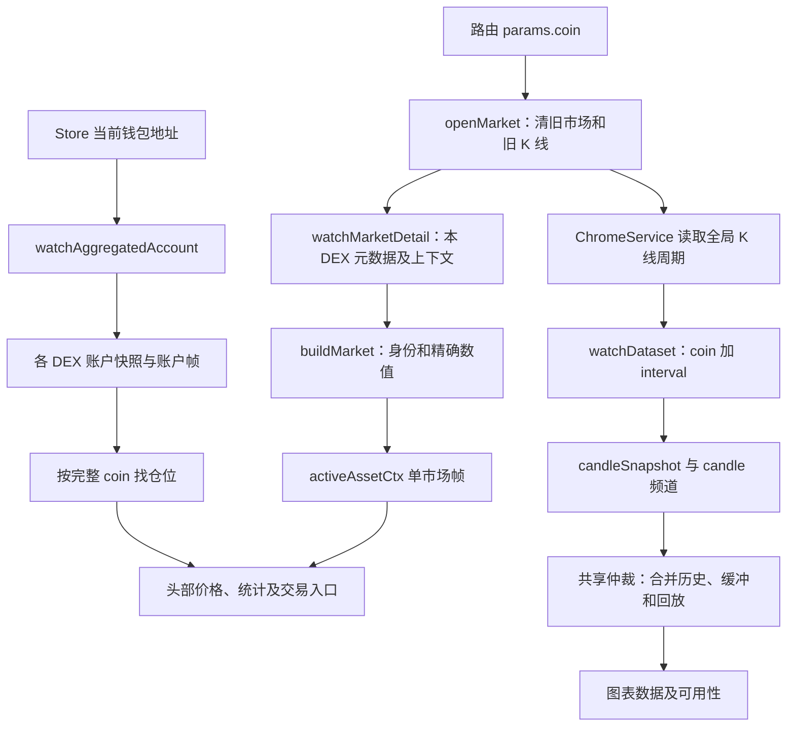

# perps market/:coin 页面行为与证据

整理日期：2026-09-23。代码基线：`205e192f` 及整理时的工作区内容。对应路由为 `/popup/perps/market/:coin`，组件目录为 `perps-market`；不是独立的 `perps-markets` 搜索页，也不是 `perps-coin-logo` 图标组件。领域术语见 [CONTEXT.md][context]。

本页展示单个市场的价格、K 线、统计和当前钱包的对应仓位，并提供下单入口。页面自身不签名、不提交订单、不修改杠杆或保证金；唯一持久化的页面偏好是 K 线周期。本文区分当前代码行为、已有测试、协议依据和仍待执行的验收。

| 要理解的问题 | 需要拿到的证据 | 本文对应内容 |
| --- | --- | --- |
| 用户做了什么，预期结果是什么？ | 入口页面、操作步骤、验收条件 | 第 1 节：浏览、换币、切周期和交易入口 |
| 数据如何流动？ | 从输入到请求，再到页面更新的调用链 | 第 2 节：单市场行情、K 线、账户及切换器 |
| 核心规则是什么？ | 数量、价格、杠杆、保证金、手续费的计算及单位 | 第 3 节：行情计算、仓位来源、图表和资金费 |
| 状态如何变化？ | 等待签名、已提交、成功、失败、取消等状态 | 第 4 节：市场、连接与图表的独立状态 |
| 异常怎么处理？ | 拒签、超时、断网、余额不足、重复点击 | 第 5 节：读取失败、数据缺失及操作边界 |
| UI 与真实结果如何保持一致？ | 请求响应、订阅、轮询、刷新和重连逻辑 | 第 6 节：快照仲裁、重连、节流和回收 |
| 正确性怎么证明？ | 协议文档、测试、可复现操作，而非仅靠代码解释 | 第 7 节：外部依据、测试记录和验收方案 |

## 1. 用户做了什么，预期结果是什么？

入口包括首页市场列表、独立搜索页列表、首页仓位卡片，以及详情页自身的币种切换器。它们都使用完整协议 coin 导航，例如 BTC 或 `xyz:XYZ100`。Perps 父路由检查钱包和 NeoX 链类型；market 子路由没有额外资金操作守卫。

| 操作 | 当前行为及验收条件 |
| --- | --- |
| 打开详情 | 标题显示 symbol、DEX 徽标和市场 maxLeverage；行情读取完成后展示价格、涨跌、统计，下方独立加载 K 线 |
| 查看价格 | 正的有效中间价优先，缺失时退回正的有效标记价并显示标记价标签；两者不可用显示 N/A，不显示 `$0` |
| 打开币种切换器 | 搜索框自动聚焦，共用市场列表，当前 coin 高亮；没有排序选择控件，默认按成交量排序并置顶指定资产 |
| 搜索并换币 | 按 symbol 忽略大小写的包含匹配，去掉关键词首尾空格；选择后关闭菜单并清关键词，路由参数变化驱动同一组件换市场 |
| 选择当前币/取消菜单 | 选择事件也会关闭菜单，即使路由没有变化；遮罩或再次点箭头关闭。重新打开不保留上次关键词 |
| 切换 K 线周期 | 默认 15m；快捷项 1m/5m/15m/1h，更多项 12h/1D/1W/1M；按协议值存储，分钟 `1m` 与月份 `1M` 不互换 |
| 缩放/向左滚动 | 初始显示约 30 根及右侧 2 根空位；接近已有历史左边缘时请求更早 K 线，前插后保持用户正在看的窗口 |
| 查看已有仓位 | 聚合账户中按完整 coin 精确匹配；有仓位时显示方向、实际杠杆、数量、仓位价值、入场价、资金费、强平价、保证金及未实现盈亏 |
| 无仓位时点击做多/做空 | 导航 `/popup/perps/order/{coin}?side=long` 或 `side=short`，尚未创建订单 |
| 有仓位时点击加仓/平仓 | 导航 `/popup/perps/order/{position.coin}?add=1` 或 `close=1`，操作继续由下单页处理 |
| 连接不实时 | 保留已有行情，stale 时显示提示并调暗；交易入口只在 marketStatus=ready 且 connectionState=live 时可用 |
| 返回 | 固定回 `PERPS_HOME_URL`，不按浏览器历史返回搜索页 |
| 学习基础知识 | 新标签打开 Hyperliquid 永续合约说明页；不发送订单 |

市场不存在或读取失败时，币种切换器、返回和学习入口仍在。missing 隐藏图表与交易区域；error 显示加载失败，图表仍按自己的读取结果展示。当前没有市场手动刷新按钮、收藏、订单簿或本页成交记录。

证据：[详情组件][component]、[模板][html]、[路由][route]、[父路由][popup-route]、[首页导航][tab]、[列表选择][market-list]、[搜索页][markets]、[下单页文档][order-doc]。

## 2. 数据如何流动？

### 2.1 三条独立链路



头部价格不读最后一根 K 线的 c，切周期不改变价格来源。账户跟随地址，换 coin 只改变仓位过滤条件；行情和 K 线也不等待账户读取成功。

| 数据 | 请求/订阅及适配 | 更新到 UI |
| --- | --- | --- |
| 单市场静态事实 | `watchMarketDetail(coin)` → 必要时 perpDexs → 本 DEX metaAndAssetCtxs → buildMarket | symbol、DEX、assetId、szDecimals、maxLeverage 等 |
| 单市场动态行情 | 首次上下文，随后 `{type:'activeAssetCtx',coin}`，每次按同一 ctx 计算 | 中间价、标记价、24h 涨跌、成交额、持仓量、资金费率、预言机价 |
| K 线初始/补取 | `getCandleRange()` → POST `/info`，type=candleSnapshot，req 含 coin、interval、startTime、endTime | 合并到对应数据集，再送 perps-chart |
| K 线实时帧 | `{type:'candle',coin,interval}`；通道按 coin/interval 分发，批量消息拆帧 | 替换正在形成的尾柱或追加新柱 |
| 当前钱包仓位 | Store → 地址 → `watchAggregatedAccount(address)` → 已启用 DEX 的 `watchAccount` | `account.positions.find(item.coin===coin)`，决定仓位面板及按钮文案 |
| 币种菜单 | `perps-market-list` → `watchMarkets()`，全列表快照加 allDexsAssetCtxs | 搜索结果、置顶、分页和当前项高亮 |
| 周期偏好 | ChromeService.getStorage/setStorage，key=perpsChartInterval | 跨市场共用一个周期；不存 K 线或视口 |

读取端点由构建配置选择：仅非 production 且 perpsNetwork=testnet 时使用测试网，生产构建固定主网；不是随钱包中 NeoX 网络选择切换。当前启用标准 DEX `''` 和 xyz。协议 JSON 先经 `parseProtocolJson` 读取，业务小数保留精确值。

证据：[行情服务][market-service]、[行情适配][market-model]、[K 线服务][candle-service]、[读取服务][hyperliquid]、[账户服务][account-service]、[数据通道][channel]、[频道身份][channel-identity]、[配置][model]、[精度约定][adr-precision]。

### 2.2 单市场读取与切换器不能混用

详情只请求当前 coin 所在的 DEX。标准市场无需注册表；HIP-3 先查 perpDexs，注册表缓存 6 小时，失败不缓存。元数据的 universe 与 ctxs 按原始下标配对，过滤下架项后也不能重算资产下标。REST 成功后才接 activeAssetCtx；首次请求在途期间的单市场帧不缓冲，后续完整 ctx 更新价格与统计。

切换器才使用全列表：集合与实时帧由共享数据集管理，完整快照的 120 秒 TTL 用于新观察者判断是否重取，并非每 120 秒定时刷新。部分 DEX 失败显示列表不完整；列表后台重试与详情的短重试不是同一机制。

菜单中的列表默认成交量降序，symbol 为 NEO/GAS 的项单独置顶，不是用户收藏；普通项每次显示 30 个，“加载更多”只增加本地渲染数量。价格帧每约 250ms 合并重绘，不因数值变化重新排行；搜索、重新进入或匹配市场集合变化会重建顺序并回第一页。搜索的是裸 symbol，输入完整 `xyz:XYZ100` 不保证匹配。详情标题有 DEX 徽标，但菜单行目前不显示 DEX 徽标，同名跨 DEX 项需专项验收。

证据：[详情数据源][market-service]、[列表组件][market-list]、[列表模板][list-html]、[列表测试][list-test]。

### 2.3 K 线快照、历史和恢复

1. 先观察 `{coin,interval}` 数据集并建立 candle 订阅，再发初始快照。请求窗口为 `now - intervalMs×500` 到 now，初始响应保留最后 500 根；这不是会话内总根数上限。
2. 核心在 REST 在途时照常应用帧，同时缓冲，快照返回后逐帧回放。同一尾柱的新帧覆盖旧值；早于当前尾柱的帧丢弃，不重新打开已收盘柱子。
3. 左边缘触发 `loadEarlier()`，每次向前请求 500 个周期，过滤重复的末端柱。历史与当前数据按 t 合并，重叠历史页不覆盖已有较新数据；快照修正则可覆盖相同时间的旧 OHLCV。
4. 空历史页只前移已探测区间，不断言历史已到底；失败释放在途标记，保留原图。再次探测通常需要先滚离左边缘再回来。服务按已有最新柱计算 5000 个周期的查询边界。
5. stale→live 时从已知尾柱到当前时间补缺。若尾柱比可恢复窗口更老，成功时替换为可查询数据；失败或此类整段重载返回空，则保留旧图并标 gapped。

官方只承诺最近 5000 根 K 线可用。代码把它换算成周期时间范围；月线按 30 天估请求范围，实际柱边界仍取服务端 t/T。稀疏市场不一定每周期都有柱，因此该时间推算不构成“完整遍历最近 5000 根实际成交柱”的证明。[Candle snapshot 协议][p-info]

证据：[K 线数据集服务][candle-service]、[窗口与合并函数][candle-model]、[共享仲裁核心][dataset]、[图表左边缘判断][chart]。

## 3. 核心规则是什么？

### 3.1 市场身份、行情与显示单位

| 项目 | 当前规则与单位 |
| --- | --- |
| coin / symbol / key | coin 保留完整 `dex:symbol`；symbol 去 DEX 前缀；key 为 `${dex或hl}:${symbol}`。请求、导航、仓位匹配都不能只用 symbol |
| assetId | 标准永续为原 universe 下标；HIP-3 为 `100000 + dexIndex×10000 + 原下标`，dexIndex 来自注册表 |
| 详情展示价 | 优先有限且大于 0 的 midPxExact，否则使用满足同条件的 markPxExact；两者都不满足则 null |
| 24h 涨跌幅 | 有正 mid 和正 prevDayPx 时，`(mid-prevDayPx)/prevDayPx×100`；显示 2 位百分比，负值着色；缺失为无数据，不补 0% |
| 24h 成交额 | 直接读 dayNtlVlm，以美元缩写 K/M/B/T 显示；不由本页 K 线量柱累加 |
| 未平仓量 | `openInterestSizeExact × markPxExact`，把协议基础资产数量转美元名义值；缺任一字段则 null |
| 预言机价格 | oraclePxExact 独立显示；不充当头部中间价，不由本页重建预言机 |
| 头部最大杠杆 | 元数据 maxLeverage，不是用户当前杠杆，也不是对任意规模订单的杠杆承诺 |
| 价格文本 | 按 `max(0,6-szDecimals)` 限小数位，中间价允许再多 1 位；十进制四舍五入，千位分隔、去尾零，不在显示时强制 5 位有效数字 |
| 图表坐标精度 | `max(0,6-szDecimals)`，市场信息未到时默认 4；不随当前价格恰好为整数而缩小 |

例：mid=101、prevDayPx=100 显示 +1.00%；mark=102 不改变这项涨跌。若 mid 不可用，则头部可显示标记价 102，但涨跌不可用。openInterest=2、mark=102 时统计持仓量为 $204。

价格显示与订单合法性校验是两个步骤。协议订单价格还有有效数字等规则，不能把本页能显示的中间价直接认定为可提交的限价。[Tick and lot size][p-precision]、[资产标识][p-assets]

证据：[行情适配][market-model]、[格式化函数][util]、[模板][html]、[组件价格判定][component]。

### 3.2 仓位、保证金及资金费

| 项目 | 数据或公式 | 页面含义 |
| --- | --- | --- |
| 数量/方向 | sziExact；显示绝对值，按 szDecimals 格式化；正为多、负为空 | 单位为基础资产 symbol；零仓位在账户解析时过滤 |
| 仓位价值 | positionValueExact | 服务端给出的美元价值，不用头部 mid 重新估值 |
| 实际杠杆 | position.leverage.value，缺失时本地默认 1 | 展示倍数；本页无调整入口，也不展示 cross/isolated 类型 |
| 入场/强平价格 | entryPxExact / liquidationPxExact | 按市场价格精度显示；空值 N/A，不在本地重新计算强平价 |
| 保证金 | marginUsedExact | 美元金额；不使用“仓位价值÷杠杆”覆盖协议值 |
| 未实现盈亏 | unrealizedPnlExact | 服务端值，带正负号美元显示 |
| 权益回报率 | returnOnEquityExact×100 | 百分比，仓位模板保留 1 位小数；不重新以本地保证金计算 |
| 开仓以来资金费 | `-fundingSinceOpenExact` | 本地约定 sinceOpen 正数表示支付，取反后显示负美元金额；缺失 N/A，不由当前费率乘持仓时长估算 |
| 市场每小时资金费率 | fundingExact×100 | 显示 4 位百分比；小于 0.0001% 的非零值保留方向并显示阈值；不是交易手续费 |
| 下一整点倒计时 | `3600000 - Date.now()%3600000`，向下取秒，HH:MM:SS | 每秒更新、依赖本机时钟；整点变为下一小时，不代表本账户已实际结算 |

例如 funding=0.0000125 显示 0.0013%；sinceOpen=0.03 显示 -$0.03，sinceOpen=-0.03 显示 $0.03。模板中的收到资金费金额没有额外加 `+`。

本页不请求用户 maker/taker 费率、不估下单手续费，也不支付资金费。官方说明资金费按小时结算，结算金额采用仓位数量、预言机价格和适用资金费率；页面只显示服务端费率和累计字段，不实现协议的溢价采样或结算计算。[Funding][p-funding]

证据：[账户解析][account-model]、[组件 position/positionFundingText/tickCountdown][component]、[模板][html]、[格式化工具][util]、[仓位渲染测试][render-test]。当前引用的接口说明提供 cumFunding 等字段，但未完整解释 sinceOpen 的符号及 prevDayPx 的取样口径；相关本地规则仍需真实账本/官方前端对照，不能仅靠注释认定协议含义已核验。

### 3.3 图表数据与视口

K 线 o/h/l/c 为价格，v 为基础资产成交量。量柱显示 `v×c` 的美元估算，先用 BigNumber 相乘再转图表 number；这不是逐笔 `Σ成交价×成交量`，不能用它精确对账 24h dayNtlVlm。[WebSocket Candle 字段][p-ws]

时间坐标为 `floor(t/1000)` 的 UTC 秒，不平移原始时间；刻度和十字光标文本使用本机时区。月线仍使用服务端真实开始时间，不能把 30 天窗口估计当成月线长度。

图表使用项目锁定的 lightweight-charts 4.2.3。尾部少量变化逐柱 update；已收盘柱被修正或一次追加超过 100 根时 setData 后恢复原逻辑范围；历史前插按实际可绘制柱数平移范围。coin/interval 改变则作为新序列重建近期窗口；清空数据也清旧图。

不可转为有效坐标的时间或 OHLC 会被丢弃并 console.warn；量值不可用时只跳过量柱，合法的零成交量可画为零。此处检查有限值、正价格和非负量，未完整验证 OHLC 高低关系或所有响应时间排序；跳过点也没有专门页面提示。

证据：[图表组件][chart]、[图表模板][chart-html]、[图表测试][chart-test]、[周期常量][model]。

## 4. 状态如何变化？

本页没有等待签名、已提交、交易成功或撤单状态。交易按钮成功只表示导航进入下单页；关闭菜单、切周期或离开页面不撤销任何订单。

| 状态维度 | 状态/事件 | UI 与后续行为 |
| --- | --- | --- |
| 市场 | loading | 清上一市场，价格和统计骨架；币种切换仍可用 |
| 市场 | ready | 展示行情和统计；是否能进下单页还要看连接状态 |
| 市场 | missing | 显示找不到市场，隐藏图表/仓位/统计/交易区域；当前实现的 null 判定范围见第 5 节 |
| 市场 | error | 首次读取失败且没有旧 market；停止市场骨架并显示失败，保留换币和图表独立状态 |
| 连接 | connecting | ready 市场的按钮禁用，提示正在连接；不显示 stale 横幅 |
| 连接 | stale | 已有值保留并调暗，提示非实时，交易入口关闭 |
| 连接 | stale→live | 重取市场静态事实，K 线独立补缺，账户独立重取；首次 connecting→live 不额外重取市场 |
| 图表 | loading | 加载层；已有缓存/实时柱可先使数据集变 live |
| 图表 | live + 空数组 | 无图表数据，区别于请求异常；没有虚构零价柱 |
| 图表 | unavailable | 无可信初始数据，页面显示加载失败，空图仍可能同时显示无数据文案 |
| 图表 | gapped | 保留已有柱并提示图表中断；后续实时尾柱不会自动清除缺口标记 |
| 账户 | 有/无匹配仓位 | 有则显示仓位及加仓/平仓；无则显示做多/做空。组件没有单独保存账户 availability |
| 切币 | params 变化 | 退订旧市场与旧 K 线视图，立即清旧柱，关两个菜单，再读新市场及周期 |
| 离开 | ngOnDestroy | 退订页面订阅和待返回的周期读取，清倒计时；共享服务按观察者和在途工作决定实际回收 |

`canOrder` 仅判断 ready 与 live，不检查 mid、图表是否 gapped、账户是否完整、余额或签名方式。没有可用中间价时仍允许进入下单页，由下单页决定市价/限价能否继续。这里不能把“入口可点”解释为“订单一定可成交”。

证据：[组件状态及入口方法][component]、[模板][html]、[K 线服务][candle-service]、[下单页职责][order-doc]。

## 5. 异常怎么处理？

| 异常 | 当前处理 | 边界 |
| --- | --- | --- |
| 不支持的 DEX、找不到 coin、下架 | watchMarketDetail 返回 null，显示 missing | 无需等全列表成功；币种切换器仍可打开 |
| 注册表不含目标 DEX、元数据缺 ctx | 同样可能返回 null | 当前 missing 不仅代表确认下架；缺字段/旧注册表可能被读作不存在 |
| 单市场 HTTP 0/5xx | 首次加最多 3 次重试，间隔 1 秒；耗尽后 error | 4xx 含 429、解析异常不做这类短重试；没有整个读取的显式 timeout |
| 市场初始读取失败 | 不在组件定时自动重试，无手动重试按钮 | 换币再换回、重新进入或后续 stale→live 可触发新读取；点击当前币一般只关菜单 |
| 重连市场快照失败 | 有旧 market 时保留 ready 和旧单市场流 | socket 已 live 时入口可恢复，即使静态元数据重取失败；没有额外元数据过期提示 |
| K 线初始快照失败 | 无缓存时 unavailable，有已有缓存时保留 | 该读取不使用详情行情的 3 次重试；candleSnapshot 也没有显式 timeout |
| K 线补缺失败 | 保留数据并标 gapped，尾柱继续更新也不清掉 | 没有专用重试按钮；重连或重新订阅的数据读取可再次尝试 |
| 历史翻页失败/空页 | 释放加载锁，保留图；空页记录已问范围 | 没有历史页专用加载/失败提示，不自动无限追前页；滚离边缘再回来可再问 |
| 返回非数组 K 线 JSON | getCandleRange 转成 [] | 会被当空结果，不能把所有“无数据”都视为协议确认没有成交 |
| 缺 mid / 缺所有头部价格 | 标记价降级或 N/A，涨跌无数据 | 不单因缺价格禁止导航；统计预言机模板仍无条件前置 `$`，缺值可能显示 `$N/A` |
| 账户读取失败或缺某个 DEX | 服务保留 stale 或发布 incomplete/unavailable，组件只取 account | 没有独立账户错误提示；隐藏仓位不能单独证明真实无仓位 |
| 断网/心跳无应答 | 连接 stale，保留数据，指数退避重连 | 每个频道健康度没有单独计时，socket live 不能证明每个订阅都交付了新帧 |
| 重复点周期/快速换周期 | 当前同周期只关菜单；不同周期共用 300ms 快照配给窗口，合并尚未发出的请求 | 已发出的共享请求不保证取消；结果归原数据集，不应覆盖当前图 |
| 图标加载失败 | img error 后字母色块，颜色由 symbol 稳定散列 | 完整 coin 决定资源地址；若选中的内置资源失败，组件直接退字母，不再逐级尝试 CDN |
| 拒签、余额不足、重复提交订单 | 本页没有相关写操作 | 导航后由 perps-order 处理，不能把详情入口的禁用当成资金安全校验 |

证据：[单市场服务][market-service]、[读取失败分类][fetch-failure]、[K 线服务][candle-service]、[读取适配][hyperliquid]、[组件][component]、[模板][html]、[图标组件][logo]、[图标解析][util]。

## 6. UI 与真实结果如何保持一致？

| 机制 | 当前实现及作用 |
| --- | --- |
| 路由跟随 | 订阅 params 而不是只读 snapshot；先清旧柱再改变 seriesKey，避免旧币 K 线出现在新 URL 下 |
| 市场恢复交接 | 刷新时保留旧 activeAssetCtx；新快照到达后才替换旧流，失败不切断旧价格；切币/销毁会同时退订旧流与待刷新订阅 |
| 账户地址隔离 | 新的非空地址先清 account，再退旧账户流、订新聚合流；回调再次核对地址。换 coin 不重建账户流 |
| 共享 K 线仲裁 | 同 key 并发 refresh 共用在途请求；在途帧缓冲后回放，重连请求排队到前一次结束，不跨数据集回填 |
| K 线重绘节流 | 每个状态先 tap 吸收，随后 throttleTime 1000ms，leading/trailing 都开；可用性变更立即 markForCheck，不丢掉整帧领域数据 |
| 图表窗口 | 尾柱更新、历史修正、历史前插与换序列分开处理；保持缩放/滚动的是本次组件视口，离开后不持久恢复 |
| 周期快照配给 | 首次立即请求，300ms 内待发请求合并到最后仍有人观察的 key；不会回头请求已经离开的中间周期 |
| 会话缓存 | 记住最多 8 个最近使用的非空 K 线数据集；末柱距 now≤2.5 个周期才先画缓存，随后仍取快照；单个数据集不按 500 根裁剪 |
| 连接恢复 | 通道共用 socket、按频道引用计数；30 秒 ping，10 秒未 pong 则 stale 并关闭；1/2/4…秒重连，上限 30 秒，恢复活跃订阅 |
| 订阅回收 | 频道最后观察者离开后延迟 500ms 退订；数据集仍有在途快照或历史 keepAlive 时暂留，工作结束且无人观察才释放 |
| 轮询范围 | 组件每秒倒计时不是行情轮询；没有固定间隔 REST 行情/K 线轮询，更新依赖帧、用户动作和重连 |

详情的 activeAssetCtx 不经过共享快照仲裁器；K 线、列表和账户才使用它。不能把 ADR 中“统一快照与帧”的规则扩展为详情也在首次请求期间缓存了每一帧。

页面退订不等于底层所有 HTTP 已取消：数据集服务拥有在途工作，注册表也使用缓存共享请求。当前 info 读取缺显式 timeout，长期不返回的请求可能延迟共享条目的回收。

证据：[详情组件][component]、[共享核心][dataset]、[K 线服务][candle-service]、[数据通道][channel]、[图表][chart]、[共享仲裁 ADR][adr-dataset]。

## 7. 正确性怎么证明？

### 7.1 协议及本地证据

以下官方资料于 2026-09-23 在线核对。本次没有连接真实行情录屏、操作真实账户或提交订单。

| 证据 | 能证明的范围 |
| --- | --- |
| [Perpetuals info][p-perps] | perpDexs、metaAndAssetCtxs、账户仓位字段和 DEX 请求方式；不等同于完整解释每个字段的业务口径 |
| [Candle snapshot][p-info] | coin/interval/毫秒范围请求、HIP-3 前缀、仅最近 5000 根可用 |
| [WebSocket subscriptions][p-ws] | activeAssetCtx、candle、allDexsAssetCtxs 的身份与字段；K 线时间及基础资产量单位 |
| [Asset IDs][p-assets] | 标准与 HIP-3 资产编号、协议 coin 标识区别 |
| [Tick and lot size][p-precision] | 订单精度约束；本页显示精度仍要单独用本地函数测试 |
| [Funding][p-funding] | 小时结算、费率方向和预言机名义价值口径；不能把本机倒计时当已结算凭据 |
| [精度 ADR][adr-precision]、[数据集 ADR][adr-dataset] | 仓库的字符串数值、快照与帧仲裁约定；实际行为需同时核对实现和测试 |

最小验收证据应同时包含：构建网络、完整 coin、请求及订阅参数、原始响应/帧、对应计算结果和页面截图。K 线另需 t/interval、断线前后快照以及视口范围；仓位需钱包地址和完整账户响应。只看代码、只看价格动了或只看测试通过，都不能证明没有串币、错单位或遗漏恢复数据。

### 7.2 已有测试与本次结果

| 测试 | 主要覆盖 |
| --- | --- |
| [详情组件测试][component-test] | mid/mark 降级、入口状态、完整 coin 导航、仓位匹配、周期存取、路由切换清图、销毁取消读取、重连交接及节流 |
| [详情渲染测试][render-test] | 模板菜单、周期标签、仓位面板、资金费符号、做多/做空与加仓/平仓入口 |
| [行情服务测试][market-test] | DEX/元数据身份、上下文计算、列表完整性与重试、单市场读取与 activeAssetCtx |
| [K 线数据集测试][candle-test] | 同柱更新、迟到帧、快照仲裁、缓存、请求配给、历史翻页与断线补缺 |
| [图表测试][chart-test] | 近期窗口、尾柱更新、历史修正/前插保持视口、异常数值、美元量柱和时区标签 |
| [列表测试][list-test] | 搜索、排序快照、分页、缺失涨跌和不完整列表 |
| [共享数据集测试][dataset-test]、[通道测试][channel-test] | 并发请求、缓冲/回放、重连排队、引用计数、心跳及频道身份 |
| [账户服务测试][account-service-test]、[账户解析测试][account-model-test]、[读取服务测试][hyperliquid-test]、[格式化测试][util-test] | 仓位精确值、跨 DEX 状态、协议请求及显示边界；本次包含共享模块的其他用例 |

在仓库根目录执行：

```bash
nvm use
npm run lint
npm run test:ci -- \
  --include='src/app/popup/perps/perps-market/*.spec.ts' \
  --include='src/app/popup/perps/perps-market-list/*.spec.ts' \
  --include='src/app/popup/perps/perps-chart/*.spec.ts' \
  --include='src/app/core/services/perps/perps-market-dataset.service.spec.ts' \
  --include='src/app/core/services/perps/perps-candle-dataset.service.spec.ts' \
  --include='src/app/core/services/perps/perps-dataset.spec.ts' \
  --include='src/app/core/services/perps/perps-data-channel.service.spec.ts' \
  --include='src/app/core/services/perps/perps-account-state*.spec.ts' \
  --include='src/app/core/services/perps/hyperliquid.service.spec.ts' \
  --include='src/app/popup/perps/perps.util.spec.ts' \
  --reporters=dots
```

本次环境：Node `16.20.1`、npm `8.19.4`、ChromeHeadless `154`。定向测试 **329 项通过**。`npm run lint` **未通过**：现有 [资金页模板][funding-html] 第 49 行 `withdrawableExact != null` 触发 `@angular-eslint/template/eqeqeq`，要求 `!==`；本次仅新增文档，未修改该模板。未执行全量测试、生产构建或真实端到端交易验收。

### 7.3 可复现验收方案（本次未执行）

准备标准永续和已启用 HIP-3 市场、一个有仓位的钱包以及可控制 REST/WS 延迟和失败的替身。保留公开接口响应、截图和时间顺序；交易入口验收停在下单表单即可，不需要提交真实订单。

| 编号 | 操作步骤 | 验收条件/需核对结果 |
| --- | --- | --- |
| M1 入口与身份 | 从首页列表、搜索结果、仓位卡进入；打开标准及 `xyz:` 市场 | URL、meta 请求 DEX、activeAssetCtx coin、K 线 coin、标题和仓位一致；不丢前缀 |
| M2 菜单 | 搜索小写/空格关键词，选择当前币、另一币、点遮罩；设置同名跨 DEX 数据 | 匹配裸 symbol，关闭清关键词；当前项精确高亮；记录菜单缺 DEX 徽标时是否可辨识 |
| M3 价格与统计 | 设置 mid=101、prev=100、mark=102、OI=2，再给缺失/零/非法 mid | +1.00%、$204；退标记价有标签且涨跌不可用；两价都无效显示 N/A；预言机缺值另核对 |
| M4 周期与存储 | 选择八种周期，重开/换币；存入 1D、旧版本周期或非法值 | 请求仍用 1d/1w/1M 等协议值；偏好全局复用，非法存储不传入数据集；验证存储延迟/失败边界 |
| M5 快速切换 | 300ms 内连换周期、币种，在旧快照/旧周期读取延迟时切走 | 新 URL 下立即没有旧柱；只发必要的待发快照；旧响应留在自己的 key，不覆盖新页面 |
| M6 快照与帧竞态 | 延迟快照，同时间尾柱先到较新 WS，再给旧快照；补一根迟到已收盘帧 | 当前尾柱不被旧快照回退；早于当前尾柱的帧忽略；历史快照修正按约定落图 |
| M7 图表视口与单位 | 缩放到中部后推尾柱、新柱、已收盘修正、超过 100 根恢复及前插 | 不无故跳回最新；量柱=v×c；UTC t 不变、标签本地化；无效量不伪装成零 |
| M8 历史边界 | 滚到左边缘，返回正常页、重复末端、空页和失败；滚离再回来 | 同一在途页不重复，重复末柱不回退；空页可继续向前，失败不删旧图；记录稀疏/月线查询边界 |
| M9 断线恢复 | 模拟无 pong、断线期间关闭多根柱、恢复成功与失败 | stale 提示及入口关闭；恢复重订并补缺；补缺失败 gapped 保留，尾柱更新不清提示 |
| M10 市场事实变化 | 断线期间下架或改 maxLeverage；恢复快照成功/失败 | 成功取到 null 则 missing；成功元数据更新；失败保留旧流，记录入口恢复但静态事实未更新的边界 |
| M11 仓位与账户 | 有/无仓位、正负 szi、正负 sinceOpen；模拟一个 DEX 账户失败 | 方向、绝对数量、资金费符号正确；按钮文案随匹配仓位；账户不完整不能误验为真实无仓位 |
| M12 交易入口 | ready 下分别设 connecting/stale/live，缺 mid 或 K 线 gapped；点四类入口 | 仅 ready+live 可导航；完整 coin 和 query 正确；不产生签名或 exchange 写请求 |
| M13 销毁和钱包切换 | 延迟 storage/账户/行情/K 线响应时换非空地址、清空钱包、离页 | 新地址不见旧仓位；离页后不新建周期订阅；清空钱包分支及共享请求回收单独记录实际结果 |
| M14 外部对照 | 固定网络/coin/时间，核对接口与官方前端；资金费跨一个真实结算点 | 对照 mid、prevDayPx 口径、OI 单位及 sinceOpen 符号；倒计时归零本身不算结算证据 |

### 7.4 当前边界与待补证据

1. **连接健康度不等于各数据源完整。** canOrder 不等待账户完整或 K 线补缺；重连元数据失败仍可能显示旧 maxLeverage。需要分别保存行情、账户和图表证据。
2. **失败和不存在尚有混淆点。** 缺上下文可进入 missing，非数组 K 线结果转为空数组；不能把所有空页面归因为协议确认没有该市场或成交。
3. **账户状态在组件被简化。** 只消费 state.account，没有显示 loading/incomplete/stale 等账户状态；钱包地址变空也没有主动清理旧 account 的分支。相关场景需 UI 验收，不能宣称完整隔离已被证明。
4. **周期存储仍有异步边界。** 初始读取只处理 next，未处理错误；用户先切周期、旧存储后返回时可能再次覆盖选择。setStorage 结果不等待，持久化成功没有页面反馈。
5. **历史完整性有实现假设。** 5000 根换算为固定时长、月按 30 天估算、无成交周期的空缺及原始快照排序，都需要稀疏市场样本核对；正常重连的空响应也不证明每个缺失时间段已补全。
6. **恢复状态不持久化。** 会话缓存只保存柱数组，不保存 gapped 及视口；重新进入并失败补取时不能仅凭缓存出现就认定历史完整。单个数据集随会话增大，没有总根数裁剪。
7. **界面价格和结算含义不同。** 头部 mid、标记估值、预言机结算以及 K 线 close 各有用途；v×c 是图表名义量估算。prevDayPx 和 sinceOpen 的具体口径仍需真实外部对照。
8. **证明范围有限。** 本次 329 项是现有定向单元/模板测试；M1–M14 为待执行方案，不代表已完成浏览器实测、实时行情对账或下单成功验证。

[context]: ./CONTEXT.md
[component]: ./perps-market.component.ts
[html]: ./perps-market.component.html
[component-test]: ./perps-market.component.spec.ts
[render-test]: ./perps-market.component.render.spec.ts
[route]: ../perps.route.ts
[popup-route]: ../../popup.route.ts
[tab]: ../perps-tab/perps-tab.component.ts
[markets]: ../perps-markets/perps-markets.component.ts
[market-list]: ../perps-market-list/perps-market-list.component.ts
[list-html]: ../perps-market-list/perps-market-list.component.html
[list-test]: ../perps-market-list/perps-market-list.component.spec.ts
[logo]: ../perps-coin-logo/perps-coin-logo.component.ts
[chart]: ../perps-chart/perps-chart.component.ts
[chart-html]: ../perps-chart/perps-chart.component.html
[chart-test]: ../perps-chart/perps-chart.component.spec.ts
[util]: ../perps.util.ts
[util-test]: ../perps.util.spec.ts
[model]: ../../_lib/perps.ts
[order-doc]: ../perps-order/README.md
[funding-html]: ../perps-funding/perps-funding.component.html
[market-service]: ../../../core/services/perps/perps-market-dataset.service.ts
[market-model]: ../../../core/services/perps/perps-market-dataset.ts
[market-test]: ../../../core/services/perps/perps-market-dataset.service.spec.ts
[candle-service]: ../../../core/services/perps/perps-candle-dataset.service.ts
[candle-model]: ../../../core/services/perps/perps-candle-dataset.ts
[candle-test]: ../../../core/services/perps/perps-candle-dataset.service.spec.ts
[dataset]: ../../../core/services/perps/perps-dataset.ts
[dataset-test]: ../../../core/services/perps/perps-dataset.spec.ts
[account-service]: ../../../core/services/perps/perps-account-state.service.ts
[account-model]: ../../../core/services/perps/perps-account-state.ts
[account-service-test]: ../../../core/services/perps/perps-account-state.service.spec.ts
[account-model-test]: ../../../core/services/perps/perps-account-state.spec.ts
[hyperliquid]: ../../../core/services/perps/hyperliquid.service.ts
[hyperliquid-test]: ../../../core/services/perps/hyperliquid.service.spec.ts
[channel]: ../../../core/services/perps/perps-data-channel.service.ts
[channel-identity]: ../../../core/services/perps/perps-channel-identity.ts
[channel-test]: ../../../core/services/perps/perps-data-channel.service.spec.ts
[fetch-failure]: ../../../core/services/perps/perps-fetch-failure.ts
[adr-precision]: ../../../../../docs/adr/0001-protocol-precision-only-domain-model.md
[adr-dataset]: ../../../../../docs/adr/0008-shared-dataset-snapshot-frame-arbiter.md
[p-info]: https://hyperliquid.gitbook.io/hyperliquid-docs/for-developers/api/info-endpoint#candle-snapshot
[p-perps]: https://hyperliquid.gitbook.io/hyperliquid-docs/for-developers/api/info-endpoint/perpetuals
[p-ws]: https://hyperliquid.gitbook.io/hyperliquid-docs/for-developers/api/websocket/subscriptions
[p-assets]: https://hyperliquid.gitbook.io/hyperliquid-docs/for-developers/api/asset-ids
[p-precision]: https://hyperliquid.gitbook.io/hyperliquid-docs/for-developers/api/tick-and-lot-size
[p-funding]: https://hyperliquid.gitbook.io/hyperliquid-docs/trading/funding
