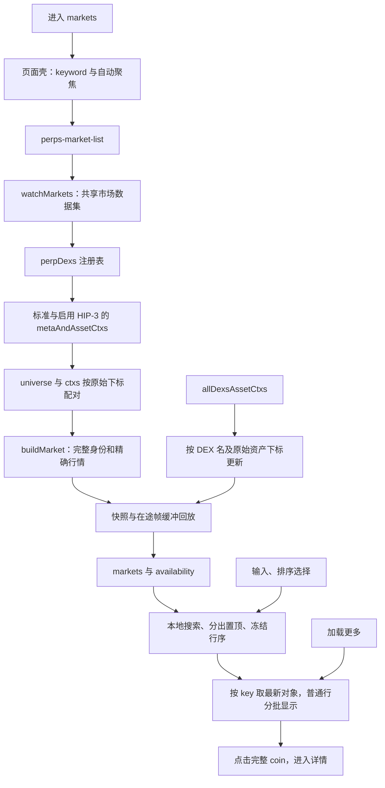

# perps/markets 页面行为与证据

整理日期：2026-09-23。代码基线：`205e192f` 及整理时的工作区内容。本文对应 `/popup/perps/markets` 独立市场搜索页，包含其共用的 `perps-market-list` 和行情数据集；单市场详情另见 [market/:coin 文档][detail-doc]。

本页用于搜索、比较和选择本产品已启用的永续市场。搜索、排序和“加载更多”都在已有数据上执行，不是按关键词查询交易所或向服务器翻页。页面不读取账户余额，不签名，不提交订单，也不保存搜索或排序偏好。

| 要理解的问题 | 需要拿到的证据 | 本文对应内容 |
| --- | --- | --- |
| 用户做了什么，预期结果是什么？ | 入口页面、操作步骤、验收条件 | 第 1 节：搜索、排序、翻页及导航 |
| 数据如何流动？ | 从输入到请求，再到页面更新的调用链 | 第 2 节：页面壳、共用列表、REST 与 WS |
| 核心规则是什么？ | 数量、价格、杠杆、保证金、手续费的计算及单位 | 第 3 节：筛选、置顶、行序、价格和单位 |
| 状态如何变化？ | 等待签名、已提交、成功、失败、取消等状态 | 第 4 节：加载、完整性、连接与空结果 |
| 异常怎么处理？ | 拒签、超时、断网、余额不足、重复点击 | 第 5 节：部分失败、重试和交互边界 |
| UI 与真实结果如何保持一致？ | 请求响应、订阅、轮询、刷新和重连逻辑 | 第 6 节：快照仲裁、缓存、恢复和回收 |
| 正确性怎么证明？ | 协议文档、测试、可复现操作，而非仅靠代码解释 | 第 7 节：证据、测试记录及验收方案 |

## 1. 用户做了什么，预期结果是什么？

从永续首页的“探索市场”进入 `/popup/perps/markets`。Perps 父路由使用 PopupWalletGuard 和 PerpsFundingGuard 检查钱包及 NeoX 链类型；markets 子路由没有额外守卫。页面本身不按当前钱包地址读取个性化数据。

| 操作 | 当前行为及验收条件 |
| --- | --- |
| 进入页面 | 标题“市场”，搜索框在 ngAfterViewInit 自动聚焦，关键词为空，默认按 24h 成交额降序；已有会话数据可立即显示 |
| 输入关键词 | 双向绑定 keyword，子列表收到变化后立即本地筛选；忽略首尾空格及大小写，按展示 symbol 包含匹配 |
| 清空关键词 | 点击 × 将 keyword 设为 ''，恢复全部当前已知市场并回到首批行；不重置已选排序项 |
| 选择排序 | 下拉有“24h 成交额”和“24h 涨跌”，始终从高到低；选择后关闭菜单并重新计算本地行序，普通行从首批 30 个开始 |
| 再选当前排序 | 仍会重算行序并把分页恢复为 30；不会反转成升序，也不能视为完全无操作 |
| 点击菜单外部 | 关闭排序菜单，不更改排序项 |
| 查看置顶区 | 符合当前搜索条件的 NEO/GAS 展示在普通排序区之前；没有收藏或取消置顶入口 |
| 加载更多 | 每次增加最多 30 个普通行，直到当前筛选结果显示完；不新增 HTTP 请求，也不是自动滚动加载 |
| 查看一行 | 图标、symbol、市场最大杠杆、24h 美元成交额、当前展示价和 24h 涨跌；标记价降级有标签 |
| 点击市场行 | 先发 marketSelected，再导航 `/popup/perps/market/{完整coin}`；本页面壳不消费该事件，选择不直接下单 |
| 返回 | nav 使用固定 backUrl=`/popup/home?tab=perps`，回到永续首页 |
| 离开再进入 | 新组件恢复空关键词、成交额排序和首批行；行情缓存可以保留，用户筛选偏好不持久化 |

“全部市场”仅指当前构建启用的标准永续和 HIP-3 DEX，不代表 Hyperliquid 的所有 DEX 或现货。当前主网/测试网都启用 `''` 与 xyz；已下架或没有对应上下文的 universe 项不会进列表。

证据：[页面组件][component]、[页面模板][html]、[列表组件][list]、[列表模板][list-html]、[首页入口][tab]、[路由][route]、[父路由][popup-route]、[导航组件][nav]、[配置][model]。

## 2. 数据如何流动？

### 2.1 页面与列表的职责

`PerpsMarketsComponent` 只持有 keyword、homeUrl 和搜索框引用。模板挂载 `<perps-market-list [keyword]="keyword" [showSort]="true">`；数据读取、行序、分页和导航都在子列表中。首页及详情币种菜单使用同一个列表，但默认不显示排序控件；只有详情菜单传入 activeCoin，本页没有“当前选中市场”状态。



这里有两种不同的“快照”：接口快照确定当前有哪些市场及其元数据；组件 `resnapshot()` 只重算当前搜索下的本地行序，不调用接口。

### 2.2 请求与更新来源

| 数据/动作 | 调用链 | 身份与输出 |
| --- | --- | --- |
| 开始观察 | 子列表 ngOnInit → watchMarkets → dataset.watch(`markets`) → ensureSnapshot | 全列表共用一个数据集条目，不按关键词建立条目 |
| DEX 注册表 | HyperliquidService.getDexRegistry → POST `/info` `{type:'perpDexs'}` | 用名称筛选已启用 DEX，用原注册表位置构建 HIP-3 assetId |
| 标准市场 | getMetaAndAssetCtxs() → `{type:'metaAndAssetCtxs'}` | dex 默认为标准永续；每次集合读取都请求它 |
| HIP-3 市场 | 对注册表中已启用、非零索引的 DEX 调 getMetaAndAssetCtxs(dex) | 当前为 xyz；不请求注册表里的所有 DEX |
| 组装快照 | forkJoin → foldSnapshot → buildMarket | 配对 universe[index] 与 ctxs[index]，跳过下架/缺 ctx，再按成交额给出初始顺序 |
| 实时数值 | channel.subscribe(`allDexsAssetCtxs`) → enabledUpdates → mergeDexAssetContexts | 按二元组 DEX 名选取，再按 dexAssetIndex 配对，不按当前排序位置或二元组位置配对 |
| 输入/排序 | ngOnChanges / setSortKey → resnapshot | 生成 pinnedKeys 与 orderedKeys，visibleCount=30 |
| 行更新/翻页 | scheduleRender / loadMore → renderRows | 用最新 markets 建 Map，按冻结的 key 找对象，普通行截取到 visibleCount |
| 点击 | toMarket(coin) | 导航保留 `dex:` 前缀，不以裸 symbol 生成请求 |

数据通过 HyperliquidService 的 text 响应及 `parseProtocolJson` 解析，行情小数适配为精确十进制字符串。网络由构建配置决定：非 production 且 perpsNetwork=testnet 才走测试网，生产固定主网，不随 NeoX 钱包网络选择改变。

该列表不订 activeAssetCtx、不取 K 线、不读取清算所账户；进入详情后才开始该页自己的数据流程。allDexsAssetCtxs 的实际推送频率由服务端决定；代码中既有带宽实测注释不是固定 10 秒推送的协议保证。

证据：[行情服务][market-service]、[读取服务][hyperliquid]、[行情适配][market-model]、[共享核心][dataset]、[数据通道][channel]、[协议 JSON][protocol-json]、[详情文档][detail-doc]。

## 3. 核心规则是什么？

### 3.1 搜索、置顶、排序与分页

| 规则 | 当前实现 |
| --- | --- |
| 搜索范围 | `(keyword或'').trim().toUpperCase()` 与 symbol.toUpperCase().includes 比较；不是精确匹配，不支持拼音、全名、地址或 DEX 筛选 |
| 带前缀的搜索 | symbol 不含 DEX 前缀，输入 `xyz:XYZ100` 通常匹配不到 symbol=XYZ100；输入 XYZ100 可匹配不同 DEX 的同名 symbol |
| 空格输入 | 归一化后为空则展示全部；原始 keyword 仍非空，因此 × 可以出现 |
| 置顶判定 | `PERPS_NEO_COINS.includes(market.symbol)`，当前为 NEO/GAS；不检查 dex，HIP-3 同名 symbol 也会置顶 |
| 置顶顺序 | 从当前 markets 筛出，保留其顺序；不套用户选的普通区比较器，也没有固定 NEO 必须排在 GAS 前的规则 |
| 普通成交额排序 | 按 dayVolumeExact 的 BigNumber 值降序，不按 `$1.2M` 等已格式化文本排序 |
| 普通涨跌排序 | changePercentExact 降序，正涨幅、零、负涨幅依次；null 沉底，不伪装成 0% |
| 相同值/缺成交额 | 没有 coin/字母等第二排序键；成交额比较没有涨跌排序那样的缺值沉底分支，不能承诺 N/A 成交额一定排最后 |
| 数值更新 | 用最新对象替换行内价格/成交额/涨跌，但保留 pinnedKeys 和 orderedKeys，不因排名反超挪动行 |
| 何时重排 | 初次有效集合、关键词变化、任意排序选择，以及当前关键词命中的 key 集合变化；后者包括新上架、下架、DEX 恢复/缺失 |
| 搜索外的集合变化 | 不改变当前匹配集合时，不重排、不重置分页；比较的是筛选后的集合，不是全集长度 |
| 每批数量 | 初始 30 个普通行，loadMore 每次 visibleCount+=30；置顶行全部额外显示，不占这 30 个名额 |
| 是否还有更多 | orderedKeys.length>visibleCount；totalMarketCount 包含置顶与全部匹配普通项，用于判空，不代表当前渲染数 |

例：有 2 个匹配置顶市场和 65 个匹配普通市场，首屏渲染 32 行，随后 62 行，最后 67 行。搜索或再选排序会把普通区恢复到 30；实时价格反超但集合未变时，已展开的页数保留。

行序固定意味着“按成交额排序”是用户最近一次重算时的顺序，不保证屏幕上不断变化的当前成交额始终严格降序。再次选择同一排序可重新排名。这是当前交互规则，不是数据未更新。

证据：[列表 resnapshot/shownSetChanged/comparator/renderRows][list]、[列表测试][list-test]、[常量][model]。

### 3.2 行内数值与单位

| 项目 | 数据/计算 | 展示规则与边界 |
| --- | --- | --- |
| 市场身份 | coin 为完整协议名称；symbol 去 DEX 前缀；key=`${dex或hl}:${symbol}` | key 用于渲染及查找，coin 用于导航；不同 DEX 的同名资产不能互换 |
| assetId | 标准为原 universe 下标；HIP-3 为 `100000+dexIndex×10000+原下标` | 本页不直接显示或提交该数字，过滤下架项不能改变原索引 |
| 行内价格 | 优先有效且大于 0 的 midPxExact，缺失则同条件的 markPxExact | 回退显示“标记价”；都无效为 N/A，无 `$` 前缀，不报虚构零价 |
| 24h 涨跌 | 正 mid 与正 prevDayPx 存在时，`(mid-prevDayPx)/prevDayPx×100` | 2 位小数；正数加 +，舍入后为零则显示 0.00%；缺失 N/A，不用 mark 替算 |
| 涨跌颜色 | 按原始 changePercentExact 是否小于 0 | 很小的负值可能文字舍入成 0.00% 仍显示负色；N/A 不套 negative 类 |
| 24h 成交额 | dayNtlVlm → dayVolumeExact | 美元名义成交额，不是基础币数量；按 K/M/B/T 缩写，2 位小数后去尾零，零为 $0，缺失 N/A |
| 价格精度 | 最多 `max(0,6-szDecimals)` 位小数，中间价再允许多 1 位 | 按实际小数位取较小值，十进制四舍五入、千分位、去尾零；不是下单价合法性校验 |
| 最大杠杆 | meta.maxLeverage | 行内 x 标签；不是用户已选杠杆，不按该数字计算保证金，也不证明任意仓位规模可用该倍数 |
| 数量、保证金、手续费 | 本页无输入或计算 | 不展示持仓数量/可用保证金，不取 maker/taker 费率，也不做余额校验 |

例如 mid=101、prevDayPx=100、mark=102 时显示价格 101 和 +1.00%。mid 缺失时显示标记价 102，涨跌 N/A。dayNtlVlm=1234567 显示 $1.23M，但比较大小使用原始精确值。

共同市场模型还携带持仓量、资金费率、预言机价、保证金档位等字段，当前列表模板没有把它们展示出来。不能将“模型中有”写成“页面已经提供”。

证据：[行情数值与身份适配][market-model]、[格式化函数][util]、[列表模板][list-html]。资产编号与订单精度可核对 [Asset IDs][p-assets]、[Tick and lot size][p-precision]；prevDayPx 的详细取样口径仍需外部对照，本地公式及测试不单独证明该字段全部语义。

### 3.3 图标与跨 DEX 区分

图标按完整 coin 解析：标准币优先选择内置资源，否则选 CDN；HIP-3 保留大小写和 DEX 前缀并编码 URL。加载失败后显示 symbol 首字母及稳定颜色块，选中内置资源失败也直接退字母，不继续试另一张 CDN 图。图标失败不隐藏市场或阻止导航。

当前列表只显示 symbol 和杠杆，没有 DEX 徽标或完整 coin 文本。虽然内部 key、图标请求和导航可区分同名资产，用户不一定能从两行相同 symbol 辨认其 DEX。置顶又只按 symbol 判断，这两点应作为独立验收项。

证据：[图标组件][logo]、[图标解析][util]、[行模板][list-html]。

## 4. 状态如何变化？

行情数据集 availability 与 WebSocket connectionState 是两条不同状态。前者回答列表是否拿到、是否完整，后者只表示共享连接是否健康；数据集标为 live 不等于每个报价已经收到最新帧。

| 状态/事件 | 组件变化 | 用户可见结果 |
| --- | --- | --- |
| 初始 loading | loading=true，忽略数据集 loading 通知 | 6 行骨架，搜索框和排序控件仍可操作 |
| 首次加载失败且无旧市场 | availability=unavailable，loading=false，marketLoadError=true | 无匹配行时显示加载失败；流继续存在，等待服务重试 |
| 成功 live | 更新 markets，清 marketLoadError、marketsIncomplete | 渲染匹配行；没有匹配则显示“没有找到市场” |
| 部分 DEX 失败 | availability=incomplete，marketsIncomplete=true | 渲染取得的部分，并显示“部分市场暂时无法加载，列表并不完整。” |
| incomplete 且无匹配 | totalMarketCount=0，但不显示普通空结果文案 | 不能据此断言所搜市场不存在 |
| stale | 有旧集合时数据集保留数组；组件不覆盖已经记住的完整性标记 | 连接为 stale 时价格及涨跌透明度降至 0.45；本页没有断线文字横幅 |
| 重连后 | 通道重订，数据集重取集合 | 新快照可更新完整性及市场集合；只恢复帧不能新增遗漏市场 |
| 数值帧、集合未变 | markets 立即更新，约 250ms 后 renderRows | 行内数字刷新，行序及展开页数不变 |
| 当前匹配集合变化 | 重新生成 key 顺序，visibleCount=30 | 新市场进入或旧市场消失，普通列表回首批 |
| 搜索/排序/翻页 | 改本地行序或渲染数量 | 无签名、提交中、成交成功或交易取消状态 |
| 离开 | 退订数据及连接、清待重绘 timer | 用户的搜索/排序状态不保存，行情服务可继续供其他观察者使用 |

市场行没有以连接状态、行情价格、钱包余额或市场完整性禁用点击。断网或 N/A 价格的行仍能导航到详情，详情再执行自己的入口判断。这里的“成功”应限定为取得并展示数据或完成导航。

证据：[列表状态处理][list]、[模板][list-html]、[断线样式][list-style]、[行情服务][market-service]、[中文文案][locale]。

## 5. 异常怎么处理？

| 异常 | 当前处理 | 需要区分的边界 |
| --- | --- | --- |
| 注册表请求失败 | 降级请求标准市场，成功后发布 incomplete，并安排重试；注册表失败不缓存 | 标准永续不依赖 HIP-3 编号，不能因注册表失败一并藏掉 |
| 某 HIP-3 元数据请求失败 | 该响应记 null，其他成功响应组成 incomplete | 新快照只含成功 DEX，不拼回该失败 DEX 的旧市场；恢复后集合变化会重排 |
| 标准元数据失败 | forkJoin 整体失败；有旧市场则保留，没有则 unavailable | 不会单独发布这次成功的 HIP-3 结果，与 HIP-3 失败的降级方式不对称 |
| 普通快照错误/断网 | 有观察者时指数退避：1、2、4…秒，上限 60 秒 | 列表不采用详情页“最多 3 次”的短重试；未设置总次数上限，完整成功后清尝试计数 |
| 429 限流 | 退避基数改为 10 秒，仍按累计尝试次数指数增长、上限 60 秒 | 注册表也限流时保留较长等待；新观察者或实时帧不应绕过已安排的等待 |
| 请求始终不返回 | 当前 info POST 没有显式 timeout | 不会仅因经过固定秒数自动进入失败/重试，可能保持骨架或保留旧数据 |
| WebSocket 断开/无 pong | stale、退避重连、恢复订阅与集合读取 | 调暗仅覆盖价格和涨跌，成交额/杠杆不调暗；没有本页手动重试按钮 |
| WS 外层结构缺失/未知 DEX | 不可用 ctxs、非数组或未启用 DEX 被过滤 | 并非所有单项字段都有完整校验；某市场缺 ctx 时沿用原对象 |
| 首次快照缺某资产 ctx | 该资产被跳过 | 不自动把整个列表标 incomplete；“完整”标记不是逐字段完整性保证 |
| 缺失/非法行情数值 | 适配为 null；价格降级或 N/A | 缺成交额的排序没有专门沉底策略；不能把 N/A 和实际零当成相同数据 |
| 输入无匹配 | 完整列表显示无市场，incomplete 抑制该结论 | 这只是本产品当前集合中无匹配，不证明所有 Hyperliquid DEX 上不存在 |
| 重复点击加载更多 | 每次加 30，slice 不会造重复行或超过已有数组 | 没有服务端重复分页请求；可以连续展开多批，没有在途锁需求 |
| 重复点击市场 | 每次发选择事件并调用路由，没有提交锁 | 是重复导航，非重复订单；Promise 导航结果没有本页专门错误提示 |
| 拒签/余额不足 | 本页没有签名或资金写入 | 不应虚构对应状态；后续下单校验由 perps-order 处理 |

证据：[快照组装与重试][market-service]、[读取服务][hyperliquid]、[通道][channel]、[行情适配][market-model]、[列表逻辑][list]、[下单文档][order-doc]。

## 6. UI 与真实结果如何保持一致？

### 6.1 快照、帧和行序的不同职责

接口快照决定市场集合和静态元数据，帧只更新已知市场的动态字段。allDexsAssetCtxs 按 DEX 名匹配，市场上下文按该 DEX 原 universe 下标读取；先排序后按数组位置套上下文会串币，当前实现保存 dexAssetIndex 避免这种混用。

共享 PerpsDataset 先建立帧订阅再取快照。请求在途期间，帧既更新当前已知状态也进入缓冲；快照返回后回放，避免旧 REST 价格覆盖较新帧。同一个条目的并发 refresh 共用请求；重连信号在请求中途到达时，补取排到该请求结束后。

组件收到同集合数值变化只安排一次约 250ms 的重绘，在 timer 到期时使用最新 markets 对象；不是每帧都排序，也不是把每帧的数据丢弃。模板 trackByKey 保持行的 DOM 身份，减少图标重载及滚动干扰。新集合会即时重算，但不主动把浏览器滚动条移到顶部。

### 6.2 新鲜度、缓存与回收

| 机制 | 当前规则 |
| --- | --- |
| 集合 TTL | 完整快照成功时间 snapshotAt 起算 120 秒；实时帧只更新 updatedAt，不延长集合 TTL；不完整或失败时 snapshotAt=null |
| TTL 触发 | 新 watchMarkets 的 ensureSnapshot，或其他调用方 getMarkets 时检查；不是页面驻留期间每 120 秒自动轮询 |
| 会话缓存 | lastState 保留最后列表，不写 ChromeService；新组件可以先画缓存，再按年龄读取集合 |
| DEX 注册表缓存 | perpDexs 缓存 6 小时，失败清缓存；重新取市场集合不必然重取注册表 |
| 缺失 DEX 重试 | 只要有列表观察者就按退避补取；实时价格帧继续保持 incomplete，不因价格流动假装集合恢复 |
| 连接探活 | 30 秒 ping、10 秒 pong 超时；失败标 stale，重连延迟 1/2/4…秒，上限 30 秒；这是连接策略，不是 REST 重试间隔 |
| 恢复 | stale→live 重订频道并重取快照；socket open 就标 live，尚不表示集合补取或每个频道都已成功 |
| 离页 | 清子组件重绘 timer、退订两个流；最后一个列表观察者离开才清服务 retryTimer，其他页面还在观察则继续 |
| 在途回收 | 核心等待在途读取结束再回收条目；晚到快照仍存 lastState，保持缓存与 snapshotAt 对应；这不是页面已经取消全部 HTTP |
| 频道回收 | 最后观察者离开后延迟 500ms 退订，短导航可复用；无频道后关闭 socket |

没有固定周期的 REST 全市场轮询。用户长期停留且连接健康时，新上架、下架或杠杆调整可能要等新的集合读取才体现；仅刷新价格不能发现这些静态事实。updatedAt 是整个数据集的客户端更新时间，也不能证明每个 DEX、每个市场的字段都同样新鲜。

证据：[行情服务][market-service]、[共享核心][dataset]、[数据通道][channel]、[列表组件][list]、[读取缓存][hyperliquid]、[共享仲裁 ADR][adr-dataset]。

## 7. 正确性怎么证明？

### 7.1 协议与本地证据

下列官方页面已在本会话于 2026-09-23 在线核对；本轮沿用该核对结果，没有执行真实行情录屏或交易。

| 证据 | 能证明的范围 |
| --- | --- |
| [Perpetuals info][p-perps] | perpDexs、metaAndAssetCtxs 的 DEX 参数、universe 及行情字段；不证明本产品完整覆盖所有 DEX |
| [WebSocket subscriptions][p-ws] | allDexsAssetCtxs 的聚合格式；不承诺代码注释中的历史实测推送频率 |
| [Asset IDs][p-assets] | 标准与 HIP-3 编号及完整协议 coin；不能使用列表排名代替资产编号 |
| [Tick and lot size][p-precision] | 交易精度约束；列表价格格式与可提交订单价格仍须分开验证 |
| [精度 ADR][adr-precision]、[仲裁 ADR][adr-dataset] | 本仓库字符串数值及快照/帧更新约定；需结合实际实现和测试 |

最小证明链应保存构建网络、启用 DEX、注册表和各 DEX 元数据响应、至少一帧聚合行情、原始 coin/key/index、关键词和排序条件、屏幕行序与数值。需同时证明“匹配的是正确资产”“数值和单位正确”“集合是否完整”；只看到价格变化不能证明三者都成立。

### 7.2 测试覆盖与执行记录

| 测试 | 当前覆盖 |
| --- | --- |
| [列表组件测试][list-test]，17 项 | mid/mark/N/A、symbol 搜索、冻结行序、降序与缺失涨跌、排序选择、搜索中分页、集合变化、incomplete、选择事件及批量展示 |
| [行情数据集测试][market-test]，42 项 | 注册表失败和限流、启用 DEX/assetId、并发快照、TTL、缺 DEX 重试、在途帧、重连、按 DEX 名/原始下标更新；也包含单市场详情等共用服务用例 |
| [共享数据集测试][dataset-test]、[通道测试][channel-test] | 引用计数、同条目请求共享、缓冲回放、恢复排队、频道身份、心跳和重连 |
| [读取服务测试][hyperliquid-test]、[格式化测试][util-test] | 读取请求与精确数值、图标及金额/价格展示；含其他业务用例 |
| markets 页面及列表模板 | 当前 markets 目录没有独立 spec；列表测试以组件逻辑为主，不等同于已验证自动聚焦、×、下拉点击、导航按钮及断线样式的真实渲染 |

本轮沿用本会话整理 market/:coin 时刚完成的测试结果：Node `16.20.1`、npm `8.19.4`、ChromeHeadless `154`，**329 项通过**，包含上述列表/共享模块及详情、K 线、账户测试；329 不是 markets 专属用例数。本轮只新增文档，未重复执行测试。完整执行命令和记录见 [详情文档第 7.2 节][test-record]。

如需单独复查本页所依赖的模块，可在仓库根目录执行以下命令；这是建议的缩小范围命令，**本轮未单独执行或另报通过数**：

```bash
nvm use
npm run test:ci -- \
  --include='src/app/popup/perps/perps-market-list/*.spec.ts' \
  --include='src/app/core/services/perps/perps-market-dataset.service.spec.ts' \
  --include='src/app/core/services/perps/perps-dataset.spec.ts' \
  --include='src/app/core/services/perps/perps-data-channel.service.spec.ts' \
  --include='src/app/core/services/perps/hyperliquid.service.spec.ts' \
  --include='src/app/popup/perps/perps.util.spec.ts' \
  --reporters=dots
npm run lint
```

最近一次 `npm run lint` 未通过：现有 [资金页模板][funding-html] 第 49 行 `withdrawableExact != null` 触发 `@angular-eslint/template/eqeqeq`。本轮未改该模板、未重跑 lint，也未执行全量测试或生产构建。

### 7.3 可复现验收方案（本轮未执行）

使用含标准及 xyz 市场的固定响应/WS 替身，准备至少 65 个普通市场、NEO/GAS、同名跨 DEX 项以及缺价格/成交额的项。记录网络请求次数、原始数值、截图和操作顺序，避免用不断变化的实盘价格代替确定的算术预期。

| 编号 | 操作步骤 | 验收条件/证据 |
| --- | --- | --- |
| S1 入口和重入 | 首页探索进入，修改关键词/排序并展开，再离开进入 | 搜索框聚焦；重入为空词、成交额、首批普通行；返回固定永续首页，缓存复用不保留旧筛选 |
| S2 搜索 | 输入小写、首尾空格、部分 symbol、仅空格、完整 dex:coin，再清空 | 包含匹配裸 symbol、大小写不敏感；无网络搜索请求；清空保留排序但重置分页 |
| S3 置顶与同名 | 设置 NEO/GAS 及跨 DEX 同名项，给不同成交额，切排序 | 按 symbol 置顶且不占普通分页；记录同名资产缺 DEX 徽标及可能误置顶的实际表现 |
| S4 降序与精度 | 比较极接近的大成交额及正/零/负/null 涨跌；再给 null 成交额 | 使用精确原值降序；null 涨跌沉底；记录 null 成交额未专门排序的边界 |
| S5 同排序重选 | 展开两批，让低排名市场成交额反超，再选当前成交额排序 | 更新期间行序不动；重选后按新值排序并回首批，不反转成升序 |
| S6 搜索中实时帧 | 保留匹配 40 项、外部 20 项，先加载到 40，再只推价格 | 匹配行序及已展开页数保持；约 250ms 后数字更新，输入不触发 REST |
| S7 集合变化 | 搜索期间加入匹配市场、删除匹配市场，再删除搜索外市场 | 前两者重排回首批；搜索外变化不影响当前行序/页数；清词后体现全集变化 |
| S8 分批显示 | 用 2 个置顶+65 个普通项，连续加载更多 | 32→62→67 行，无重复、无分页 HTTP；最后不再显示更多按钮 |
| S9 价格与单位 | mid=101、prev=100、mark=102、成交额=1234567，再置空/零 mid | 101、+1.00%、$1.23M；退标记价有标签且涨跌 N/A；全部无价时不显示 `$0` |
| S10 DEX 身份 | 交换聚合帧二元组顺序，过滤 universe 中间下架项，推每 DEX 不同价格 | 依名称和原下标更新，coin/assetId 不串；点击 HIP-3 保留完整 coin |
| S11 部分失败 | 注册表失败、xyz 失败、标准失败分别触发；在 incomplete 搜无匹配 | 按第 5 节降级，incomplete 不显示确定的“没有找到”；旧/新集合是否保留符合对应失败分支 |
| S12 退避和 TTL | 429 后持续推帧并新增观察者；等完整成功后只推帧超过 120 秒 | 已安排重试不被绕过；集合 TTL 不因帧延长；新观察者触发补集合，单纯驻留没有 120 秒轮询 |
| S13 快照竞态 | 延迟 REST，先推较新帧，再返回旧价格快照；中途重连 | 返回后不回退已收到的新数值；同条目共享请求，恢复补取在前次结束后进行 |
| S14 连接和回收 | 丢 pong、断网、恢复；延迟响应时离页，分别保留/移除其他观察者 | stale 时仅报价/涨跌调暗且仍可导航；无观察者后停重试；晚到快照缓存可供下次使用 |
| S15 UI 与真实结果 | 模拟图标失败、点 ×、菜单外点击、重复点击行；对照实时接口同一 coin | 字母降级、菜单和清词有效；只导航不签名/写 exchange；外部核对 prevDayPx 口径及当前集合 |

### 7.4 当前边界与待补证据

1. **列表完整性不是全字段校验。** incomplete 主要由注册表请求错误或已请求 DEX 的 null 响应决定；成功但漏掉启用 DEX 的注册表、个别缺 ctx 等未必置该标记。无匹配结论应限制在当前已知集合。
2. **完整性提示有组件记忆。** 已有组件收到 stale 会保留此前 incomplete；新组件若先拿到 stale 缓存，默认标记为 false，不能只靠该状态恢复先前不完整事实，需要专门验收。
3. **价格实时不代表集合新。** 长驻页面没有定期集合刷新，注册表另有 6 小时缓存；socket live 也不说明每个市场的上下文刚更新。当前页面不显示更新时间或断线文字提示。
4. **行序不是持续更新的实时名次。** 价格/成交额更新不会重排；匹配集合变化会重排并重置页数，即使并非用户主动操作。不能把注释中的“只由用户动作重排”当成没有例外的承诺。
5. **同名资产可见区分不足。** 内部身份与路由保留 DEX，但行上只显示 symbol；置顶也只按 symbol。应验证同名跨 DEX 市场能否被用户正确选择。
6. **异常数值与请求悬挂仍需验收。** 缺成交额没有单独沉底规则，接口缺显式超时；不能用“有自动重试”推导任何读取都能在固定时限内结束。
7. **验证没有覆盖完整页面交互。** 已有逻辑测试不能替代 markets 自动聚焦、清词、模板样式、键盘操作和真实网络对照。S1–S15 为待执行方案，不是已通过的验收记录。

[component]: ./perps-markets.component.ts
[html]: ./perps-markets.component.html
[list]: ../perps-market-list/perps-market-list.component.ts
[list-html]: ../perps-market-list/perps-market-list.component.html
[list-style]: ../perps-market-list/perps-market-list.component.scss
[list-test]: ../perps-market-list/perps-market-list.component.spec.ts
[logo]: ../perps-coin-logo/perps-coin-logo.component.ts
[tab]: ../perps-tab/perps-tab.component.ts
[route]: ../perps.route.ts
[popup-route]: ../../popup.route.ts
[nav]: ../../../share/components/nav/nav.component.ts
[model]: ../../_lib/perps.ts
[util]: ../perps.util.ts
[util-test]: ../perps.util.spec.ts
[detail-doc]: ../perps-market/README.md
[test-record]: ../perps-market/README.md#72-已有测试与本次结果
[order-doc]: ../perps-order/README.md
[funding-html]: ../perps-funding/perps-funding.component.html
[market-service]: ../../../core/services/perps/perps-market-dataset.service.ts
[market-model]: ../../../core/services/perps/perps-market-dataset.ts
[market-test]: ../../../core/services/perps/perps-market-dataset.service.spec.ts
[hyperliquid]: ../../../core/services/perps/hyperliquid.service.ts
[hyperliquid-test]: ../../../core/services/perps/hyperliquid.service.spec.ts
[dataset]: ../../../core/services/perps/perps-dataset.ts
[dataset-test]: ../../../core/services/perps/perps-dataset.spec.ts
[channel]: ../../../core/services/perps/perps-data-channel.service.ts
[channel-test]: ../../../core/services/perps/perps-data-channel.service.spec.ts
[protocol-json]: ../../../core/services/perps/perps-protocol-json.ts
[locale]: ../../../../_locales/zh_CN/messages.json
[adr-precision]: ../../../../../docs/adr/0001-protocol-precision-only-domain-model.md
[adr-dataset]: ../../../../../docs/adr/0008-shared-dataset-snapshot-frame-arbiter.md
[p-perps]: https://hyperliquid.gitbook.io/hyperliquid-docs/for-developers/api/info-endpoint/perpetuals
[p-ws]: https://hyperliquid.gitbook.io/hyperliquid-docs/for-developers/api/websocket/subscriptions
[p-assets]: https://hyperliquid.gitbook.io/hyperliquid-docs/for-developers/api/asset-ids
[p-precision]: https://hyperliquid.gitbook.io/hyperliquid-docs/for-developers/api/tick-and-lot-size
