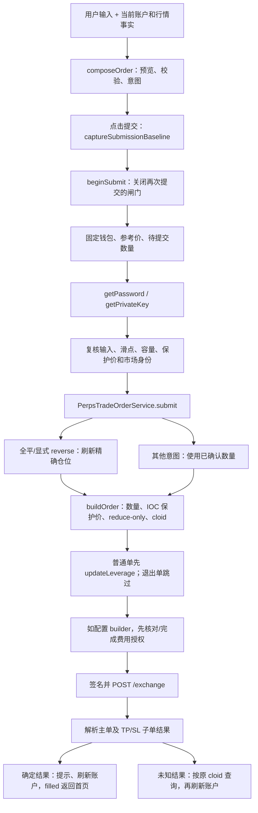

# perps-order 页面行为与证据

整理日期：2026-09-23。代码基线：`261d928d` 及整理时的工作区内容，包含尚未提交的下单页改动。本文描述当前实现，不等同于已发布版本；领域术语见 [CONTEXT.md][context]。

本页负责单个永续市场的开仓、加仓、减仓/全平，以及已有仓位的独立杠杆调整。当前模板是简化市价表单，点击一次按钮即开始提交；内部仍保留审核基线、限价及全仓计算能力。以下将“页面能操作什么”“底层支持什么”和“尚未验证什么”分开说明。

| 要理解的问题 | 需要拿到的证据 | 本文对应内容 |
| --- | --- | --- |
| 用户做了什么，预期结果是什么？ | 入口页面、操作步骤、验收条件 | 第 1 节：入口及行为表 |
| 数据如何流动？ | 从输入到请求，再到页面更新的调用链 | 第 2 节：数据源、下单、杠杆写入 |
| 核心规则是什么？ | 数量、价格、杠杆、保证金、手续费的计算及单位 | 第 3 节：计算、精度、保护单及提交条件 |
| 状态如何变化？ | 等待签名、已提交、成功、失败、取消等状态 | 第 4 节：提交生命周期与执行结果 |
| 异常怎么处理？ | 拒签、超时、断网、余额不足、重复点击 | 第 5 节：异常处理及限制 |
| UI 与真实结果如何保持一致？ | 请求响应、订阅、轮询、刷新和重连逻辑 | 第 6 节：同步、冻结、刷新及回收 |
| 正确性怎么证明？ | 协议文档、测试、可复现操作，而非仅靠代码解释 | 第 7 节：协议依据、测试结果、验收方案 |

## 1. 用户做了什么，预期结果是什么？

路由为 `/popup/perps/order/:coin`，通常从市场详情页进入。`coin` 是完整协议币种，例如 `ETH` 或 `xyz:TSLA`，不能替换成去掉 DEX 前缀的显示符号。Perps 父路由检查钱包及 NeoX 链类型；下单子路由没有单独的资金页守卫。Hyperliquid 主网/测试网由构建的 `environment.perpsNetwork` 决定。

| 操作/入口 | 当前行为及验收条件 |
| --- | --- |
| 市场详情点击做多/做空 | 导航到 `?side=long` 或 `?side=short`；普通表单可切换方向，显示当前仓位、可用 USDC、金额和杠杆 |
| 从已有仓位点击加仓 | 导航到 `?add=1`；沿用仓位方向、杠杆和保证金模式，隐藏多空切换及杠杆控件；金额表示本次增加的名义价值 |
| 点击平仓 | 导航到 `?close=1`；优先于 `add=1`，方向取仓位反方向，杠杆取已有值；默认 100% 全平，可改为部分平仓；隐藏开仓保证金、强平价和 TP/SL 控件 |
| 输入金额 | 以 USDC 标签表示 USD 名义价值，不是保证金投入；输入过程中直接截到两位小数并回填；金额清空时不报余额不足，按钮不可提交 |
| 拖动百分比/输入百分比 | 范围 0–100%；开仓按当前方向购买力，平仓按持仓价值计算。手动输入金额后取消百分比跟随 |
| 调整普通表单的杠杆 | 在 `1..market.maxLeverage` 内取整数；已有仓位且新杠杆不同，会显示独立“应用杠杆”按钮 |
| 点击应用杠杆 | 只发送杠杆写入并刷新账户，不下订单；使用已有仓位的保证金模式。失败时恢复到已知仓位杠杆并显示错误 |
| 开启止盈止损 | 仅非平仓页可用，可只填 TP、只填 SL，或两者都填；两项都空时仍只提交主单。支持按触发价、收益/损失百分比或 USDC 金额联动输入 |
| 点击下单/加仓/平仓 | 一次点击捕获输入与参考价，进入解锁、签名和发送；没有第二次确认面板。提交中禁用主要输入和按钮；无效保护价在点击时提示，不签名、不发送 |
| 全部成交 | 提示成交、刷新目标 DEX 账户并导航到 `/popup/home?tab=perps`；最终持仓由账户数据确认 |
| 结果未知 | 自动按原 cloid 查询；尝试耗尽后显示“再查一次”和历史入口，继续禁止再次下单 |
| 返回/切换钱包 | 返回按钮执行 `history.go(-1)`；切换地址会销毁本页订阅并回永续首页。离开页面不撤销已发出的订单 |

证据：[模板][html]、[组件][component]、[市场详情导航][market-page]、[Perps 路由][route]、[父路由][popup-route]、[渲染测试][render-test]。

当前页面与底层能力的边界：

| 能力 | 当前页面可达性 |
| --- | --- |
| 市价单 | 默认且唯一有完整可见操作路径的订单类型 |
| 限价/GTC | `setOrderType()`、限价输入处理及服务仍支持；模板没有订单类型切换或限价输入框，不能写成人工可点击流程 |
| 滑点设置 | 默认 3%，会读取保存值；对话框方法仍存在，但模板没有打开入口 |
| 全仓 | 可通过 `?marginMode=cross` 或已有全仓仓位进入；模板没有保证金模式选择器。无仓位默认逐仓，仅逐仓市场会将初值设为逐仓 |
| 显式 reverse 意图 | 提交服务支持“平掉旧仓再开指定新仓”的 `reverse`；当前 `composeOrder()` 不生成该意图。普通反向订单只发送输入数量 |
| 确认面板 | 旧 CONTEXT 有描述，当前模板与测试明确为一次点击直接提交；`reviewing` 仅作为内部短暂状态保留 |

## 2. 数据如何流动？

### 2.1 输入与事实来源

| 输入/事实 | 来源与调用 | 如何影响页面 |
| --- | --- | --- |
| 市场、模式、方向 | `route.snapshot.params.coin` 及 `close/add/side/marginMode` 查询参数 | 决定页面模式及目标 DEX；没有订阅路由参数变化 |
| 钱包/地址 | `Store.select('account')` | 加载账户、单资产容量、个人费率；切换地址结束当前页 |
| 行情与元数据 | `watchMarketDetail(coin)` → `perpDexs`（HIP-3）/`metaAndAssetCtxs` → WS `activeAssetCtx` | 价格、精度、杠杆上限、保证金档位、HIP-3 费率参数 |
| 目标 DEX 账户 | `watchAccount(address, dex)` → `getAccount()` → `clearinghouseState`、现货状态及账户模式；后续账户 WS | 当前仓位、账户可用金额、账户可用性 |
| 方向容量 | `watchActiveAssetData(address, coin)` → REST `activeAssetData`，再订阅同名 WS | `availableToTrade[买,卖]`、`maxTradeSzs[买,卖]`、交易场所杠杆设置 |
| 全仓抵押池 | 非平仓且模式为 cross 时调用 `watchCrossMarginAccount()` | 标准账户读取目标 DEX；统一账户使用全 DEX 状态、现货和抵押币元数据，供强平预估 |
| 账户费率 | `getUserFeeRates(address)` → `/info userFees` | 更新 taker/maker 费率；失败保留本地基础费率 |
| 最大滑点 | `ChromeService.getStorage(perpsMaxSlippage)` | 有限且在 0.1–10 范围才采用；共享存储键，不按地址或市场隔离 |
| 金额、杠杆、TP/SL | 组件输入处理方法 | 更新 `PerpsOrderInput`，触发重新计算，必要时使审核基线失效 |

`patchFacts()` 每次创建新事实对象；`seedForm()` 只为尚未由用户接管的字段填初值或跟随值；`composeOrder(facts, input, pendingSizeExact)` 同时输出预览、不可提交原因和交易意图。模板读取这些结果，不自行构造协议订单。

证据：[组件][component]、[表单播种][seeding]、[订单编排][composition]、[Hyperliquid 读取服务][hyperliquid]、[市场服务][market-service]、[账户服务][account-service]。

### 2.2 点击下单到页面更新



解锁后的复核包括：输入与基线相同、价格偏移未超范围、固定数量仍可提交、保护价仍有效、市场身份字段及 operation 未变。`sameMarket` 比较的是交给服务的市场字段，不是冻结整份行情对象。

交易服务只对 `close` 和底层显式 `reverse` 做强制账户刷新；普通 `open/increase/reduce` 使用传入数量。全平刷新后按市场 `key` 找仓位，检查它仍在订单的反方向，并使用最新绝对数量。因此全平表达的是“全部退出”，最终数量可以与点击时不同。

普通单的杠杆写入和订单写入是顺序执行的两次请求，不是原子事务：杠杆成功后，后续授权或订单仍可能失败。退出单 `reduce/close` 不先写杠杆；杠杆写入失败时订单尚未发送。

证据：[组件 `submit()`][component]、[交易订单服务][trade-service]、[写服务][exchange]、[提交意图类型][trade-types]。

### 2.3 规范化与签名

订单 payload 由写服务构造：`a` 为资产 ID、`b` 为买卖方向、`p/s` 为规范十进制价格/数量、`r` 为 reduce-only、`t.limit.tif` 为 IOC/GTC、`c` 为 16 字节随机 cloid。带保护单时追加反方向 reduce-only 子单并使用 `normalTpsl` 分组。

L1 写入使用 `msgpack(action) + uint64 nonce + 无 vault 标记` 的哈希作为 EIP-712 `Agent.connectionId`；主网/测试网 `source` 分别为 `a/b`。nonce 按签名者在当前服务实例内分配为 `max(Date.now(), last+1)`。价格、数量保持字符串，回复以无损 JSON 解析并规范化 ID。

**当前订单路径不自动重签。** `signedL1Action()` 分配一次 nonce 并提交；文件中的 `withNonceRetry()` 被提现路径调用，不在当前下单/杠杆链路上。不能从这个辅助方法的存在推导出“下单 nonce 拒绝自动重试”。

证据：[签名实现][signing]、[nonce 分配][nonce]、[写服务][exchange]、[协议 JSON][protocol-json]；外部契约见 [Signing][p-signing]、[Exchange endpoint][p-exchange]。

## 3. 核心规则是什么？

### 3.1 数量、金额、价格及滑点

约定：`A` 为输入名义金额（USD，界面标 USDC），`P` 为成交参考价（USD/标的），`M` 为标记价，`Q` 为本次订单标的数量，`L` 为杠杆倍数；`floor_lot` 表示按 `szDecimals` 向下取整。

| 规则 | 当前计算与边界 |
| --- | --- |
| 普通数量 | `Q = floor_lot(A / P)`，名义价值 `N = Q × P`；预览与最小金额检查使用 N，不直接使用输入 A |
| 参考价 | 市价取有效 `midPx`；无 mid 时禁止市价提交，不使用 mark 顶替。底层限价单取用户有效限价 |
| 数量精度 | 步长为 `10^-szDecimals`，发送前服务再向下量化；量化为零则拒绝 |
| 发送价格精度 | 最多 5 位有效数字且最多 `6-szDecimals` 位小数，整数价格例外；UI 显示中间价的精度不能代替发送精度 |
| IOC 边界 | 买单 `P0 × (1+s/100)`、卖单 `P0 × (1-s/100)`，P0 固定为点击提交时参考价；买价向下、卖价向上按协议价位量化，保持在用户边界内 |
| 解锁期间滑点检查 | `abs(Pnew-P0)/P0 × 100 <= s`；上下两个方向都检查，恰好等于上限允许。默认 s=3，合法范围 0.1–10 |
| 最小金额 | 普通单和部分平仓要求 `N >= 10 USD`；本地全平跳过最低额检查，最终仍由交易场所决定 |
| 普通反向订单 | 仅发送输入换算出的 Q，先抵减已有净仓，超出部分形成反方向敞口；不自动把旧仓数量加进去 |
| 部分平仓 | `Q = min(floor_lot(A/P), abs(szi))`，发送 reduce-only，不能反向开仓 |
| 全平识别 | `closeMode` 且百分比为 100，或输入金额不小于持仓价值按两位小数四舍五入后的值；预览保留完整仓位数量，实际提交再刷新并取最新数量 |

例如 `A=100`、`P=30`、`szDecimals=2`：数量为 `3.33`，实际名义价值为 `99.90`。若 `M=31`、`L=5`，本次初始保证金预估为 `3.33×31/5=20.646`，不是直接用 `100/5`。

证据：[`composeOrder` / `submittedSize`][composition]、[`buildOrder`][trade-service]、[精度函数与常量][perps-lib]；协议依据：[Tick and lot size][p-precision]、[Exchange endpoint][p-exchange]。

### 3.2 可用金额、百分比与杠杆

优先采用与所选保证金模式匹配的 `activeAssetData`；买方索引 0，卖方索引 1。方向可用抵押品为 `C=availableToTrade[i]`，不会因为修改杠杆而缩放 C。最大名义容量为 `min(C×L, maxTradeSzs[i]×P)`；零数量上限是有效限制。容量不存在或模式不匹配时，退回账户 `availableBalanceExact×L`，不把其他 DEX 的余额擅自加进来。

开仓百分比基数先量化为 `floor_lot(maxNotional/P)×P`，百分比金额再向下取到分。平仓百分比基数为 `positionValueExact`。默认全平播种按 `ROUND_HALF_UP` 取两位小数，而百分比操作按 `ROUND_FLOOR`；全平通过 100% 标记保留全部仓位，不依赖金额反推精度。

未触碰的普通表单杠杆优先跟随有效交易场所设置，再取已有仓位值，最后使用不超过市场上限的 2 倍缺省值；平仓直接采用持仓杠杆，加仓由组件沿用持仓杠杆。无仓位默认逐仓，有仓位跟随其模式，`strictIsolated/noCross` 市场不允许新全仓单。

当前购买力计算没有额外预扣 taker 费，也没有在表单侧完整重建交易场所风控。杠杆上限还可能受当前名义价值档位限制，最终 `updateLeverage` 仍可能被拒绝。

证据：[编排中的容量/百分比函数][composition]、[表单播种][seeding]、[独立 `applyLeverage()`][component]。

### 3.3 初始保证金与强平预估

初始保证金为 `Q×M/L`，单位 USD/USDC；数量、名义价值和费用使用 P。无有效 mark 时保证金和相应强平预估显示 `N/A`；缺少有效风险数据不必然阻止其他条件满足的订单。

| 预估 | 计算依据及范围 |
| --- | --- |
| 分档维持保证金 | 从当前 DEX 的 `meta.marginTables` 及市场 `marginTableId` 解析。合法 ID 小于 50 时为单档，其最大杠杆等于 ID；不会用 `market.maxLeverage` 臆造缺失档位 |
| 档内公式 | 维持费率 `r=1/(2×档位最大杠杆)`；`MM(N)=N×r-D`。首档 D=0，后续 `Dnew=Dold+档位下界×(rnew-rold)` |
| 逐仓强平 | 对成交后净仓，解 `C + side×(Q×x-E) = MM(Q×x)`；C 为抵押品，E 为入场名义价值，side 为多 +1/空 -1，x 为强平价。按候选 x 处的名义价值选档，不只按当前 mark 选档 |
| 已有逐仓加仓 | 旧抵押品取 `marginUsed-unrealizedPnl`，与新订单保证金、入场价值及数量合并；同时改变旧仓杠杆而缺少调整后保证金时不报强平价 |
| 普通反向订单 | 部分抵减时按比例保留旧抵押品、旧入场价及旧方向；恰好全平无强平价；超额成交只为新方向净仓计算。权益不足初始保证金时采用补足后的预估假设，不代表实际划入保证金 |
| 标准账户全仓池 | 只使用目标 DEX 的 `crossMarginSummary.accountValue`、全仓维持保证金与全仓仓位 |
| 统一账户全仓池 | 按 `meta.collateralToken` 选同抵押币的全部 DEX；权益为现货该币 total 减逐仓 `marginUsed`。不扣 spot hold，也不再次累加持仓浮盈亏；不按本产品行情白名单裁剪风险池 |
| 全仓强平 | 假设其他市场价格不变，按成交后的净仓位求解；账户权益仅加入旧仓标记价变化和新交易的增量，并扣其他仓位维持保证金。固定数量下，订单杠杆不直接改变该预估 |
| 无法估算 | 缺失/非法档位、无正向解、净仓为零、抵押币或风险数据不足，以及 Portfolio Margin、dexAbstraction、unknown 的全仓池均不报数字 |

上述预估未计未来手续费、资金费及实际滑点。协议说明初始保证金以 mark 计、维持保证金需分档，且下单预估可采用补足初始保证金的假设。[Margining][p-margining]、[Margin tiers][p-tiers]、[Liquidations][p-liquidations]

实现证据：[`previewOrder`][composition]、[分档/强平函数][margin]、[全仓池适配][cross-margin]、[全仓池订阅][hyperliquid]。

### 3.4 平仓盈亏与预计收到

令 `H=abs(当前 szi)`，`q=min(待平数量,H)`，`f=q/H`，`Epx` 为旧入场价：

- 平仓名义额：`q×P`；预估平仓盈亏：`q×(P-Epx)×旧仓方向符号`。
- 按比例释放的 `marginUsed`：`abs(marginUsed)×f`。
- 逐仓抵押品：释放值减 `unrealizedPnl×f`，避免把 mark 上浮盈亏再算一次；全仓直接使用释放值。
- 预计收到：`上述抵押品 + 平仓盈亏 - 预估费用`。它表示估计回到账户的金额，不是向钱包地址提现。
- 缺入场价等必要字段时不编造盈亏；HIP-3 费率无法估算时，预计收到为 `N/A`。

例：逐仓 `H=2`、入场价 100、mark 110、marginUsed 60、unrealizedPnl 20；本次平 1 个、参考价 112，则释放 marginUsed 为 30，抵押品为 `30-20×0.5=20`，盈亏为 12，预计收到为 `32-费用`。

证据：[编排 `previewClosePosition()`][composition]及[平仓计算测试][composition-test]。

### 3.5 手续费与展示单位

`userFees` 的 taker 取 `userCrossRate`，maker 取 `userAddRate`；正费率乘 `1-activeReferralDiscount`，负 maker 返佣不打推荐折扣。读取前或失败时使用基础 taker `0.00045`、maker `0.00015`，即 `0.045%/0.015%`。这只是兜底，不证明已取得该账户当前实际费率。

HIP-3 再乘部署方系数 `d<1 ? d+1 : 2d` 和 growth 系数（开启为 0.1，否则为 1）；非正 maker 不乘部署方系数，但仍应用 growth。缺少部署方系数时显示费用无法估算，订单本身仍可继续。当前实现未计 aligned quote token 的额外调整；扩展 DEX 支持范围时需复核。[官方 Fees 公式][p-fees]

builder 配置值 `45` 的单位是十分之一个 bp，对应 `0.045%=0.00045`；只在 builder 地址已配置时加入。整理时主网/测试网地址均为空，实际 builder 费率为 0，不发费用授权。

预览内部计算 `fee=N×(协议费率+builder费率)`，平仓预计收到会扣除这项。**当前模板手续费一行只展示总费率，不展示手续费金额**；普通市价显示 taker，底层限价分支可显示 taker/maker 两侧，负总费率保留返佣符号。

证据：[读取服务][hyperliquid]、[`marketFeeRates`][composition]、[组件 `feeText`][component]、[builder 常量][perps-lib]、[授权与写入][exchange]；builder 单位见 [Exchange endpoint][p-exchange]。

### 3.6 止盈止损

TP/SL 是随这笔父单提交的固定数量子单，不等同于为整个已有仓位创建动态全仓保护。

| 规则 | 当前行为 |
| --- | --- |
| 可选性 | 开关关闭或两项都为空时无子单；允许单独 TP 或 SL。只有填写了至少一项才校验保护价 |
| 方向 | 多单 TP>P、SL<P；空单 TP<P、SL>P；等于参考价不合法，比较基于本次成交参考价 |
| 精度 | `protectionPrice()` 仅接受正的十进制文本，按协议价位 `ROUND_HALF_UP` 量化；失焦回填，组合和服务再次校验 |
| 收益率联动 | 令方向符号 d 为多 +1/空 -1，TP 符号 k=+1、SL k=-1，`Δ=(触发价-P)×d×k`；输入百分比为 `Δ/(M/L)×100`。这里是基于预估保证金的杠杆收益/损失比例，不是单纯价格涨跌幅 |
| USDC 联动 | 收益/损失金额为 `Δ×本次订单数量`；无订单数量时用当前仓位绝对数量预览。逆算为 `Δ=金额/数量`，再解触发价；不包含费用和资金费 |
| 子单构造 | 方向与父单相反、`reduceOnly=true`、`trigger.isMarket=true`，分组 `normalTpsl`；数量取本次请求数量，父子各有独立 cloid |
| 触发后限价 | 平多的卖出子单约为触发价×0.9，平空的买入子单约为×1.1，再量化；与父单保存的滑点值独立 |
| 响应处理 | 检查主单及各子单状态。主单成交但子单拒绝/缺失时保留成交结果并提示保护未确认；父单部分成交也提示保护未确认 |

协议由 **mark price** 触发 TP/SL，父单未完全成交时子单生效存在额外条件；本页只处理下单响应，不能从“主单部分成交”推断已有完整保护。[官方 TP/SL][p-tpsl]

证据：[TP/SL 输入联动][component]、[保护价规则][protection]、[子单构造][trade-service]、[分组及逐项响应][exchange]。

### 3.7 提交资格

`composeOrder.submittable` 要求市场 ready、账户已存在、金额和价格为正、数量大于零且没有不可用原因。页面再叠加“未销毁、没有独立杠杆写入、生命周期闸门开放”。

普通错误按顺序只展示一条：账户不可用、市场不存在/读取失败、不支持全仓、已有仓位模式冲突、无仓可平、无市价参考价、滑点非法、保证金不足、名义额不足、保护价无效。收益或亏损为负（触发价在参考价的错误一侧）、触发价等于参考价、或触发价不是正的十进制价格，都算保护价无效，页面直接展示错误并禁用提交。输入尚未填完通常只禁用按钮。

有参考价时就会校验已填写的保护价，不要求金额已经填完。解锁等待期间参考价穿过触发价时，`reportInvalidProtection()` 再用提示条拦住发送。市场 OI 上限、盘口是否可成交等最终由交易场所判断。

## 4. 状态如何变化？

页面生命周期只有 `composing/reviewing/submitting/unknown` 四类；成交、挂单、拒绝属于执行结果，不是同一组枚举。

| 状态/事件 | 转移与页面结果 |
| --- | --- |
| `composing` | 可编辑，满足规则时可提交 |
| 点击提交 | 先 `review(baseline)` 短暂进入 reviewing，同一次调用中 `beginSubmit(stillApproved)` 进入 submitting；不等待额外确认点击 |
| `submitting` | 包含等待密码/私钥、必要刷新、杠杆写入、授权、签名与发送；待提交数量固定，主要控件禁用，提交按钮 `aria-busy=true` |
| 已发送但尚未收到回复 | 仍为 submitting；没有单独“已提交成功”状态或成交承诺 |
| `filled` | 逐单填充数量有效，剩余为零；settled 回 composing、刷新账户，然后返回永续首页。若保护子单异常，优先提示保护未确认，但父单成交仍保留 |
| `partial` | 已成交大于零、剩余大于零；提示部分成交，回 composing 并刷新账户，留在本页，不自动补单 |
| `resting` | 返回有效挂单 oid；提示挂单、回 composing 并刷新，不等于已形成持仓 |
| `unfilled/rejected` | IOC/无流动性类逐单错误映射 unfilled，其他逐单错误为 rejected；提示并刷新，重新开放提交 |
| `unknown` 查询中 | 保存父单 cloid、关闭提交；延迟 1.5 秒后查询，单次返回/报错后再排下一次，最多 4 次 |
| 查询得到 `status: order` | 表示交易场所有可查询订单，回 composing、提示状态已查明并刷新账户；不解析成“已全部成交”，不自动返回首页 |
| 查询耗尽 | `unknown, resolving=false`；显示再查一次/历史入口，刷新账户但继续禁止第二次提交。再查一次仍查询原 cloid |
| 取消/返回 | 本页没有撤单按钮或 canceled 生命周期。离开时停止定时查询并忽略旧回调，已经发送的订单继续完成 |

取密码/私钥失败回 composing；独立杠杆写入另由 `leverageUpdating` 表示等待，不创建订单执行结果。

证据：[生命周期][lifecycle]、[组件结果处理][component]、[执行结果解析][exchange]。HTTP 200 或顶层 `status: ok` 不足以证明成交，必须检查 `statuses` 中的具体结果。[官方 Exchange endpoint][p-exchange]

## 5. 异常怎么处理？

| 异常 | 当前处理 | 限制/应保留证据 |
| --- | --- | --- |
| 解锁取消、密码或私钥读取失败 | catch 后结束 submitting，显示 `verifyFailed`，不调用订单服务 | 未定义独立“用户拒签”枚举；真实取消弹窗表现需人工联调 |
| Ledger/二维码钱包 | 根据 `ledgerSLIP44/qrBasedXFP` 显示签名不可用并提前返回；独立杠杆写入同样检查 | 当前不能据此宣称硬件钱包下单已支持 |
| 重复点击 | `beginSubmit()` 同步关闭闸门；独立杠杆写入由 `leverageUpdating` 阻止并发 | 仅当前页面进程内有效，未做跨窗口协调或持久化防重 |
| 解锁时行情/容量变化 | 再检查固定数量、参考价偏移、市场字段、操作类型和保护价；不符则停止发送，要求重新操作 | 不是冻结所有账户/市场事实，也不是整个异步服务链上的持续复核 |
| 保证金不足 | 表单按可交易容量拦截；交易场所仍可拒绝杠杆或订单 | 保存 availableToTrade、maxTradeSzs、输入杠杆、参考价及原始拒绝原因 |
| 全平前仓位消失/反向 | 强制刷新后按 key 和方向检查，报 `position-changed`，不发订单 | 账户不可用则失败；全平数量允许跟随最新仓位变化 |
| 杠杆写入失败 | 普通单停止后续订单，显示 `perpsLeverageUpdateFailed`；独立调整失败恢复已知杠杆 | “订单未发送”不证明网络故障下杠杆操作一定未生效；当前没有独立杠杆未知结果恢复流程 |
| builder 查询/授权失败 | 查询失败按未授权处理，尝试一次授权；授权失败终止订单发送 | 只在配置 builder 时适用；会话授权缓存不等于永久授权 |
| HTTP 4xx 或明确业务拒绝 | 当前分类为确定答复，显示错误；订单逐项拒绝保留原文 | 下单路径不自动用新 nonce 重发 |
| HTTP 0/5xx、响应丢失或无法解析 | 父订单转 unknown 并保留 cloid，开始查询，不重复提交 | unknown 中的零成交占位值不证明实际未成交 |
| HTTP 长时间不返回 | `/exchange` 和订单状态查询没有显式 `timeout`，可能持续等待 | “4 次、间隔 1.5 秒”是次数策略，不是保证 6 秒内结束；请求不结算时尝试次数也不会推进 |
| WS 断线/半开 | 显示 stale 横幅，保留已知报价；数据通道自动重连 | stale 本身不阻止 HTTP 下单，也没有逐资产报价年龄上限；网络恢复仍需看实际快照/帧 |
| 市场初始读取失败 | 传输类暂时失败最多重试 3 次，间隔 1 秒；明确拒绝不重试，最终 market=error | 本页没有市场加载重试按钮；默认需要离开再进入 |
| 单资产容量/个人费率失败 | 容量 REST 失败后等待 WS，期间按账户可用值回退；费率保留基础值 | 兜底不等于已取得实时权威容量/费率 |
| 保护子单未确认 | 保留父单的真实结果，单独提示保护未确认 | 当前页不持续跟踪子单是否激活/触发；未知父单恢复也不据此宣称保护成功 |
| 切换地址或销毁页面 | 中止未交给服务的提交；退订读取、停止查询调度，旧发送回调不再导航 | 一旦已交给交易服务，不退订其发送链；杠杆/授权/订单后续步骤可能继续完成，关闭 UI 不等于撤单 |

证据：[页面][component]、[生命周期][lifecycle]、[交易服务][trade-service]、[写服务][exchange]、[失败分类][fetch-failure]、[数据通道][channel]。

## 6. UI 与真实结果如何保持一致？

| 机制 | 当前实现及边界 |
| --- | --- |
| 单一组合结果 | `composeOrder()` 由 facts 和 input 同时推导数量、预估、资格及意图；组件以引用和输入值记忆化，不维护第二套余额或本地订单账本 |
| 表单播种 | 用户触碰字段后不再被对应默认值覆盖；平仓未触碰金额跟随仓位价值、默认 100%；审核/提交期间暂停播种 |
| 百分比重算 | 方向、杠杆操作会重算金额；容量及费率到达会触发 `repricePercent()`。当前并非每条市场价格帧都重算百分比金额，平仓百分比也不走该方法 |
| 提交数量冻结 | 点击后 `pendingSizeExact` 供预览和容量检查共用，价格在解锁期间变化不会重新把输入美元换成另一份提交数量；服务全平刷新是明确例外 |
| 账户数据 | 目标 DEX 使用共享账户数据集：初次快照、WS、请求期间缓冲帧及重连补快照；读取失败不会被当成正常零余额 |
| 单市场数据 | `watchMarketDetail()` 初始快照后接 `activeAssetCtx`，并不走市场列表的 120 秒 TTL/共享数据集；初始请求期间不收该订阅帧，等待后续完整帧更新 |
| 容量数据 | REST 结束后通过 `concat` 订阅 `activeAssetData`；重连由通道恢复订阅，本页没有额外的容量重连 REST 刷新 |
| 全仓风险池 | 标准模式快照与 WS 合并，收到 WS 后停止未完成的旧快照；统一模式等待完整全 DEX WS 与现货，再读取相关 DEX 抵押币。不是账户聚合 Tab 的余额模型 |
| 重连策略 | 通道 30 秒 ping，10 秒无 pong 主动关闭；1、2、4…秒重连，上限 30 秒。账户数据集补快照，单市场和容量等订阅等待新帧，各自策略不同 |
| 写后缓存与刷新 | `wrote()` 通知清除读取服务账户/现货缓存；页面在确定结果、未知查询结束/耗尽时主动刷新目标 DEX 账户；缓存清除本身不等于 UI 已更新 |
| 页面与历史分工 | 当前页不订阅 `orderUpdates/userFills` 持续跟踪挂单；确定 resting/partial 后回编辑态，后续结果需看账户及历史。HTTP 已接受不能替代持仓确认 |
| 生命周期回收 | 销毁时退订行情、账户、容量、费率、全仓池和连接状态，dispose 未知结果查询；不让旧发送结果把用户拉回首页 |

本页没有固定周期余额轮询。仅 unknown 结果按 cloid 有限查询；账户失败重试、市场初始读取重试与 WS 重连是不同机制。重连时间、客户端收到帧的时间和交易完成时间也不能互相替代。

设计依据：[协议精度 ADR][adr-precision]、[审核价格基线 ADR][adr-review]、[交易提交边界 ADR][adr-submit]。这些文档帮助解释设计，但若与当前模板冲突，应结合当前代码及渲染测试核对。

## 7. 正确性怎么证明？

### 7.1 协议证据

以下资料于 2026-09-23 在本次整理及同会话的 perps-tab 整理中在线核对，均为 Hyperliquid 官方文档。

| 资料 | 核对内容 |
| --- | --- |
| [Perpetuals info][p-info] | 账户、市场元数据、`activeAssetData`、方向容量和风险数据来源 |
| [Account abstraction modes][p-modes] | 标准/统一/组合保证金的区别，完整抵押池与单 DEX 余额的边界 |
| [Tick and lot size][p-precision] | 数量精度、5 位有效数字、小数位限制、整数价格例外 |
| [Margining][p-margining]、[Margin tiers][p-tiers]、[Liquidations][p-liquidations] | 初始保证金价格、维持保证金分档、强平求解及预估假设 |
| [Fees][p-fees] | 推荐折扣、maker 返佣、HIP-3 费率系数 |
| [TP/SL][p-tpsl] | mark 触发、父子关联及部分成交场景 |
| [Exchange endpoint][p-exchange]、[Signing][p-signing] | 订单字段、逐单结果、签名方案、编码精度与字段顺序 |
| [WebSocket subscriptions][p-ws]、[Timeouts and heartbeats][p-heartbeat] | 实时频道及 ping/pong 约定 |

协议文档证明外部约定，单元测试证明给定输入下的本地行为，真实测试网请求才可以证明联调。仅能本地恢复出正确签名者不足以证明服务端会接受签名，官方 Signing 文档明确要求核对实际编码。

### 7.2 已有测试与本次执行结果

| 测试 | 主要证据 |
| --- | --- |
| [组件逻辑测试][component-test] | 输入和预览联动、解锁期间冻结、容量/市场变化拦截、钱包切换、独立杠杆写入 |
| [组件渲染测试][render-test] | 一次点击下单、无确认面板、可见控件、TP/SL 可选性与联动、stale 横幅、未知结果入口 |
| [编排测试][composition-test] | 方向容量、精度和最小名义额、全平/部分平仓、反向净单、费用及强平预估 |
| [播种测试][seeding-test] | 行情/账户到达顺序、用户输入不被覆盖、默认方向/杠杆/全平金额 |
| [生命周期测试][lifecycle-test] | 提交闸门、未知结果四次查询、再查询、销毁及过期回调 |
| [交易服务测试][trade-test] | IOC/GTC 与 reduce-only、全平取最新数量、杠杆失败停止订单、保护子单方向和边界 |
| [写服务测试][exchange-test] | payload、部分成交、未知结果不重发、主单/保护单分别确认、cloid 查询、builder 授权 |
| [签名测试][signing-test]、[nonce 测试][nonce-test] | 固定哈希样例、uint64 编码、签名恢复及实例内 nonce 分配；不等于真实端点验签记录 |
| [读取服务测试][hyperliquid-test]、[全仓池测试][cross-test] | 费率/精度适配、全仓抵押池、账户模式、完整跨 DEX 风险 |
| [保证金测试][margin-test]、[保护价测试][protection-test]、[协议模型测试][perps-test]、[格式化测试][format-test] | 分档边界、保护价方向/精度、协议数值与页面格式 |

在仓库根目录执行：

```bash
nvm use
npm run lint
npm run test:ci -- \
  --include='src/app/popup/perps/perps-order/*.spec.ts' \
  --include='src/app/core/services/perps/perps-trade-order.service.spec.ts' \
  --include='src/app/core/services/perps/perps-exchange-write.service.spec.ts' \
  --include='src/app/core/services/perps/hyperliquid*.spec.ts' \
  --include='src/app/core/services/perps/perps-cross-margin.spec.ts' \
  --include='src/app/core/services/perps/perps-nonce.spec.ts' \
  --include='src/app/popup/_lib/perps*.spec.ts' \
  --include='src/app/popup/perps/perps.util.spec.ts' \
  --reporters=dots
```

本次结果：Node `16.20.1`、npm `8.19.4`、ChromeHeadless `154`；lint 通过，定向测试 **359 项通过**。这是上述测试文件的总数，其中共享服务文件也含部分非下单用例。未执行全量测试、生产构建或真实交易。

### 7.3 可复现验收方案（本次未执行）

准备：记录代码版本、构建网络、测试地址、账户模式、市场 coin/key/assetId、数量精度及保证金档位。用测试网账户执行真实交易；响应丢失、快照延迟等使用可控测试替身。保留输入、原始请求/逐单响应、cloid/oid、刷新后的账户状态及截图，才能区分界面变化与交易事实。

| 编号 | 操作步骤 | 验收条件 |
| --- | --- | --- |
| O1 入口与表单 | 从详情分别进入普通、加仓、平仓；打开 `?marginMode=cross`；检查标准及 HIP-3 coin | 完整 coin 保留；普通方向可切；加仓沿用仓位；平仓默认反方向 100%；当前没有确认面板/限价/模式切换控件 |
| O2 计算单位 | 替身设置 P=30、M=31、精度 2、杠杆 5，输入 100 | 意图 Q=3.33、N=99.90，保证金内部值 20.646；界面按金额格式显示；保存计算与最终发送数量 |
| O3 百分比与方向容量 | 买卖方向设置不同 availableToTrade/maxTradeSzs，分别取 100%；再将一侧 maxTradeSzs 置零 | 每个方向独立限额，向下取分/数量；零容量不能被当作缺失放行 |
| O4 反向普通单 | 已有空仓 2 个，在普通表单买 1 个，再测试买 3 个 | 请求数量分别就是 1、3，不额外加旧仓；成功成交后净仓分别为剩余空 1、净多 1；以账户回报确认 |
| O5 全平与部分平仓 | 用存在小额尾数的仓位，先取 50%，再取 100%；解锁后让最新仓位变大/消失 | 部分平仓 reduce-only 且数量不超过持仓；全平使用刷新后的精确数量；仓位消失/方向反转则不发送 |
| O6 解锁期间变化 | 用延迟私钥 Promise，分别改变价格超过滑点、容量低于固定数量、assetId/精度、钱包地址 | 对应情况不调用订单提交；滑点内且固定数量仍合法时发送点击时数量及基准保护价，连续点击不多发 |
| O7 杠杆独立写入 | 普通页已有仓位，改变杠杆后点击应用；模拟成功、保证金拒绝、网络错误 | 只有 updateLeverage，无 order；成功刷新已生效值；错误不声称订单成交，记录网络错误下杠杆真实状态 |
| O8 强平分档 | 用可控单档/多档元数据及跨档仓位，分别计算多空、加仓、反向部分抵减和净零 | 满足权益=维持保证金方程；按强平价处价值选档；净零/无数据时 N/A。全仓固定数量换杠杆不改变强平预估 |
| O9 费用 | 模拟 userFees 返佣、推荐折扣、HIP-3 d<1/d>=1、growth；另让元数据缺系数 | 费率与公式一致，负号保留；缺系数显示无法估算；当前无 builder 配置时不发送授权。费用行只显示费率 |
| O10 TP/SL 输入 | 多空分别填合法/反侧触发价，切换 %/$；仅开开关不填，再只填 TP；解锁中跨过触发价 | 两空不附子单；反侧点击时报错且不发送；联动符合公式；解锁后再次校验保护价 |
| O11 父子响应 | 返回父单 filled + 子单 error，再返回 partial + waitingForFill | 父单真实结果保留，提示保护未确认，不自动补保护单/重下父单；账户确认父单影响 |
| O12 结果未知 | 模拟 POST 已被接受但客户端收到 0/5xx 或畸形响应；再模拟查询有订单/四次无结果 | 原 cloid 被查询，无新 order；有结果后刷新；耗尽仍禁用下单，再查一次沿用原 cloid |
| O13 断线/退出 | 已加载时停止 pong，再恢复；在提交后离开或切换钱包 | stale 提示与重连；旧回调不导航、未知查询停止。已交服务的写入仍可能完成，去历史/账户确认 |
| O14 模型保留分支 | 运行对应测试或通过测试夹具设置 limit/GTC、显式 reverse；不要求用户点击不存在的控件 | 限价规范化及 GTC 生效；显式 reverse 使用最新旧仓+目标新仓数量，与 O4 普通反向单区分 |

### 7.4 证据边界与维护注意

1. **旧页面描述不能当成当前 UI。** 本目录 CONTEXT 的确认面板、部分注释中的“审核时第二次确认”已与模板不同；当前渲染测试明确验证一次点击和无确认面板。限价、滑点及模式方法仍存在，不等于有可见入口。
2. **只冻结承诺过的输入和点击参考价。** 费用、余额、风险池继续变化；全平以最新完整仓位为准。解锁后校验通过，不代表后续杠杆/授权网络等待期间全部事实仍保持不变。
3. **结果未知的恢复是有限且进程内的。** cloid 和查询状态未持久化；关闭页面后不会自动续查。查询只确认父单可被交易场所查到，不确认其一定成交或 TP/SL 已生效。
4. **预估不等于风险引擎。** 可用金额回退、个人费率兜底、缺失强平价、Portfolio Margin 不支持完整全仓估值都有明确范围；测试通过不能扩展这些范围。
5. **模式异常尚需真实场景核对。** 加仓依赖进入时的仓位播种；如果仓位随后消失，当前 addMode 没有独立“无仓可加”阻断。应在联调中记录实际意图，不把标题“加仓”当成服务端保证。
6. **359 项不是测试网验收。** 本次没有真实验签、成交、保护触发、浏览器关闭后恢复或硬件钱包测试记录。O1–O14 为待执行方案。

[context]: ./CONTEXT.md
[component]: ./perps-order.component.ts
[html]: ./perps-order.component.html
[component-test]: ./perps-order.component.spec.ts
[render-test]: ./perps-order.component.render.spec.ts
[composition]: ./perps-order-composition.ts
[composition-test]: ./perps-order-composition.spec.ts
[seeding]: ./perps-order-seeding.ts
[seeding-test]: ./perps-order-seeding.spec.ts
[lifecycle]: ./perps-order-lifecycle.ts
[lifecycle-test]: ./perps-order-lifecycle.spec.ts
[market-page]: ../perps-market/perps-market.component.ts
[route]: ../perps.route.ts
[popup-route]: ../../popup.route.ts
[perps-lib]: ../../_lib/perps.ts
[perps-test]: ../../_lib/perps.spec.ts
[margin]: ../../_lib/perps-margin.ts
[margin-test]: ../../_lib/perps-margin.spec.ts
[protection]: ../../_lib/perps-protection.ts
[protection-test]: ../../_lib/perps-protection.spec.ts
[format-test]: ../perps.util.spec.ts
[trade-service]: ../../../core/services/perps/perps-trade-order.service.ts
[trade-types]: ../../../core/services/perps/perps-trade-order.ts
[trade-test]: ../../../core/services/perps/perps-trade-order.service.spec.ts
[exchange]: ../../../core/services/perps/perps-exchange-write.service.ts
[exchange-test]: ../../../core/services/perps/perps-exchange-write.service.spec.ts
[hyperliquid]: ../../../core/services/perps/hyperliquid.service.ts
[hyperliquid-test]: ../../../core/services/perps/hyperliquid.service.spec.ts
[cross-margin]: ../../../core/services/perps/perps-cross-margin.ts
[cross-test]: ../../../core/services/perps/perps-cross-margin.spec.ts
[market-service]: ../../../core/services/perps/perps-market-dataset.service.ts
[account-service]: ../../../core/services/perps/perps-account-state.service.ts
[channel]: ../../../core/services/perps/perps-data-channel.service.ts
[signing]: ../../../core/services/perps/hyperliquid-signing.ts
[signing-test]: ../../../core/services/perps/hyperliquid-signing.spec.ts
[nonce]: ../../../core/services/perps/perps-nonce.ts
[nonce-test]: ../../../core/services/perps/perps-nonce.spec.ts
[protocol-json]: ../../../core/services/perps/perps-protocol-json.ts
[fetch-failure]: ../../../core/services/perps/perps-fetch-failure.ts
[adr-precision]: ../../../../../docs/adr/0001-protocol-precision-only-domain-model.md
[adr-review]: ../../../../../docs/adr/0005-client-side-review-price-freeze.md
[adr-submit]: ../../../../../docs/adr/0006-thin-client-trade-submission.md
[p-info]: https://hyperliquid.gitbook.io/hyperliquid-docs/for-developers/api/info-endpoint/perpetuals
[p-modes]: https://hyperliquid.gitbook.io/hyperliquid-docs/trading/account-abstraction-modes
[p-precision]: https://hyperliquid.gitbook.io/hyperliquid-docs/for-developers/api/tick-and-lot-size
[p-exchange]: https://hyperliquid.gitbook.io/hyperliquid-docs/for-developers/api/exchange-endpoint
[p-signing]: https://hyperliquid.gitbook.io/hyperliquid-docs/for-developers/api/signing
[p-fees]: https://hyperliquid.gitbook.io/hyperliquid-docs/trading/fees
[p-margining]: https://hyperliquid.gitbook.io/hyperliquid-docs/trading/margining
[p-tiers]: https://hyperliquid.gitbook.io/hyperliquid-docs/trading/margin-tiers
[p-liquidations]: https://hyperliquid.gitbook.io/hyperliquid-docs/trading/liquidations
[p-tpsl]: https://hyperliquid.gitbook.io/hyperliquid-docs/trading/take-profit-and-stop-loss-orders-tp-sl
[p-ws]: https://hyperliquid.gitbook.io/hyperliquid-docs/for-developers/api/websocket/subscriptions
[p-heartbeat]: https://hyperliquid.gitbook.io/hyperliquid-docs/for-developers/api/websocket/timeouts-and-heartbeats
