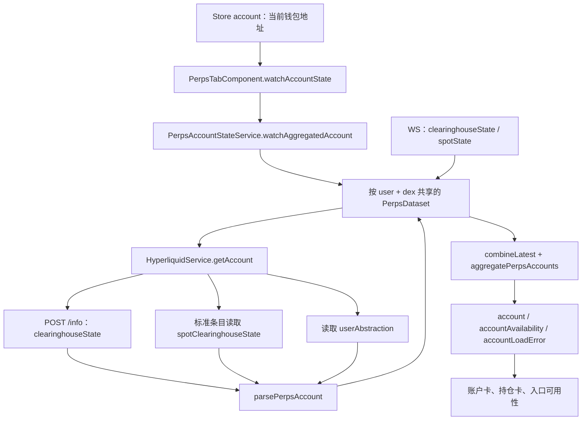

# perps-tab 页面行为与证据

整理日期：2026-09-23。代码基线：`261d928d` 及整理时的工作区内容；工作区已有下单页等未提交改动，本文描述当前实现，不等同于已发布版本。

`perps-tab` 是钱包首页的永续合约 Tab，负责账户摘要、持仓卡片、行情列表和页面跳转。它本身不接收交易参数、不签名、不下单，也不直接执行出入金。下文涉及交易的内容会注明所属的后续页面。

| 要理解的问题 | 需要拿到的证据 | 本文对应内容 |
| --- | --- | --- |
| 用户做了什么，预期结果是什么？ | 入口页面、操作步骤、验收条件 | 第 1 节：入口及行为表 |
| 数据如何流动？ | 从输入到请求，再到页面更新的调用链 | 第 2 节：账户、行情、交易返回三条链路 |
| 核心规则是什么？ | 数量、价格、杠杆、保证金、手续费的计算及单位 | 第 3 节：本页展示口径与下单页计算边界 |
| 状态如何变化？ | 等待签名、已提交、成功、失败、取消等状态 | 第 4 节：数据状态与后续交易状态 |
| 异常怎么处理？ | 拒签、超时、断网、余额不足、重复点击 | 第 5 节：异常处理及限制 |
| UI 与真实结果如何保持一致？ | 请求响应、订阅、轮询、刷新和重连逻辑 | 第 6 节：同步机制及边界 |
| 正确性怎么证明？ | 协议文档、测试、可复现操作，而非仅靠代码解释 | 第 7 节：协议依据、测试结果、验收步骤 |

## 1. 用户做了什么，预期结果是什么？

入口为 `/popup/home?tab=perps`。首页只有在 `chainType === 'NeoX'` 时显示入口和渲染组件；`showPerps()` 懒加载 `PerpsModule`。切换 Tab 会用 `replaceUrl` 同步查询参数。账户 Store 变化时，非 NeoX 地址首页先回到资产 Tab；仍是 NeoX 地址则保持当前 Tab，永续页读取当前地址。

NeoX 在这里是钱包类型约束。Hyperliquid 使用哪个网络由 `environment.perpsNetwork` 决定，开发配置为 `testnet`、生产配置为 `mainnet`，不能根据钱包当前 RPC 网络推断。当前启用的 DEX 为标准永续 `''` 和 HIP-3 `xyz`，不是注册表中的全部 DEX。

| 用户操作 | 预期结果及验收条件 | 代码证据 |
| --- | --- | --- |
| 进入永续 Tab | 展示账户卡、已有持仓和行情。账户未到达时金额为 `N/A`；行情初次加载为 6 行骨架；未知账户不能显示成零余额账户 | [Tab 组件][tab-ts]、[模板][tab-html]、[市场列表][list-ts] |
| 查看账户 | 标准模式显示账户价值；统一/组合保证金模式显示 USDC 余额。标准模式的现货 USDC 单独列出 | `accountValueLabel`、`accountEquityExact`、`availableMarginExact`、`hasSeparateSpotUsdc` |
| 查看持仓 | 每个非零仓位对应一张卡：币种、DEX 标识、多空、杠杆、未实现盈亏、收益率、市场价格、强平价；数量本身不在本页卡片显示 | [账户解析][account-model]、[模板][tab-html] |
| 点击持仓或行情行 | 进入 `/popup/perps/market/{coin}`，保留协议币种的 DEX 前缀，例如 `xyz:TSLA`。卡片上没有直接加仓/平仓按钮 | `toMarket`、[渲染测试][tab-render-test] |
| 点击入金/提现 | 分别进入 `/popup/perps/funding?tab=deposit`、`?tab=withdraw`，本次点击只导航。无账户、聚合仍在加载、缺少 DEX 时禁用这两个入口 | `toFunding`、`globalActionsDisabled` |
| 点击历史 | 进入 `/popup/perps/history`；不受账户聚合按钮禁用条件限制 | `toHistory`、[模板][tab-html] |
| 点击探索市场 | 进入 `/popup/perps/markets`，在那里使用搜索和排序。首页列表默认按成交量降序；可用的 `NEO`、`GAS` 市场独立置顶 | `toMarkets`、`sortKey`、`isPinned` |
| 点击加载更多 | 非置顶市场每次增加 30 行；已渲染行的数量更新不导致行情重新请求 | `loadMore`、`PERPS_MARKET_PAGE_SIZE` |
| 查看真正的空账户 | 仅在账户 `live`、模式已知、金额已知、聚合完整、无持仓、权益和现货 USDC 都不大于零时显示入金引导 | `emptyAccount` |

入口证据：[首页组件][home-ts]、[首页模板][home-html]、[父路由][popup-route]、[Perps 路由][perps-route]。Perps 路由入口及资金子路由使用 [PerpsFundingGuard][funding-guard]；链类型不符或读取失败时返回首页。

## 2. 数据如何流动？

### 2.1 账户：当前钱包地址 → 协议快照/推送 → 页面



1. `ngOnInit()` 订阅 `store.select('account')`，读取 `currentWallet.accounts[0].address`。
2. 新地址到达后，清空本页账户、设为 `loading`、退订旧账户，再订阅新地址；回调还检查地址是否仍与当前页面一致。
3. `watchAggregatedAccount()` 对 `enabledDexes` 分别调用 `watchAccount()`，地址转成小写，按 `user:dex` 隔离数据。
4. 初次读取调用 `getAccount(user, true, dex)`，请求该 DEX 的 `clearinghouseState`；标准 DEX 条目额外读取账户级现货状态，避免跨 DEX 重复计入 USDC。账户模式来自 `userAbstraction`。
5. 快照经 `parsePerpsAccount()` 生成精确字符串模型；`clearinghouseState` 和 `spotState` 推送更新这份模型；聚合器合并仓位和金额，并保留 `missingDexes`。
6. Tab 根据聚合结果更新模板，不自行从盈亏推算账户余额。

证据：[账户服务][account-service]、[账户模型][account-model]、[读取服务][hyperliquid]、[数据集核心][dataset]。

### 2.2 行情：元数据及上下文 → 共享数据集 → 持仓报价和行情行

1. Tab 和内嵌列表各自订阅 `PerpsMarketDatasetService.watchMarkets()`，共用同一份市场数据集和正在进行的快照请求。
2. `/info` 的 `perpDexs` 返回注册表，再读取标准及已启用 HIP-3 DEX 的 `metaAndAssetCtxs`。按原始 `universe` 下标配对上下文，过滤已下架或没有上下文的市场。
3. `buildMarket()` 生成 `key`、协议 `coin`、`assetId`、数量精度、最大杠杆和价格字段。标准键形如 `hl:ETH`，HIP-3 键形如 `xyz:TSLA`。
4. 共享 WS 订阅 `allDexsAssetCtxs`，按 DEX 名挑选启用的数据，再按 `dexAssetIndex` 更新市场。不能用成交量排序后的行号对应协议数组。
5. Tab 用 `position.key` 寻找持仓对应市场；列表用 `trackByKey` 保持行身份。价格更新会改数值，但不重新洗排行序。

证据：[行情服务][market-service]、[市场构建与更新][market-model]、[列表组件][list-ts]。

### 2.3 从本页进入交易，再返回本页

```text
持仓卡/行情行
  → market/{coin}
  → order/{coin}?side=long|short，或 ?add=1 / ?close=1
  → composePerpsOrder：输入 + 账户/市场事实 → 校验、预览、交易意图
  → submit：锁定审核基线 → 取密码/私钥 → 再次校验
  → PerpsTradeOrderService：校验意图、必要时刷新仓位、写杠杆
  → PerpsExchangeWriteService：builder 授权（如配置）、签名、POST /exchange
  → 解析成交/挂单/拒绝/未知结果 → 刷新对应 DEX 账户
  → filled 时回 /popup/home?tab=perps → 本页重新订阅账户和行情
```

入金/提现走 [资金页][funding-ts]：提交前刷新余额和费用，入金由 `PerpsDepositChainService` 广播并查询源链回执，提现由 `PerpsExchangeWriteService.withdraw()` 发起；完成相应阶段后刷新标准 DEX 账户。本页看到的结果仍来自账户快照/推送，不能把点击、签名或“已提交”提示直接当成到账。

## 3. 核心规则是什么？

### 3.1 本页金额与持仓

所有 `*Exact` 金额/数量/价格使用十进制字符串和 `BigNumber` 运算；格式化发生在展示层。`null` 表示未知，已确认的 `'0'` 表示零，两者不可互换。

| 字段/规则 | 来源、计算与单位 |
| --- | --- |
| 标准账户价值 | 聚合已读取 DEX 的 `marginSummary.accountValue`，单位为本产品支持市场的 USD/USDC 金额。`default`、`disabled`、`dexAbstraction` 在当前实现中进入非统一模式分支 |
| 标准账户可用保证金 | 聚合各 DEX 的 `withdrawable`；这是本页展示口径，不代表任意市场、任意方向都能用这笔汇总金额下单 |
| 统一/组合保证金账户余额 | 只读取标准条目持有的现货 USDC `total` 一次，不累加各 DEX 的 `accountValue`；标题为 USDC 余额 |
| 统一/组合保证金可用值 | `max(0, spot USDC total - hold)`，单位 USDC；不计算其他抵押资产的价值、抵押折扣或完整组合保证金风险 |
| 标准模式现货余额 | 单列 `spotUsdcExact`，不并入永续权益；页面不提供现货与永续之间的内部划转 |
| 已用保证金 | 模型聚合 `marginSummary.totalMarginUsed` 为 `totalMarginUsedExact`；本页不展示 |
| 模式未知/标准条目缺失 | 账户级权益和可用金额保持 `null`；其他成功条目中的持仓仍可显示。缺失 DEX 由 `missingDexes` 明示 |
| 仓位数量及方向 | `szi` 为带符号标的数量；零仓位被过滤，正数为多、负数为空；本页显示仓位条数而非持仓数量 |
| 仓位杠杆 | 直接读取 `position.leverage.value`，单位倍；市场行的 `maxLeverage` 是市场上限，两者含义不同 |
| 未实现盈亏/收益率 | 分别读取 `unrealizedPnl` 和 `returnOnEquity`。后者为比例，展示时乘 100，例如 `0.035 → +3.5%`；本页不重算盈亏 |
| 强平价 | 直接使用账户返回的 `liquidationPx`，单位 USD/标的。`null`、缺失和非法值显示 `N/A`；明确的 `0` 仍显示为零。不使用首页总余额重新估算 |

例：标准 DEX 权益 `100`、xyz 权益 `50`、现货 USDC `20`，在快照完整时账户价值显示 `150`，现货另列 `20`。统一模式若现货 USDC `total=120`、`hold=25`，余额显示 `120`、可用值 `95`，不再叠加两个 DEX 的权益。

依据：[账户模型][account-model]及[账户模式测试][account-model-test]。协议也要求统一/组合保证金模式从现货状态读取余额；完整 Portfolio Margin 涉及多资产，本页的 USDC 口径不能解释为完整组合估值。[官方账户模式说明][protocol-modes]

### 3.2 本页价格与行情

| 规则 | 当前行为 |
| --- | --- |
| 持仓卡/列表报价 | 优先有效且大于零的 `midPxExact`；缺失时退回有效 `markPxExact`；两者均不可用时显示 `N/A`。列表回退时有“标记价格”标识，持仓卡目前没有该标识 |
| 24 小时涨跌幅 | `(midPx - prevDayPx) / prevDayPx × 100`；缺少有效中间价或前日价时为 `null`，不使用 mark 替代。因此列表可能显示 mark 价格，同时涨跌幅显示 `N/A` |
| 24 小时成交量 | 使用 `dayNtlVlm`，为名义成交金额，不是标的数量；用紧凑金额格式显示并参与默认降序排名 |
| 价格展示精度 | 普通价格最多 `max(0, 6 - szDecimals)` 位小数，中间价额外允许 1 位；按 `ROUND_HALF_UP` 格式化，不强制截成 5 位有效数字 |
| 金额展示 | `perpsUsd` 默认两位小数，整数移除 `.00`；非零且绝对值小于 `0.01` 时显示 `$<0.01`，不伪装成零；缺失或非法值为 `N/A`，明确的零仍显示为零 |
| 同名市场 | 按 `key` 区分 DEX，按 `coin` 导航，不能只用 `symbol` 查找精度或决定交易资产 |

依据：[Tab][tab-ts]、[行情字段计算][market-model]、[格式化工具][format]。数量精度及价格上限由协议元数据决定；发送订单的价格精度与“展示中间价的精度”是两个用途。[官方 Tick and lot size][protocol-precision]

### 3.3 后续下单页的数量、杠杆、保证金和费用

这些规则帮助理解本页跳转后的结果；Tab 本身没有这些输入或计算。

| 项目 | 当前实现与单位 | 证据 |
| --- | --- | --- |
| 下单金额和数量 | 输入金额为 USD 名义价值 `A`；参考价格 `P` 为 USD/标的；`Q = floor_to_lot(A / P)`，数量步长为 `10^-szDecimals`；可执行名义金额 `N = Q × P` | [编排][composition] 的 `submittedSize`、`executableNotional` |
| 市价/限价 | 市价使用 mid，缺少 mid 时不能用 mark 下单；限价使用有效输入价格。市价实际发送带滑点边界的 IOC，限价为 GTC | `executionPriceExact`、[提交服务][trade-service] 的 `buildOrder` |
| 滑点 | 输入单位为百分数，默认 3，范围 0.1–10；买单边界 `P × (1+s/100)`，卖单 `P × (1-s/100)`。发送前按协议精度对买价向下、卖价向上取整 | [常量][perps-lib]、`buildOrder` |
| 发送精度 | 价格受 5 位有效数字及 `6-szDecimals` 小数位限制；整数价格例外。数量不经过 JS 浮点数后再签名 | [常量与精度函数][perps-lib]、[协议精度][protocol-precision] |
| 平仓 | 部分平仓数量不超过当前仓位绝对数量；全平直接保留完整仓位数量，避免用两位小数金额反推而残留零头。普通单/部分平仓本地最低名义额为 10 USD；全平跳过此预检，最终由交易场所判定 | `submittedSize`、`orderAvailability`、[提交服务][trade-service] |
| 杠杆与保证金预览 | 杠杆单位为倍。开仓预估保证金 `Q × markPx / L`；最大容量还要考虑当前市场、方向、保证金模式及 `activeAssetData`。杠杆写入可能因保证金档位被拒绝，不能只比较首页 `maxLeverage` | `composePerpsOrder`、`buildOrderPreview`、`PerpsTradeOrderService.submit` |
| 交易手续费 | 预估 `N × (市场 maker/taker 费率 + builder 费率)`，单位 USD/USDC；费率为小数比例。限价单展示两侧费率，因为 GTC 也可能立即吃单；负 maker 费率表示返佣 | `marketFeeRates`、`quotesBothFeeSides`、`buildOrderPreview` |
| HIP-3 费用修正 | 部署方系数 `d<1 ? d+1 : 2d`，growth mode 系数为 `0.1`，否则为 `1`；正 maker/taker 费率应用部署方系数，非正 maker 不应用。缺少部署方费率配置时，UI 标记无法估算 | `marketFeeRates`；[官方费用公式][protocol-fees] |
| builder 费用 | 配置值 `45` 的单位为 `0.1 bp`，对应 `0.045% = 0.00045`；仅配置 builder 地址时启用，地址为空时费率为零，不能只凭常量断言实际收费 | [常量][perps-lib]、[写服务][exchange-service]；[Exchange 参数][protocol-exchange] |

资金页的网络费和跨链费属于独立报价，不等同于上表的交易手续费。本页的可用保证金也不等同于资金页最终可提现额；后者需按账户模式、费用和提交前刷新结果重新校验。

## 4. 状态如何变化？

### 4.1 本页有两组独立状态

连接状态为 `connecting → live → stale → live`。账户/市场数据集另有以下状态，不能把“连接已打开”等同于“账户和市场均已完整加载”。

| 数据状态 | 含义与页面表现 |
| --- | --- |
| `loading` | 还在等待快照。账户金额未知则显示 `N/A`，出入金入口禁用；行情初次加载显示骨架 |
| `live` | 本次读取完整且可用；按已知内容显示账户、持仓和行情。空账户引导必须满足额外条件 |
| `incomplete` | 部分 DEX 缺失。账户卡显示不完整提示并禁用出入金入口；保留已读取的持仓。市场列表显示独立的不完整提示 |
| `stale` | 已有数据作为最后已知值保留。页面横幅及数值调暗由共享连接状态 `stale` 驱动；连接陈旧本身不直接禁用出入金导航 |
| `unavailable` | 账户不可用时显示加载失败、隐藏金额行；若没有账户则禁用资金入口。市场初次读取失败且无列表时显示失败文案；订阅保留，等待重试 |

聚合账户的优先级为：仍有条目加载 → 有陈旧账户 → 无账户 → 部分缺失 → 完整实时。`missingDexes` 单独保留，因此 `stale` 与“不完整”提示可以同时出现。

### 4.2 等待签名、已提交及取消属于后续页面

| 阶段 | 实际状态与判断依据 |
| --- | --- |
| 编辑/审核 | 下单生命周期为 `composing`、`reviewing`；编辑审核过的意图会使基线失效 |
| 等待密码/私钥、签名和发送 | 统一归入 `submitting`，没有独立的 `waitingSignature` 枚举；进入后关闭再次提交的闸门，取私钥后仍会重新校验意图及行情 |
| 全部成交 | 响应解析为 `filled`，提示成交、刷新对应账户，并返回永续 Tab |
| 部分成交/挂单 | 分别为 `partial`、`resting`；刷新账户但不当成全部成交返回。挂单也不等于已经形成持仓 |
| 未成交/业务拒绝 | 分别为 `unfilled`、`rejected`，展示对应信息；HTTP 200 或顶层 `status: ok` 不足以证明成交，必须检查逐单结果 |
| 结果未知 | `unknown` 保留 `cloid`，每次间隔 1.5 秒查询，最多 4 次；查询无明确答案仍关闭提交闸门，提供“再查一次”。查到订单只代表结果可查询，不直接宣称全部成交 |
| 取消 | 本页没有撤单入口或取消交易状态。离开 Tab 只退订数据；关闭资金确认页只取消本地确认；已发出的订单不会因为离开页面就自动撤销 |
| 入金/提现已提交 | 资金页分别提示已发起/已提交。源链入金回执 `confirmed` 仍不等于 HyperCore 到账；`reverted` 才表示该源链交易回滚，等待超过 90 秒归为仍待确认 |

依据：[订单页面][order-ts]、[生命周期][lifecycle]、[写服务][exchange-service]、[资金页][funding-ts]。协议返回的 `resting`、`filled` 和逐单 `error` 是不同结果。[官方 Exchange endpoint][protocol-exchange]

## 5. 异常怎么处理？

| 异常 | 当前处理 | 需要保留的证据/限制 |
| --- | --- | --- |
| 账户请求失败 | 无可保留数据时报不可用；连接已 stale 且有旧账户时保留旧值；有订阅者时自动重试 | 普通失败从 1 秒指数退避，429 从 10 秒起，均封顶 60 秒；最后一个观察者离开后取消重试 |
| 某个 DEX 缺失 | 保留成功读取部分、标记不完整；账户级出入金入口禁用，已知仓位卡仍可点击 | 账户服务和市场服务分别判断完整性，不能用行情成功推断账户成功 |
| WS 断网/半开连接 | 连接标 stale，保留可用旧值；重连后恢复订阅并补快照 | 30 秒发 ping，10 秒无 pong 主动断开；重连退避 1、2、4…秒，上限 30 秒 |
| HTTP 请求一直无返回 | 本页没有独立超时 UI；`HyperliquidService.post()`、`postExchange()` 没有显式 `timeout` | 自动重试依赖请求实际进入错误分支；WS 心跳超时不能当成 HTTP 超时保证 |
| 账户模式读取失败 | 模式降级为 `unknown`，总额保持未知，仍保留可读取仓位 | 模式缓存为 30 分钟，失败不作为有效模式缓存；未知模式不满足空账户引导条件 |
| 拒签/解锁失败 | Tab 不签名；下单页取密码/私钥抛错时结束提交态并提示 `verifyFailed`。Ledger/二维码钱包由 `perpsSigningUnavailable` 提前阻止 | 当前没有独立“用户拒签”状态码；真实取消弹窗路径需用实际钱包人工验证 |
| 余额/保证金不足 | Tab 只展示数值，不把零余额当加载失败；下单页按数量/容量拦截，资金页提交前刷新余额，余额下降时退回重新确认 | 最终仍可能由交易场所拒绝；本页汇总余额不是跨 DEX 可自由使用的统一额度 |
| 重复点击 | Tab 入口只导航。下单页用 `beginSubmit` 与 `gateOpen` 拦截并发提交；资金页用 `canSubmit` / `submitting` 控制 | 下单闸门只在当前页面进程内有效，不承诺跨窗口或重启后的防重 |
| 已发送但响应丢失/不可解码 | 订单按 `unknown + cloid` 查询，不自动重发；入金广播不确定时保留原哈希查回执；提现提示状态未知并刷新账户 | 明确的 nonce 拒绝最多重签一次，与传输故障区分；不能把未知标成失败 |
| 切换账户/离开页面 | Tab 退订旧账户，销毁时退订账户、行情、连接状态；下单页离开后不再让旧回调驱动导航 | 退订页面不证明已发出的交易取消；未知订单的页面内 cloid 不持久化 |

证据：[账户服务][account-service]、[行情服务][market-service]、[数据通道][channel]、[订单生命周期][lifecycle]、[资金页][funding-ts]。

## 6. UI 与真实结果如何保持一致？

| 机制 | 实现及作用 |
| --- | --- |
| 快照和帧的仲裁 | `PerpsDataset` 在 HTTP 请求进行期间继续接收并缓冲 WS 帧；快照到达后重放这些帧，防止旧响应覆盖较新数值 |
| 并发共享 | 同一个数据集键上的并发刷新共享正在进行的请求；Tab 与列表不会因为各自订阅而重复获取相同市场快照 |
| 订阅隔离 | 账户按 user/DEX 寻址，行情按 DEX/资产原始下标寻址；无法识别频道或无效 JSON 帧被丢弃 |
| 重连补偿 | 数据通道恢复所有活跃订阅；数据集发现 `stale → live` 后重新取快照。若已有请求未完成，则排队补一次重连读取 |
| 市场集合缓存 | 完整快照 TTL 为 120 秒，新订阅或 `getMarkets()` 检查时决定是否重取；价格帧不能延长集合快照 TTL。不完整集合另走失败重试 |
| 请求缓存 | 注册表缓存 6 小时、账户模式 30 分钟；账户读取服务有 3 秒缓存，但账户数据集读取使用 `force=true`。缓存时长不等于轮询周期 |
| 写入后刷新 | 写服务的 `wrote()` 清除读取服务的账户/现货缓存；订单页面还主动刷新对应 DEX，资金页主动刷新标准 DEX。缓存失效本身不会立即向 Tab 发布新账户 |
| 返回本页 | 成交返回时重新订阅。仍存活的数据集可直接给出共享状态；无人持有、已回收的账户条目会重新取快照 |
| 列表稳定性 | 数值更新约 250ms 合并重绘；进入、搜索、排序或市场集合变化才重新生成行序，普通行情帧不改变顺序及翻页位置 |
| 退出回收 | 数据集最后观察者离开后回收无在途工作的条目；通道最后观察者离开后保留频道约 500ms，便于连续导航复用 |

**轮询边界：** Tab 没有固定周期 HTTP 轮询、手动刷新按钮或下拉刷新。其更新依赖快照、WS、失败重试和重连；120 秒 TTL 不会让持续停留的页面每两分钟自动拉取市场集合。资金页的钱包余额 15 秒轮询、下单页未知订单查询属于其他页面。

**新鲜度边界：** stale 横幅使用共享连接状态，而非每个账户/DEX 的独立帧年龄。`lastUpdatedLabel` 来源是市场数据集最近快照/帧的客户端时间，不是账户更新时间或成交确认时间；该 getter 自身没有逐秒计时器。一次行情请求失败但仍保留旧列表时，也不能仅凭没有 stale 横幅就认定所有行情都是最新的。

架构依据：[共享快照/帧仲裁 ADR][dataset-adr]；实现依据：[数据集][dataset]、[数据通道][channel]、[行情服务][market-service]。协议规定订阅及 ping/pong 形式；本实现的 30/10 秒参数是客户端策略。[官方 WS 订阅][protocol-ws]、[官方心跳说明][protocol-heartbeat]

## 7. 正确性怎么证明？

### 7.1 协议证据

以下官方页面于 2026-09-23 在线核对；协议依据说明外部契约，不能单独证明本地实现或真实交易已通过。

| 官方资料 | 用来核对什么 |
| --- | --- |
| [Perpetuals info][protocol-info] | `perpDexs`、`metaAndAssetCtxs`、账户状态字段、按 DEX 读取，以及统一账户应改读现货余额 |
| [Account abstraction modes][protocol-modes] | 标准模式的分离余额、统一余额来源、组合保证金的多资产语义 |
| [WebSocket subscriptions][protocol-ws] | `allDexsAssetCtxs`、`clearinghouseState`、`spotState` 的订阅及返回结构 |
| [Timeouts and heartbeats][protocol-heartbeat] | ping/pong 与服务端空闲断开约定 |
| [Tick and lot size][protocol-precision] | 下单价格、数量精度与整数价格例外 |
| [Exchange endpoint][protocol-exchange] | 订单逐项结果、IOC/GTC、cloid、builder 费率单位 |
| [Fees][protocol-fees] | maker/taker、返佣和 HIP-3 费率修正公式 |

### 7.2 已有测试与本次执行结果

| 测试文件 | 能证明的行为 |
| --- | --- |
| [perps-tab.component.spec.ts][tab-test] | 按市场键匹配、未知金额、加载期间入口禁用、mid/mark 回退、两种统一口径账户的展示 |
| [perps-tab.component.render.spec.ts][tab-render-test] | 实际模板绑定、持仓卡点击路由、金额/收益率格式、缺失强平价、账户模式标签、无直接加平仓按钮、`connecting/live/stale` 下的 stale 横幅 |
| [perps-market-list.component.spec.ts][list-test] | 默认成交量排序、行情帧不扰乱行序、分页、无价展示和不完整列表提示 |
| [perps-account-state.spec.ts][account-model-test] | 多账户模式金额口径、未知值保留、USDC 只计算一次、其他抵押品不被擅自估值 |
| [perps-account-state.service.spec.ts][account-service-test] | 聚合精度、DEX 隔离、共享刷新、缓冲帧重放、失败重试、断线旧值与恢复 |
| [perps-market-dataset.service.spec.ts][market-service-test] | 注册表失败降级、HIP-3 资产标识、TTL、缺失 DEX 重试、WS 按 DEX 名和原始下标更新 |
| [perps-dataset.spec.ts][dataset-test] | 请求共享、快照与帧仲裁、重连排队、引用释放 |
| [perps-data-channel.service.spec.ts][channel-test] | 频道隔离、重连恢复、心跳超时、引用计数、无效帧处理 |

在仓库根目录执行：

```bash
nvm use
npm run lint
npm run test:ci -- \
  --include='src/app/popup/perps/perps-tab/*.spec.ts' \
  --include='src/app/popup/perps/perps-market-list/*.spec.ts' \
  --include='src/app/core/services/perps/perps-account-state*.spec.ts' \
  --include='src/app/core/services/perps/perps-market-dataset*.spec.ts' \
  --include='src/app/core/services/perps/perps-dataset.spec.ts' \
  --include='src/app/core/services/perps/perps-data-channel.service.spec.ts'
```

本次结果：Node `16.20.1`、npm `8.19.4`、ChromeHeadless `154`；lint 通过，定向测试 **134 项通过**。首次测试因沙箱禁止监听 Karma `9876` 端口未启动，允许本地监听后同一命令通过。未执行全量测试、生产构建或真实资金交易。

下单/资金联动可继续参考 [订单生命周期测试][lifecycle-test]、[订单编排测试][composition-test]、[交易提交测试][trade-test]、[写服务测试][exchange-test]、[资金页测试][funding-test]；这些文件不在本次 134 项执行范围内。

### 7.3 可复现验收步骤（本次未执行）

通用准备：记录代码版本、构建的 `perpsNetwork`、钱包类型、测试地址和账户模式；打开开发者工具保留 Network 请求及 WS Messages。故障场景使用本地接口替身或已有测试 fake 注入；涉及下单/出入金时使用有测试资金的测试账户。

| 编号 | 操作步骤 | 验收条件与应保存的证据 |
| --- | --- | --- |
| A1 入口和路由 | 使用 NeoX 钱包进入永续 Tab，依次点击持仓、行情、资金、历史，再返回；另切 Neo2/Neo3 检查入口 | Tab URL 为 `?tab=perps`；卡片跳转保留完整 `coin`；返回恢复 Tab；非 NeoX 不渲染。保存 URL 和页面截图 |
| A2 标准账户 | 读取标准与 xyz 的 `clearinghouseState`、模式及现货余额，对照账户卡 | 权益及可用值按第 3 节相加，现货单列；仓位数量等于两份响应的非零仓位总数。保存原始响应和计算表 |
| A3 统一/组合账户 | 对测试账户读取 USDC 的 `total/hold` 并进入 Tab | 余额为 total，可用为 `max(0,total-hold)`，不重复叠加 DEX 金额。记录其他抵押资产未计入的范围 |
| A4 首屏和失败 | 延迟账户/行情快照，再分别让账户全部失败、xyz 单独失败、账户模式失败 | 未知显示 `N/A`；全部失败显示错误；单 DEX 失败显示不完整且禁用资金入口、保留已知持仓；unknown 不显示空账户引导 |
| A5 数量/价格显示 | 注入 `returnOnEquity=0.035`、`liquidationPx=null`、`midPx=null` 且 mark 有效，再把 mark 置零 | 收益率 `+3.5%`，强平价 `N/A`；列表先展示带标记标签的 mark，随后显示 `N/A`；缺 mid 时涨跌幅不冒充 0% |
| A6 行序和分页 | 进入列表、加载超过 30 个非置顶市场，然后推送会改变成交量排名的帧 | 原有行序及已加载数量保留、数值更新；新上市/下市导致集合变化时允许重建顺序。保存前后行键及帧 |
| A7 断线和重连 | 已加载后断网，或让 fake socket 保持 OPEN 但不回 pong；恢复网络 | stale 提示和旧值保留；重连恢复订阅并补账户/市场快照，离线期间变化最终同步。保存 ping/pong、重连和 `/info` 时序 |
| A8 慢快照竞争 | 让快照延迟，先推送较新价格/余额帧，再放行旧快照 | 页面最终仍保留新帧数值。用可控替身记录输入快照、帧与最终状态，不能只靠肉眼刷新判断 |
| A9 切换账户 | A 账户请求未返回时切到 NeoX 地址 B，再返回 A 的响应；另切到非 NeoX 地址 | 页面不把 A 的余额写给 B，且仍停在永续 Tab、只显示 B。切到非 NeoX 时首页回到资产 Tab。保存两个地址请求及当前 URL |
| A10 下单闭环 | 从行情进详情并下测试单；分别模拟 filled、resting、rejected、响应丢失和连续点击 | filled 返回 Tab 后从账户读取新增仓位；resting 不伪造持仓；响应丢失仅查询原 cloid，不自动重发；一次提交期间不产生第二笔订单。保存逐单结果、cloid、刷新后的账户快照 |
| A11 签名及资金异常 | 在解锁阶段取消；另使余额在资金确认后下降、令入金回执等待超过 90 秒 | 解锁未完成不发送订单；余额下降退回确认；回执超时提示待确认，不能直接显示到账或失败。保存请求数量及回执结果 |

### 7.4 当前证据边界与后续核对点

1. **渲染测试不替代通道重连：** Tab 渲染测试用 `connecting/live/stale` 验收 stale 横幅、旧值保留和出入金入口仍可用。重连、心跳和补快照仍由通道与数据集测试证明；A7 仍是待执行的真实断线验收。
2. **没有真实账户联调结论：** 本次测试使用替身，不能证明当前端点权限、实际网络延迟、跨链到账、硬件钱包拒签或组合保证金所有抵押资产均已验证。A1–A11 是待执行验收方案，不是通过记录。

[tab-ts]: ./perps-tab.component.ts
[tab-html]: ./perps-tab.component.html
[tab-test]: ./perps-tab.component.spec.ts
[tab-render-test]: ./perps-tab.component.render.spec.ts
[home-ts]: ../../home/home.component.ts
[home-html]: ../../home/home.component.html
[popup-route]: ../../popup.route.ts
[perps-route]: ../perps.route.ts
[funding-guard]: ../perps-funding/perps-funding.guard.ts
[list-ts]: ../perps-market-list/perps-market-list.component.ts
[list-test]: ../perps-market-list/perps-market-list.component.spec.ts
[format]: ../perps.util.ts
[perps-lib]: ../../_lib/perps.ts
[account-model]: ../../../core/services/perps/perps-account-state.ts
[account-service]: ../../../core/services/perps/perps-account-state.service.ts
[account-model-test]: ../../../core/services/perps/perps-account-state.spec.ts
[account-service-test]: ../../../core/services/perps/perps-account-state.service.spec.ts
[market-model]: ../../../core/services/perps/perps-market-dataset.ts
[market-service]: ../../../core/services/perps/perps-market-dataset.service.ts
[market-service-test]: ../../../core/services/perps/perps-market-dataset.service.spec.ts
[hyperliquid]: ../../../core/services/perps/hyperliquid.service.ts
[dataset]: ../../../core/services/perps/perps-dataset.ts
[dataset-test]: ../../../core/services/perps/perps-dataset.spec.ts
[channel]: ../../../core/services/perps/perps-data-channel.service.ts
[channel-test]: ../../../core/services/perps/perps-data-channel.service.spec.ts
[order-ts]: ../perps-order/perps-order.component.ts
[composition]: ../perps-order/perps-order-composition.ts
[composition-test]: ../perps-order/perps-order-composition.spec.ts
[lifecycle]: ../perps-order/perps-order-lifecycle.ts
[lifecycle-test]: ../perps-order/perps-order-lifecycle.spec.ts
[trade-service]: ../../../core/services/perps/perps-trade-order.service.ts
[trade-test]: ../../../core/services/perps/perps-trade-order.service.spec.ts
[exchange-service]: ../../../core/services/perps/perps-exchange-write.service.ts
[exchange-test]: ../../../core/services/perps/perps-exchange-write.service.spec.ts
[funding-ts]: ../perps-funding/perps-funding.component.ts
[funding-test]: ../perps-funding/perps-funding.component.spec.ts
[dataset-adr]: ../../../../../docs/adr/0008-shared-dataset-snapshot-frame-arbiter.md
[protocol-info]: https://hyperliquid.gitbook.io/hyperliquid-docs/for-developers/api/info-endpoint/perpetuals
[protocol-modes]: https://hyperliquid.gitbook.io/hyperliquid-docs/trading/account-abstraction-modes
[protocol-ws]: https://hyperliquid.gitbook.io/hyperliquid-docs/for-developers/api/websocket/subscriptions
[protocol-heartbeat]: https://hyperliquid.gitbook.io/hyperliquid-docs/for-developers/api/websocket/timeouts-and-heartbeats
[protocol-precision]: https://hyperliquid.gitbook.io/hyperliquid-docs/for-developers/api/tick-and-lot-size
[protocol-exchange]: https://hyperliquid.gitbook.io/hyperliquid-docs/for-developers/api/exchange-endpoint
[protocol-fees]: https://hyperliquid.gitbook.io/hyperliquid-docs/trading/fees
